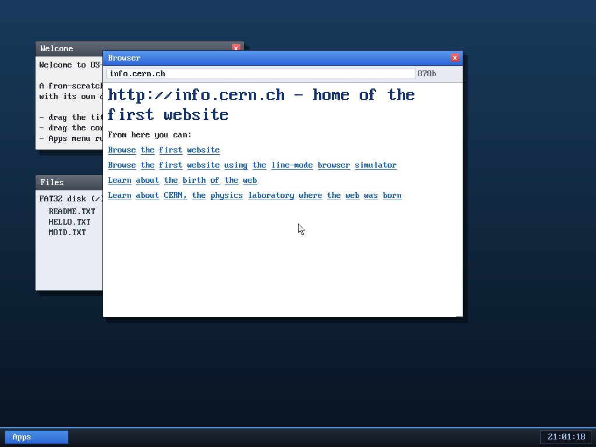

# OS-DEV

A from-scratch x86_64 operating system, written in C + a little assembly,
booted via Multiboot under QEMU.

## Status

✅ **330 milestones complete — a fully keyboard-drivable graphical desktop OS with its own from-scratch JavaScript interpreter (with full class-based OOP — classes, `extends`, `super` — and modern ES6 syntax — spread/rest `...`, destructuring, arrow functions, template literals — atop a Math/JSON/String/Array standard library, runnable from the shell *and* inside web pages via `<script>`), whose web browser now browses the real HTTPS web (validated live on example.com, gnu.org, the NPR text news site, and danluu.com) — verifying the server's CertificateVerify signature, the cert chain's issuer links, and anchoring the chain to a baked-in trusted root CA (NPR → R13 → ISRG Root X1), all with from-scratch ECDSA/RSA/X.509 crypto — following links across pages (a from-scratch TLS 1.3 client, also wired to the shell's `get`/`wget`) and renders every common image format — PNG (incl. interlaced), animated GIF, and baseline-&-progressive JPEG — all inline and from scratch, plus colour text, a hierarchical filesystem, seventeen userspace apps (nine games incl. a text adventure/maze/Sudoku/Tetris/Breakout/Minesweeper, a text editor, a calendar, a Mandelbrot explorer, a piano, a Matrix screensaver, …), a system monitor, a complete verified crypto + TLS toolkit (SHA-256/AES-GCM/ChaCha20-Poly1305/HKDF/X25519/RSA/ECDSA/X.509), and a real taskbar. The browser is interactive: page `<script>` drives a live DOM (`getElementById`, `querySelector`/`querySelectorAll`/`getElementsBy*` by CSS selector — tag/`.class`/`#id`/`[attr]`, `.textContent`/`.innerHTML`/`.value`, `get`/`set`/`hasAttribute`, `.classList`), inline `onclick` plus JS-assigned `addEventListener`/`el.onclick=fn` handlers (whose state persists across clicks via a persistent per-page JS env), and editable `<input>` fields turn typing into output, and HTML forms submit — so it can **search the live web** (type a query → build `?q=…` → HTTPS-fetch + cert-validate → render DuckDuckGo's results). It even loads and runs programs from its own disk.**
OS-DEV goes from power-on to a themed windowing **desktop environment** that
hosts **actual ring-3 programs as windows**: 64-bit long mode, interrupts,
physical/virtual memory + a heap, **preemptive** multitasking with **sleep/wake**
and **per-process isolation**, ring-3 userspace + syscalls, a **read-write
FAT32** filesystem on its own ATA driver, **PCI**, an **e1000 NIC**
(ping + **DNS resolve**), **framebuffer graphics**, mouse + **USB absolute
pointer**, **PC-speaker sound**, a **real-time clock**, and a **window manager**
(drag/resize/start-menu) hosting real userspace programs — a **shell**, a live
clock, and a **graphical web browser** that fetches and renders real web pages
over a **from-scratch TCP/HTTP stack** (chunked-encoding aware). The browser is
**fully keyboard-driven** — links (Tab/Enter), in-page find (`\`), bookmarks
(`a`), history/back, save, scroll — and renders headings, **lists, tables,
`<pre>`, `` alt text, form fields, and HTML entities**. The desktop adds
keyboard window management (F2 focus, F4 maximize), an interactive **Files**
launcher, and **terminal scrollback**; and the OS can `run` an **ELF program
loaded from the FAT32 disk**, not just the kernel-embedded ones:



Where to go next: **[WHATS-NEXT.md](WHATS-NEXT.md)**. The honest take on the
long-term goals (browser, music, Claude Code): **[GOALS.md](GOALS.md)**.

## Quick start

```sh
make          # build the kernel + userspace shell + FAT32 disk image
make run      # boot in a QEMU window (VGA output)
make test     # boot headless, capture serial output, exit after 5s
make clean
```

Drive the shell over the serial line (so it works headlessly):

```sh
(sleep 1; printf 'help\nls\ncat hello.txt\nexit\n') | \
  qemu-system-x86_64 -no-reboot -kernel build/kernel32.elf \
    -drive file=build/fat.img,format=raw,if=ide -display none -serial stdio
```

## How it boots

1. QEMU's built-in Multiboot loader (`-kernel`) finds the multiboot header in
   `boot/boot.asm`, loads the kernel at physical 1 MiB, and jumps to `_start`
   in **32-bit protected mode**.
2. `_start` (32-bit) verifies multiboot + long-mode support, builds page tables
   that identity-map the low 1 GiB, enables PAE + long mode + paging, loads a
   64-bit GDT, and far-jumps into 64-bit code.
3. The 64-bit entry sets up segments + stack and calls `kmain()` (C).

**The 32-bit-container trick:** QEMU's multiboot loader refuses an ELF64
("give a 32bit one"). So we link as a real **ELF64** (`build/kernel.elf`, keep
for `gdb`), then `objcopy` it into a **32-bit ELF container**
(`build/kernel32.elf`) the loader accepts — the 64-bit code inside is untouched.
No GRUB, no ISO, no `xorriso`.

## Layout

```
boot/boot.asm        multiboot header + 32->64-bit long-mode trampoline
kernel/              the kernel
  kmain.c            entry; wires every subsystem together
  console.c vga.c serial.c     text output + kprintf
  gdt.c idt.c interrupts.c pic.c   descriptor tables + interrupts
  timer.c keyboard.c           PIT + PS/2 (and the input queue)
  pmm.c vmm.c kheap.c          physical / virtual memory + heap
  task.c                       kernel threads + scheduler
  elf.c syscall.c              ELF loader + syscall dispatch
  ata.c fat32.c vfs.c          disk driver + filesystem + VFS
  asm/                         context switch, ISR stubs, usermode, user blob
  include/                     kernel headers
user/                ring-3 programs: ulib (libc) + shell
tools/mkfatfs.c      host-side FAT32 image builder
linker.ld            kernel ELF layout (loaded at 1 MiB)
Makefile             build / run / test
docs/                a learning write-up for every milestone
```

## Documentation

A standalone explainer for each milestone — read them in order to learn how the
whole thing works:

| # | Topic | Doc |
|---|-------|-----|
| 0 | Booting to 64-bit long mode        | [docs/00](docs/00-boot-and-long-mode.md) |
| 1 | Terminal driver + `kprintf`        | [docs/01](docs/01-terminal-and-kprintf.md) |
| 2 | Interrupts (GDT/TSS, IDT, PIC)     | [docs/02](docs/02-interrupts.md) |
| 3 | Timer + keyboard                   | [docs/03](docs/03-timer-and-keyboard.md) |
| 4 | Physical memory manager            | [docs/04](docs/04-physical-memory.md) |
| 5 | Virtual memory + higher-half       | [docs/05](docs/05-virtual-memory.md) |
| 6 | Kernel heap                        | [docs/06](docs/06-kernel-heap.md) |
| 7 | Multitasking + scheduler           | [docs/07](docs/07-multitasking.md) |
| 8 | Userspace, syscalls, ELF loader    | [docs/08](docs/08-userspace.md) |
| 9 | libc + shell                       | [docs/09](docs/09-libc-and-shell.md) |
| 10| VFS + FAT32 filesystem             | [docs/10](docs/10-vfs-and-fat32.md) |
| 11| Preemptive scheduling              | [docs/11](docs/11-preemptive-scheduling.md) |
| 12| PCI bus enumeration                | [docs/12](docs/12-pci.md) |
| 13| NIC driver + ARP + ping            | [docs/13](docs/13-networking.md) |
| 14| Framebuffer graphics + font        | [docs/14](docs/14-framebuffer.md) |
| 15| Graphical console + real font      | [docs/15](docs/15-graphical-console.md) |
| 16| PS/2 mouse + cursor                | [docs/16](docs/16-mouse.md) |
| 17| Window manager / compositor        | [docs/17](docs/17-window-manager.md) |
| 18| Desktop apps + widgets             | [docs/18](docs/18-desktop-apps.md) |
| 19| USB tablet (absolute pointer)      | [docs/19](docs/19-usb-tablet.md) |
| 20| Resizable windows + start menu     | [docs/20](docs/20-resize-and-start-menu.md) |
| 21| Per-process address spaces         | [docs/21](docs/21-process-isolation.md) |
| 22| Userspace apps as windows          | [docs/22](docs/22-userspace-apps.md) |
| 23| Sleep/wake (blocking)              | [docs/23](docs/23-sleep-wake.md) |
| 24| Visual polish (theming)            | [docs/24](docs/24-visual-polish.md) |
| 25| Real-time clock (RTC)              | [docs/25](docs/25-rtc.md) |
| 26| PC speaker sound                   | [docs/26](docs/26-pc-speaker.md) |
| 27| System commands (mem/clear/reboot) | [docs/27](docs/27-system-commands.md) |
| 28| FAT32 write (saving files)         | [docs/28](docs/28-fat32-write.md) |
| 29| Networking from the shell (ping/DNS) | [docs/29](docs/29-shell-networking.md) |
| 30| Userspace text editor              | [docs/30](docs/30-text-editor.md) |
| 31| File delete (`rm`)                 | [docs/31](docs/31-file-delete.md) |
| 32| Process spawning + multiple programs | [docs/32](docs/32-process-spawning.md) |
| 33| TCP + HTTP GET (fetch real web pages) | [docs/33](docs/33-tcp-http.md) |
| 34| **Graphical web browser** (HTML render) | [docs/34](docs/34-browser.md) |
| 35| Clickable links (follow + URL resolution) | [docs/35](docs/35-clickable-links.md) |
| 36| Non-blocking (async) page loads        | [docs/36](docs/36-async-browser.md) |
| 37| Richer HTML rendering (title/lists/hr) | [docs/37](docs/37-richer-rendering.md) |
| 38| Browser history / Back                 | [docs/38](docs/38-browser-history.md) |
| 39| `browse <url>` shell command           | [docs/39](docs/39-browse-command.md) |
| 40| Concurrency hardening (browser worker) | [docs/40](docs/40-concurrency-hardening.md) |
| 41| Browser start page + bookmarks         | [docs/41](docs/41-start-page.md) |
| 42| Save a web page to disk (`s` → PAGE.TXT) | [docs/42](docs/42-save-page.md) |
| 43| FAT32 subdirectories (mkdir/cd/pwd)    | [docs/43](docs/43-subdirectories.md) |
| 44| Calculator userspace app               | [docs/44](docs/44-calculator.md) |
| 45| Browser opens local files (`file:…`)   | [docs/45](docs/45-local-files.md) |
| 46| Filesystem write hardening (review fix) | [docs/46](docs/46-fs-write-hardening.md) |
| 47| `cp` / `mv` shell commands             | [docs/47](docs/47-cp-mv.md) |
| 48| `tree` recursive directory listing     | [docs/48](docs/48-tree.md) |
| 49| Taskbar window list (click to focus)   | [docs/49](docs/49-taskbar.md) |
| 50| `ps` process list                      | [docs/50](docs/50-ps.md) |
| 51| Browser bold & italic rendering        | [docs/51](docs/51-emphasis.md) |
| 52| Compositor scene-cache (optimization)  | [docs/52](docs/52-compositor-cache.md) |
| 53| Arrow-key support (browser scroll)     | [docs/53](docs/53-arrow-keys.md) |
| 54| Shell command history (↑/↓)            | [docs/54](docs/54-command-history.md) |
| 55| Snake game + non-blocking input        | [docs/55](docs/55-snake.md) |
| 56| `df` + input review fixes              | [docs/56](docs/56-df-and-fixes.md) |
| 57| Graphical text editor                  | [docs/57](docs/57-editor.md) |
| 58| `find` recursive search                | [docs/58](docs/58-find.md) |
| 59| Browser follows HTTP redirects         | [docs/59](docs/59-redirects.md) |
| 60| 2048 game                              | [docs/60](docs/60-2048.md) |
| 61| `hexdump` command                      | [docs/61](docs/61-hexdump.md) |
| 62| `wc` + FAT cycle-guard (review fix)    | [docs/62](docs/62-wc-and-fatguard.md) |
| 63| `cal` calendar (RTC + day-of-week)     | [docs/63](docs/63-cal.md) |
| 64| `grep` (search file contents)          | [docs/64](docs/64-grep.md) |
| 65| Graphical System Monitor (live bars)   | [docs/65](docs/65-system-monitor.md) |
| 66| SHA-256 + `sha256` checksum            | [docs/66](docs/66-sha256.md) |
| 67| Customizable browser bookmarks (SITES) | [docs/67](docs/67-bookmarks.md) |
| 68| AES-128 + `crypt` file encryption      | [docs/68](docs/68-aes-crypt.md) |
| 69| `base64` encoding                      | [docs/69](docs/69-base64.md) |
| 70| Review-driven syscall/crypto hardening | [docs/70](docs/70-review-hardening.md) |
| 71| HTTP chunked transfer-encoding decode  | [docs/71](docs/71-chunked-http.md) |
| 72| Keyboard link navigation (Tab/n/p/Enter)| [docs/72](docs/72-keyboard-link-nav.md) |
| 73| `wget` — download from web to disk     | [docs/73](docs/73-wget.md) |
| 74| 8th review: browser hardening          | [docs/74](docs/74-review-browser-hardening.md) |
| 75| Keyboard window switching (F2)          | [docs/75](docs/75-window-cycle.md) |
| 76| Window maximize/restore (F4)            | [docs/76](docs/76-maximize.md) |
| 77| Bookmark current page (a) + Back fix    | [docs/77](docs/77-bookmark-add.md) |
| 78| `<pre>` preformatted text + clip fix    | [docs/78](docs/78-pre-rendering.md) |
| 79| 9th review: Back URL race fix           | [docs/79](docs/79-review-back-race.md) |
| 80| Numbered & nested list rendering        | [docs/80](docs/80-lists.md) |
| 81| Basic table rendering (pipe-separated)  | [docs/81](docs/81-tables.md) |
| 82| Interactive Files window (keyboard)     | [docs/82](docs/82-file-browser.md) |
| 83| 10th review: WM gesture fixes           | [docs/83](docs/83-review-wm.md) |
| 84| HTML entity decoding (hex/typographic)  | [docs/84](docs/84-entities.md) |
| 85| Run an ELF program from disk            | [docs/85](docs/85-run-from-disk.md) |
| 86| Terminal scrollback (PgUp/PgDn)         | [docs/86](docs/86-scrollback.md) |
| 87| Editor keeps the cursor visible         | [docs/87](docs/87-editor-scroll.md) |
| 88| In-page find (\\ + query)               | [docs/88](docs/88-find.md) |
| 89| `` alt text rendering              | [docs/89](docs/89-img-alt.md) |
| 90| Find: all matches + prev/next           | [docs/90](docs/90-find-all.md) |
| 91| Form `<input>` placeholders             | [docs/91](docs/91-form-inputs.md) |
| 92| PNG image rendering (DEFLATE + PNG)     | [docs/92](docs/92-png-images.md) |
| 93| Conway's Game of Life (7th app)         | [docs/93](docs/93-game-of-life.md) |
| 94| Bigger fetch buffers (real-sized images)| [docs/94](docs/94-bigger-buffers.md) |
| 95| PNG palette support (colour type 3)     | [docs/95](docs/95-png-palette.md) |
| 96| Clickable inline images                 | [docs/96](docs/96-clickable-images.md) |
| 97| GIF image rendering (LZW)               | [docs/97](docs/97-gif-images.md) |
| 98| Text colour (`<font color>`)            | [docs/98](docs/98-font-color.md) |
| 99| Tetris (8th app) — 100 milestones!      | [docs/99](docs/99-tetris.md) |
| 100| Browser view-source (`u`)              | [docs/100](docs/100-view-source.md) |
| 101| Breakout (9th app)                      | [docs/101](docs/101-breakout.md) |
| 102| Window tiling (F5/F6)                   | [docs/102](docs/102-window-tiling.md) |
| 103| Browser nav keys (home, bottom)         | [docs/103](docs/103-browser-nav-keys.md) |
| 104| Multi-cluster root dir (lift 16-file cap) + Files scroll | [docs/104](docs/104-multicluster-root.md) |
| 105| Compositor opts: partial cursor-rect blit (~1700× less/move) + memcpy flush | [docs/105](docs/105-cursor-blit-optimization.md) |
| 106| Word-at-a-time `memcpy`/`memset` (96K-case host-verified)    | [docs/106](docs/106-fast-memcpy-memset.md) |
| 107| Clip-once `fb_fill_rect` (hottest draw primitive)           | [docs/107](docs/107-fast-fill-rect.md) |
| 108| Fast glyph blit (`fb_glyph`/`fb_glyph_fg` in-bounds path)   | [docs/108](docs/108-fast-glyph-blit.md) |
| 109| Shell `history` command (exposes the command-recall ring)   | [docs/109](docs/109-shell-history.md) |
| 110| Browser inline `<code>`/`<tt>`/`<kbd>`/`<samp>` styling      | [docs/110](docs/110-inline-code.md) |
| 111| **Inline images** in the browser (local PNG/GIF in the flow) | [docs/111](docs/111-inline-images.md) |
| 112| **From-scratch baseline JPEG decoder** (integer IDCT, fuzzed) | [docs/112](docs/112-jpeg-decoder.md) |
| 113| `` sizing for inline images               | [docs/113](docs/113-img-dimensions.md) |
| 114| Adam7 interlaced PNG (completes PNG support)                | [docs/114](docs/114-adam7-png.md) |
| 115| Tab completion of filenames in the shell line editor       | [docs/115](docs/115-tab-completion.md) |
| 116| **Progressive JPEG** (multi-scan, AC refinement; completes JPEG) | [docs/116](docs/116-progressive-jpeg.md) |
| 117| **Animated GIF** (multi-frame decode + timer-driven playback)    | [docs/117](docs/117-animated-gif.md) |
| 118| Minesweeper (6th game) + start page links the local demos       | [docs/118](docs/118-minesweeper.md) |
| 119| X25519 (Curve25519 ECDH) — first step toward HTTPS/TLS          | [docs/119](docs/119-x25519.md) |
| 120| AES-128-GCM (the TLS AEAD; matches OpenSSL over 4000 cases)     | [docs/120](docs/120-aes-gcm.md) |
| 121| HMAC-SHA256 + HKDF + HKDF-Expand-Label (TLS key schedule)       | [docs/121](docs/121-hmac-hkdf.md) |
| 122| ChaCha20-Poly1305 AEAD (RFC 8439 + OpenSSL) — TLS crypto complete | [docs/122](docs/122-chacha20-poly1305.md) |
| 123| X.509/ASN.1 cert parser (pubkey extract; vs OpenSSL, fuzzed) | [docs/123](docs/123-x509-parser.md) |
| 124| Bignum + RSA PKCS#1 & PSS signature verify (vs Python + OpenSSL) | [docs/124](docs/124-bignum-rsa.md) |
| 125| ECDSA-P256 signature verify — TLS crypto+cert toolkit complete | [docs/125](docs/125-ecdsa-p256.md) |
| 126| Reusable TCP stream API (foundation for HTTPS)               | [docs/126](docs/126-tcp-stream-api.md) |
| 127| **TLS 1.3 client — the browser fetches real HTTPS pages**    | [docs/127](docs/127-tls-https.md) |
| 128| HTML entities in `alt` text + Latin-1 folding (HTTPS-page fidelity) | [docs/128](docs/128-entity-alt-decoding.md) |
| 129| UTF-8 body text decoding (folds to ASCII) — the real web speaks UTF-8 | [docs/129](docs/129-utf8-text.md) |
| 130| **Click-through HTTPS browsing** (relative-link scheme + multi-fetch fix) | [docs/130](docs/130-https-link-following.md) |
| 131| HTTPS from the shell — `get`/`wget` over TLS (`SYS_https`)       | [docs/131](docs/131-shell-https.md) |
| 132| DNS + ARP caches — faster multi-page browsing on a site         | [docs/132](docs/132-dns-cache.md) |
| 133| Parser robustness: HTML comments (`<!-- … -->`) + inline `<svg>` suppression | [docs/133](docs/133-html-comments.md) |
| 134| Window minimize / restore (F3) — desktop window management      | [docs/134](docs/134-window-minimize.md) |
| 135| TCP partial-segment fix + real-web validation (renders live NPR) | [docs/135](docs/135-tcp-partial-segment.md) |
| 136| Network info (IP + gateway) in the System Monitor dashboard     | [docs/136](docs/136-monitor-network.md) |
| 137| Keyboard-drivable Apps menu (F9) — the DE is fully keyboard-usable | [docs/137](docs/137-keyboard-apps-menu.md) |
| 138| **TLS CertificateVerify** — validates real certs' key-possession (vs Cloudflare/NPR/Let's Encrypt) | [docs/138](docs/138-cert-verify.md) |
| 139| X.509 chain-internal verification — each cert signed by the next (real chains) | [docs/139](docs/139-cert-chain.md) |
| 140| **Root-CA trust store** — anchors the chain to a trusted root (NPR → ISRG Root X1) | [docs/140](docs/140-root-ca-anchor.md) |
| 141| SHA-384/512 + SHA-384 cert signatures (microsoft.com chain 2/2 verified) | [docs/141](docs/141-sha384.md) |
| 142| **ECDSA P-384** — full EC chain verification (example.com chain 3/3)    | [docs/142](docs/142-ecdsa-p384.md) |
| 143| Expanded trust store + key-match anchoring (example.com fully validated to root) | [docs/143](docs/143-trust-store-expand.md) |
| 144| **From-scratch JavaScript interpreter** — lexer + parser + tree-walking evaluator; shell `js` / `js file.js` | [docs/144](docs/144-js-interpreter.md) |
| 145| **JavaScript runs in the browser** — pages execute their `<script>` tags (document.write) | [docs/145](docs/145-js-in-browser.md) |
| 146| **JS standard library** — Math, JSON.stringify, Object.keys, String/Array methods (map/filter/…) | [docs/146](docs/146-js-stdlib.md) |
| 147| **Arrow functions** — `x => x*x`, `(a,b) => a+b`, block bodies, currying | [docs/147](docs/147-arrow-functions.md) |
| 148| **JSON.parse** — recursive-descent parser; completes the JSON round-trip | [docs/148](docs/148-json-parse.md) |
| 149| **Template literals** — `` `hi ${name}, ${1+2}` ``, nesting + escapes | [docs/149](docs/149-template-literals.md) |
| 150| **More Array/String methods** — reduce/find/some/every/findIndex, padStart/padEnd | [docs/146](docs/146-js-stdlib.md) |
| 151| **Clickable JavaScript** — `<a href="javascript:...">` runs JS on click; page updates | [docs/151](docs/151-clickable-js.md) |
| 152| **JS switch / do-while** — full fall-through, default, string cases | [docs/152](docs/152-switch-dowhile.md) |
| 153| **JS for-of** — iterate arrays & string characters | [docs/152](docs/152-switch-dowhile.md) |
| 154| **JS try/catch/finally/throw** — full exceptions; built-in errors catchable | [docs/154](docs/154-try-catch.md) |
| 155| **JS Object.values/entries, Array.isArray/from** — stdlib roundout | [docs/146](docs/146-js-stdlib.md) |
| 156| **JS object shorthand + default params** — `{x,y}`, `function f(a,b=10)` | [docs/146](docs/146-js-stdlib.md) |
| 157| **Persistent page state (localStorage)** — interactive pages that remember (a real counter) | [docs/155](docs/155-localstorage.md) |
| 158| **JS Array.includes/concat, String.lastIndexOf** + a committed regression suite (`make jstest`) | [tests/](tests/) |
| 159| **JS Array.sort** — default string order + custom comparator | [tests/](tests/) |
| 160| **JS Date()** — wall-clock timestamps from the CMOS RTC (shell + in-page) | [kernel/js.c](kernel/js.c) |
| 161| **JS for-in** — iterate object keys / array indices | [tests/](tests/) |
| 162| **JS parseInt(radix)/0x, Array.fill/lastIndexOf** | [tests/](tests/) |
| 163| **JS Object.assign, Array.flat, Math.sign** | [tests/](tests/) |
| 164| **JS Number.toString(radix)** — `(255).toString(16)`→`ff` | [tests/](tests/) |
| 165| **JS `this` / `new` / OOP** — constructors, method shorthand, lexical arrow `this`, `o.n++` | [docs/165](docs/165-this-new-oop.md) |
| 166| **JS `class` / `extends`** — methods, inheritance, override (method-copy model) | [docs/166](docs/166-class-syntax.md) |
| 167| **JS `super`** — super-constructor + `super.method()`, multi-level chains | [docs/167](docs/167-super.md) |
| 168| **JS spread / rest `...`** — `[...a]`, `f(...args)`, `{...o}`, `(...rest)` | [docs/168](docs/168-spread-rest.md) |
| 169| **JS destructuring** — `var [a,...r]=arr`, `{x:y=1,...rest}=o`, nested, for-of | [docs/169](docs/169-destructuring.md) |
| 170| **JS hardening** — `bind_pattern` depth guard (review L1) | [kernel/js.c](kernel/js.c) |
| 171| **JS parameter destructuring** — `function f({a,b})`, `arr.map(([k,v])=>…)` | [docs/171](docs/171-param-destructuring.md) |
| 172| **JS assignment destructuring** — `[a,b]=[b,a]` swap, `({x}=o)`, `[o.p]=…` | [docs/172](docs/172-assignment-destructuring.md) |
| 173| **JS `??` / `?.`** — nullish coalescing + optional chaining (+ arena 1→2 MB) | [docs/173](docs/173-nullish-optional.md) |
| 174| **JS `Map` / `Set`** — ES6 collections, any key type, iteration, `for-of` | [docs/174](docs/174-map-set.md) |
| 175| **JS `?.` full-chain short-circuit** — `a?.b.c()` → `undefined` (review fix) | [kernel/js.c](kernel/js.c) |
| 176| **JS computed property keys** — `{[expr]: v}` | [kernel/js.c](kernel/js.c) |
| 177| **JS stdlib batch** — Array `at`/`flatMap`/`findLast`, String `at`/`replaceAll`, `Object.fromEntries` | [kernel/js.c](kernel/js.c) |
| 178| **JS regular expressions** — from-scratch `RegExp` (test/exec) + String match/replace/split/search; ReDoS-safe | [docs/178](docs/178-regex.md) |
| 179| **Regex hardening** — fix 2 CRITICAL kernel stack overflows (parser + matcher depth caps) | [docs/179](docs/179-regex-hardening.md) |
| 180| **JS regex literals** — `/pattern/flags` (context-sensitive lexing vs division) | [docs/180](docs/180-regex-literals.md) |
| 181| **JS `Array.from`(Set/Map/mapfn), `Array.of`, Set/Map constructor initializers** | [kernel/js.c](kernel/js.c) |
| 182| **JS `JSON.stringify` pretty-printing** — `JSON.stringify(x, null, 2)` indent | [kernel/js.c](kernel/js.c) |
| 183| **JS `Array.flat(depth)`, `String.trimStart`/`trimEnd`** | [kernel/js.c](kernel/js.c) |
| 184| **Regex-literal `.flags` fix** — CRITICAL stack-use-after-scope (review) | [kernel/js.c](kernel/js.c) |
| 185| **JS `Date` object** — `new Date().getHours()` etc. (RTC-backed) | [kernel/js.c](kernel/js.c) |
| 186| **JS `console.warn`/`error`/`info`/`debug`** — page scripts use them | [kernel/js.c](kernel/js.c) |
| 187| **JS `encodeURIComponent`/`decodeURIComponent`/`encodeURI`/`decodeURI`** — URL/query handling | [kernel/js.c](kernel/js.c) |
| 188| **JS `String.matchAll`** — all regex matches with capture groups | [kernel/js.c](kernel/js.c) |
| 189| **JS `String.replace` with a function replacer** — `replace(re, m=>…)` | [kernel/js.c](kernel/js.c) |
| 190| **JS arena 2→4 MB + jstest truncation guard** — suite outgrew 2 MB (regex-heavy) | [tests/](tests/) |
| 191| **Fix CRITICAL Date/Map/Set `keys[]` crash** — gate key iteration on obj kind (review) | [docs/191](docs/191-keyed-object-fix.md) |
| 192| **Minimal DOM — interactive browser!** `document.getElementById(id).textContent/innerHTML` mutate the page | [docs/192](docs/192-dom.md) |
| 193| **DOM review fix** — sync `document.write` cursor with DOM mutations | [kernel/browser.c](kernel/browser.c) |
| 194| **DOM polish** — preserve link selection across re-render (repeated clicks) | [kernel/browser.c](kernel/browser.c) |
| 195| **DOM `document.querySelector('#id')`** — compatibility with querySelector-using scripts | [kernel/js.c](kernel/js.c) |
| 196| **DOM `textContent` HTML-escaping** — text isn't interpreted as markup (vs `innerHTML`) | [kernel/browser.c](kernel/browser.c) |
| 197| **Inline `onclick` handlers** — `<button onclick="…">` runs JS on click (real HTML events) | [kernel/browser.c](kernel/browser.c) |
| 198| **Editable form fields** — type into `<input>`, read via `el.value`: user input→JS→DOM | [docs/198](docs/198-forms-input.md) |
| 199| **Form submission (GET) → web search** — submit builds `action?q=…`, URL-encodes, navigates; searches DuckDuckGo live over HTTPS | [docs/199](docs/199-form-submit.md) |
| 200| **Enter-to-submit** — pressing Enter in a field submits the form (natural search box: focus, type, Enter) | [docs/199](docs/199-form-submit.md) |
| 201| **`<button>` form submit** — a `<button>`/`<button type=submit>` submits, not just `<input type=submit>` | [docs/199](docs/199-form-submit.md) |
| 202| **Address-bar search** — type a query (not a URL) in the bar → DuckDuckGo results, like any modern browser | [docs/199](docs/199-form-submit.md) |
| 203| **Password masking** — `<input type=password>` shows `*` on screen; JS/submit still get the real value | [docs/199](docs/199-form-submit.md) |
| 204| **256 KB fetch buffer** — doubled from 128 KB so larger pages render fully (e.g. Wikipedia reaches its TOC/article); TCP verified stable | [kernel/browser.c](kernel/browser.c) |
| 205| **`element.getAttribute(name)`** — page JS reads any element's HTML attributes (href, `data-*`, type…); missing → `null` | [docs/205](docs/205-dom-attributes-and-events.md) |
| 206| **`element.setAttribute(name,val)`** — page JS writes attributes (rewrites the tag in place + re-renders); swap `src`/`href`/`data-*` | [docs/205](docs/205-dom-attributes-and-events.md) |
| 207| **`window.location`** — page JS reads the current URL (`href`/`protocol`/`host`/`pathname`/`search`), e.g. a results page's `?q=` | [docs/205](docs/205-dom-attributes-and-events.md) |
| 208| **Address-bar replace-on-type** — first keystroke after focusing the bar clears it, so typing a search/URL needs no backspacing | [kernel/browser.c](kernel/browser.c) |
| 209| **`Array.splice`/`shift`/`unshift`** — the common array mutators (insert/remove anywhere, front ops), ASan-fuzzed | [kernel/js.c](kernel/js.c) |
| 210| **Checkboxes & radios** — `[x]`/`(o)` toggles (Enter), `checked` default, read via `.value`; checked ones submit `name=on` | [docs/205](docs/205-dom-attributes-and-events.md) |
| 211| **Radio group exclusion** — selecting a radio unchecks the others sharing its `name` (proper mutually-exclusive groups) | [docs/205](docs/205-dom-attributes-and-events.md) |
| 212| **`onchange` handlers** — toggling a checkbox/radio runs its `onchange` JS immediately (reactive forms, no button) | [docs/205](docs/205-dom-attributes-and-events.md) |
| 213| **Text-field `onchange`** — a text input fires its `onchange` on blur (Enter/Esc): type, leave the field, the handler runs | [docs/205](docs/205-dom-attributes-and-events.md) |
| 214| **`Array.reduceRight`** — right-to-left reduce, completing the reduce family | [kernel/js.c](kernel/js.c) |
| 215| **`oninput`** — text fields fire `oninput` on every keystroke (search-as-you-type / live validation) | [docs/205](docs/205-dom-attributes-and-events.md) |
| 216| **In-page anchors** — `<a href="#id">` jumps to the element with that id (TOC / "back to top" links) | [kernel/browser.c](kernel/browser.c) |
| 217| **More HTML entities** — arrows (`&rarr;`…), `&plusmn;`/`&sect;`/`&para;`/`&prime;`/`&minus;` fold to ASCII | [kernel/browser.c](kernel/browser.c) |
| 218| **Strikethrough** — `<s>`/`<del>`/`<strike>` render in muted grey with a line through (edits, old prices) | [kernel/browser.c](kernel/browser.c) |
| 219| **`<mark>` highlight** — highlighted text renders dark-on-yellow, like a marker pen | [kernel/browser.c](kernel/browser.c) |
| 220| **Legacy `<a name>` anchors** — `<a name="x">` is a valid `#x` jump target too (older pages' TOCs) | [kernel/browser.c](kernel/browser.c) |
| 221| **`Function.call`/`.apply`** — invoke with an explicit `this` + args (method borrowing, `Math.max.apply(null,arr)`) | [kernel/js.c](kernel/js.c) |
| 222| **`Function.bind`** — partial application + a fixed `this`; the bind-chain unwrap is depth-guarded | [kernel/js.c](kernel/js.c) |
| 223| **`<sub>`/`<sup>`** — subscript/superscript render at a vertical offset (H₂O, mc², footnotes) | [kernel/browser.c](kernel/browser.c) |
| 224| **`<cite>`/`<var>`/`<dfn>`/`<address>`** — render italic (semantic tags) | [kernel/browser.c](kernel/browser.c) |
| 225| **`<details>`/`<summary>`** — collapsible sections: click a summary to expand/collapse the body (per-section; `open` honored) | [kernel/browser.c](kernel/browser.c) |
| 226| **More entities** — currency (`&cent;`/`&pound;`/`&yen;`), `&micro;`, angle quotes, `&frasl;`, `&Dagger;` fold to ASCII | [kernel/browser.c](kernel/browser.c) |
| 227| **`<ol type>`/`<ol start>`** — ordered-list markers as `a`/`A`/`i`/`I` (roman) + a custom start number | [kernel/browser.c](kernel/browser.c) |
| 228| **`delete` operator** — `delete obj.x` / `obj[k]` removes an own property (keyed objects + array slots); JS-engine | [kernel/js.c](kernel/js.c) |
| 229| **`in` operator** — `key in obj` (own-property test) / `i in arr` (valid-index test); for-in preserved | [kernel/js.c](kernel/js.c) |
| 230| **Bitwise `^` / `~`** — XOR (precedence between `&` and `|`) + unary bitwise NOT; completes the bitwise set | [kernel/js.c](kernel/js.c) |
| 231| **`instanceof` operator** — inheritance-aware; walks the instance→ctor→parent chain via a new `parent_class` link | [kernel/js.c](kernel/js.c) |
| 232| **`**` / `void`** — exponentiation (right-associative, binds tighter than `*`) + the `void` operator; JS operator set now complete | [kernel/js.c](kernel/js.c) |
| 233| **Compound assignment** — `&=` `|=` `^=` `<<=` `>>=` `**=`; completes the assignment-operator set | [kernel/js.c](kernel/js.c) |
| 234| **Number literals** — binary `0b`, octal `0o`, exponent `1e3`/`5E2` (integer engine; hex/decimal/fractional unchanged) | [kernel/js.c](kernel/js.c) |
| 235| **Stdlib batch** — `Array.fill`, `Array.from({length:n})` (+ map fn), `Math.hypot`/`log2`, `Object.getOwnPropertyNames` | [kernel/js.c](kernel/js.c) |
| 236| **More `Math`** — `cbrt`, `clz32`, `imul` (integer-exact; rounds Math out toward the spec) | [kernel/js.c](kernel/js.c) |
| 237| **`Object.freeze` / `isFrozen`** — shallow immutability via a per-object flag guarding `obj_set`/`obj_delete` | [kernel/js.c](kernel/js.c) |
| 238| **More `Date`** — `getTime`/`valueOf` (epoch ms), `getDay` (weekday), `getMilliseconds`; exact via `days_from_civil` | [kernel/js.c](kernel/js.c) |
| 239| **Logical assignment** — `\|\|=` `&&=` `??=` (short-circuiting; RHS only evaluated when it assigns) | [kernel/js.c](kernel/js.c) |
| 240| **Class fields** — `class { x = 0 }` public instance fields, incl. inherited (run up the parent chain before the ctor) | [kernel/js.c](kernel/js.c) |
| 241| **`typeof` undeclared** — `typeof undeclaredVar` yields `"undefined"` instead of throwing (the feature-detection guard idiom) | [kernel/js.c](kernel/js.c) |
| 242| **Numeric separators** — `1_000_000`, `0xFF_FF`, `0b1010_1010`, `0o7_5_5` (`_` between digits, all bases) | [kernel/js.c](kernel/js.c) |
| 243| **Computed method names** — `{ [expr](){…} }` object-literal computed-key methods (with `this`) | [kernel/js.c](kernel/js.c) |
| 244| **Static class members** — `static method(){}` / `static field` reachable as `Class.x` (`this` = the class); via a side statics object | [kernel/js.c](kernel/js.c) |
| 245| **Static read/write** — `Class.field = x` writes to statics + a static initializer can reference an earlier static (`static b = C.a+1`); completes M244 | [kernel/js.c](kernel/js.c) |
| 246| **Static inheritance** — a subclass inherits the parent's statics (`Sub.parentStatic()`, `this`=subclass), walking the class chain | [kernel/js.c](kernel/js.c) |
| 247| **Tagged templates** — `` tag`a${x}b` `` calls `tag(["a","b"], x)` (cooked strings array + interpolated values) | [kernel/js.c](kernel/js.c) |
| 248| **`Number`/`String` statics** — `Number.isInteger`/`isNaN`/`isFinite`/`parseInt`/`MAX_SAFE_INTEGER` + `String.fromCharCode` (side-statics; coercion + `typeof` preserved) | [kernel/js.c](kernel/js.c) |
| 249| **Spread `Set`/`Map`** — `[...new Set(arr)]` (dedup), `[...map]`→`[k,v]` entries, `f(...set)` + `Number.isSafeInteger` | [kernel/js.c](kernel/js.c) |
| 250| **Index correctness** — `String.slice` negative indices (vs `substring`), `indexOf`/`includes` `fromIndex` (String + Array) | [kernel/js.c](kernel/js.c) |
| 251| **`split` limit** — `str.split(sep, limit)` caps the result count | [kernel/js.c](kernel/js.c) |
| 252| **Error objects** — `Error`/`TypeError`/`RangeError`/`SyntaxError` with `.message`/`.name` (`throw new Error(...)` + `catch(e){e.message}`); arena 4→8 MB | [kernel/js.c](kernel/js.c) |
| 253| **`instanceof` native ctors** — `new Map()/Set()/Date()/Error() instanceof X` (links native-built objects to their ctor); `e instanceof RangeError` | [kernel/js.c](kernel/js.c) |
| 254| **`Date.now()`** — current epoch-ms static (side-statics on the Date native; RTC-backed) | [kernel/js.c](kernel/js.c) |
| 255| **`element.remove()`** — JS removes a DOM element (splices the whole `<tag>…</tag>` span out of the page, re-renders) | [kernel/js.c](kernel/js.c), [kernel/browser.c](kernel/browser.c) |
| 256| **`arguments`** — the arguments object in non-arrow functions (`arguments.length`/`[i]`); flagged (cached AST walk) so only functions that reference it pay | [kernel/js.c](kernel/js.c) |
| 257| **Date setters** — `setFullYear`/`setMonth`/`setDate`/`setHours`/`setMinutes`/`setSeconds` (return the new epoch ms) | [kernel/js.c](kernel/js.c) |
| 258| **`substring` arg-swap** — `"abc".substring(3,1)`→`"bc"` (swaps when start>end, per spec; `slice` still clamps to empty) | [kernel/js.c](kernel/js.c) |
| 259| **`Object.is`** — precise equality (`Object.is({},{})`→`false` by identity, `Object.is(true,1)`→`false` across types); in an integer engine with no `NaN`/`-0` it is exactly strict `===` | [kernel/js.c](kernel/js.c) |
| 260| **ES2023 change-array-by-copy** — `with(i,v)`, `toReversed()`, `toSorted(cmp)`, `toSpliced(start,del,…items)`: each returns a **new** array and leaves the original intact (immutable updates) | [kernel/js.c](kernel/js.c) |
| 261| **Getters & setters** — accessor properties in object literals *and* classes (`get x(){…}` / `set x(v){…}`), fired on `.x`/`[k]` read & write incl. inheritance/override; `in`/`delete`/`JSON` correctly never fire them; `get`/`set` stay usable as ordinary names | [kernel/js.c](kernel/js.c), [docs](docs/261-getters-setters.md) |
| 262| **`Object.defineProperty` / `getOwnPropertyDescriptor`** — programmatic accessor (`{get,set}`, reusing M261) or data (`{value}`) property definition + descriptor read-back; the prototype-needing `Object.create`/`.prototype` stay deferred | [kernel/js.c](kernel/js.c) |
| 263| **Prototype chain** — `Object.create`/`getPrototypeOf`/`setPrototypeOf`, function `.prototype` + `new F()` for plain constructors, `__proto__`; member read/call/write walk the chain (inherited accessors fire with `this`=receiver), cycle-capped. **Additive**: own-only `delete`/enumeration and the class system are unchanged | [kernel/js.c](kernel/js.c), [docs](docs/263-prototype-chain.md) |
| 264| **`in` / `instanceof` walk the prototype chain** — `'k' in Object.create({k:1})`→`true` (existence only — never fires an inherited getter); `Object.create(F.prototype) instanceof F`→`true`; both cycle-capped and additive (proto-less objects & class instances unchanged) | [kernel/js.c](kernel/js.c) |
| 265| **`Object.defineProperties` + `Object.create(proto, descriptors)`** — apply a whole `{key:{value\|get\|set}}` map at once (each via M262's `defineProperty`); completes the define/create family | [kernel/js.c](kernel/js.c) |
| 266| **`structuredClone`** (deep clone preserving cycles & shared refs) **+ fixed object identity in `===`/`!==`/`==`/`!=`** — they coerced every object to `0` so *any two objects compared equal* (`{}===​{}`→`true`!); now reference identity (`{}===​{}`→`false`, `a===a`→`true`), matching `Object.is` | [kernel/js.c](kernel/js.c), [docs](docs/266-equality-and-structured-clone.md) |
| 267| **String relational compare + `array.length =`** — `<`/`>`/`<=`/`>=` compare two strings lexically (`"apple"<"banana"`→`true`; was coerced to `0` so all-false); assigning `arr.length` now truncates or grows (with `undefined`), bounded | [kernel/js.c](kernel/js.c) |
| 268| **`Array(n)` / `new Array(…)` constructor** — `new Array(3)` (length-3), `Array(1,2,3)` (elements); `Array` is now a callable function (`typeof Array`→`"function"`) with `isArray`/`from`/`of` kept on the side; length bounded | [kernel/js.c](kernel/js.c) |
| 269| **`>>>` unsigned right shift** — completes the bitwise/shift operator set; 32-bit unsigned per JS (`-1>>>0`→`4294967295`, `-8>>>1`→`2147483644`), same precedence as `<<`/`>>` | [kernel/js.c](kernel/js.c) |
| 270| **`>>>=` compound assignment** — the last missing compound op; completes the set (`+= -= *= /= %= &= \|= ^= <<= >>= >>>= **= \|\|= &&= ??=`) | [kernel/js.c](kernel/js.c) |
| 271| **Loose `==`/`!=` vs strict `===`/`!==`** — `==` now does abstract equality (`null==undefined`→`true`, `"5"==5`→`true`, `x==null` matches null *or* undefined, object↔primitive coercion); `===` routes through `val_equal` so it's truly strict, also fixing the old `1===true`→`true` | [kernel/js.c](kernel/js.c), [docs](docs/271-loose-equality-and-probing.md) |
| 272| **`Array.prototype.copyWithin`** — `[1,2,3,4,5].copyWithin(0,3)`→`[4,5,3,4,5]`; in-place, negative + out-of-range indices clamped, overlap-safe (memmove) | [kernel/js.c](kernel/js.c) |
| 273| **`WeakMap` / `WeakSet`** — backed by Map/Set (no GC, so weak refs are moot — permissive, not broken); distinct constructors for `instanceof`; lets real library code that uses them run | [kernel/js.c](kernel/js.c) |
| 274| **`hasOwnProperty` + `Object.hasOwn`** — own-property test (the classic `for-in` filter; excludes inherited keys), on objects *and* arrays; a user-defined `hasOwnProperty` still takes precedence | [kernel/js.c](kernel/js.c) |
| 275| **`toString()` / `valueOf()` method calls** — on objects (`({}).toString()`→`"[object Object]"`), arrays (→ join), strings; user-defined `toString` wins; numbers keep radix `toString`, `Date.valueOf()` keeps returning epoch | [kernel/js.c](kernel/js.c) |
| 276| **`String.substr` + array `keys`/`values`/`entries`** — legacy `substr(start,length)`; (eager-array) iterators that work with `for-of`, incl. `for(const [i,v] of arr.entries())` | [kernel/js.c](kernel/js.c) |
| 277| **`Reflect`** — `get` (fires getters, walks the proto chain), `set` (fires setters), `has` (own+inherited), `ownKeys`, `deleteProperty`; the metaprogramming namespace, reusing the existing read/keys/delete paths | [kernel/js.c](kernel/js.c) |
| 278| **`toLocaleString` + `localeCompare` + `codePointAt`/`fromCodePoint`** — `(1234567).toLocaleString()`→`"1,234,567"` (thousands grouping); ASCII `localeCompare` (sort-ready); codePointAt/fromCodePoint (= charCodeAt/fromCharCode for ASCII) | [kernel/js.c](kernel/js.c) |
| 279| **`propertyIsEnumerable` + array `toLocaleString` + `Object.getOwnPropertyDescriptors`** — own-enumerable test, array→join, and the plural `{key:descriptor}` map (reuses the singular form) | [kernel/js.c](kernel/js.c) |
| 280| **Labeled `break`/`continue`** — `outer: for(…){ for(…){ continue outer; break outer; } }`; **completes the JS statement set**. Additive: unlabeled is byte-identical, only labeled completions re-propagate past non-matching loops; `switch` passes labeled break + all continue through | [kernel/js.c](kernel/js.c) |
| 281| **`querySelector` / `querySelectorAll` by CSS selector** — `tag`, `.class`, `#id`, and compounds (`p.fruit`). The blocker (an id-less match has no name to address it by) is solved with **byte-offset "position handles"** (`vals[1]` = offset of the matched `<`), fully additive — the id-keyed path stays byte-identical. `querySelectorAll` returns a plain array, so `.length`/`[i]`/`forEach`/`for-of` work for free | [kernel/browser.c](kernel/browser.c), [kernel/js.c](kernel/js.c), [docs/281](docs/281-queryselector.md) |
| 282| **`getElementsByTagName`/`ClassName` + `getAttribute` on matches** — both return arrays of position handles (reusing the M281 matcher); `getAttribute` on a match via a position-variant `dom_attr_region_at`. Read-complete on selector matches | [kernel/browser.c](kernel/browser.c), [kernel/js.c](kernel/js.c) |
| 283| **Position-handle WRITE** — `.textContent`/`.innerHTML`/`setAttribute`/`remove` on a selector match, splicing the page source + re-rendering. Splice **duplicated** (not refactored) from the id path → zero regression to the working browser; the offset is re-validated each use so a stale/forged offset fails closed (memory-safe; single-match writes exact, multi-write best-effort). Memory-safety reviewed SHIP (1401-mutation ASan fuzz; `vals[1]` proven unforgeable) + an overflow-proofing follow-up | [kernel/browser.c](kernel/browser.c), [kernel/js.c](kernel/js.c) |
| 284| **`[attr]` attribute-presence selector** — `querySelectorAll("[data-x]")`, `"p[class]"`; additive to the M281 matcher (one `has_attr` check, matches valued + boolean attrs) | [kernel/browser.c](kernel/browser.c) |
| 285| **`element.classList`** — `add`/`remove`/`toggle`/`contains`, the most-used DOM API. A `V_CLASSLIST` handle carrying the element's id/offset addressing, reading & rewriting the class attribute via the existing get/setAttribute callbacks (works for id + position handles; no new browser code) | [kernel/js.c](kernel/js.c) |
| 286| **`element.hasAttribute`** — completes get/set/has on the attribute API; reuses the getAttribute callbacks | [kernel/js.c](kernel/js.c) |
| 287| **Persistent per-page JS environment** — a page's load `<script>` and every later event handler now share one global env (rebuilt only on navigation), so a function/var defined at load survives to fire on a click (and state persists across clicks, no `localStorage`). The long-standing arena-reset-per-run blocker; additive via a `mode` on `js_run_impl` — the shell `js` path is byte-unchanged. The prerequisite for `addEventListener`/`el.onclick=fn` | [kernel/js.c](kernel/js.c), [kernel/browser.c](kernel/browser.c), [docs/287](docs/287-persistent-page-env.md) |
| 288| **`addEventListener` / `el.onclick = fn`** — JS-assigned event handlers: a handler *function* attached at load (no inline `onclick=`) fires on a later click. Stored in a per-page registry (in the M287 persistent env); the element is marked clickable via a synthetic `data-jsh` attribute the renderer turns into an `event:ID` link, dispatched to `js_fire_event`. Real event-driven page JS, with handler state persisting across clicks | [kernel/js.c](kernel/js.c), [kernel/browser.c](kernel/browser.c) |
| 289| **`querySelectorAll` skips `<script>`/`<style>` content** — a correctness fix found by the capstone demo: the raw-byte matcher was matching tag-like *text* inside a script body (e.g. a `"<li class=…>"` string literal). Now it skips raw-text elements' content. Plus `app.htm`, a mini task app integrating `addEventListener` + a persistent array + `querySelectorAll` end-to-end | [kernel/browser.c](kernel/browser.c) |
| 290| **Scripted `onchange`/`oninput` handlers** — `checkbox.onchange = fn` (JS-assigned, no inline attribute) fires on toggle/blur/keystroke. `fire_handler` falls through to the M288 registry (`js_fire_event`) when there's no inline attribute, so the event-handler set is complete: onclick + `addEventListener` + onchange/oninput, inline *and* scripted | [kernel/browser.c](kernel/browser.c) |
| 291| **Event object passed to handlers** — a handler is now called with `this` = the element and a first arg `event` carrying `.type` and `.target` (an element handle, so `e.target.id`/`.textContent` work). Additive: existing no-arg handlers are unaffected | [kernel/js.c](kernel/js.c) |
| 292| **`removeEventListener` / `el.onclick = null`** — drop a registered handler (a second click then no-ops). Completes the handler lifecycle: add / fire (with `event` + `this`) / remove, all with state persisting across events via the M287 env | [kernel/js.c](kernel/js.c) |
| 293| **`classList.toggle(name, force)`** — the 2-arg conditional-class form (`el.classList.toggle('active', cond)`): force the class present/absent per the 2nd arg, returning the resulting state | [kernel/js.c](kernel/js.c) |
| 294| **`element.matches(selector)`** — the event-delegation idiom (`e.target.matches('.btn')`), pairing with the M291 event object. Reuses the M281 matcher (run the selector, test whether this element is among the matches); read-only, no new matcher | [kernel/browser.c](kernel/browser.c), [kernel/js.c](kernel/js.c) |
| 295| **`element.removeAttribute(name)`** — completes the attribute API (get/set/has/**remove**). A new `attr_span` finds the full ` name="value"` span; the splice mirrors the (reviewed) `browser_dom_set` remove path. Both id and position handles | [kernel/browser.c](kernel/browser.c), [kernel/js.c](kernel/js.c) |
| 296| **`element.closest(selector)`** — walk to the nearest self-or-ancestor match (event delegation). A forward approach reusing the matcher + inner-span finder (innermost enclosing match); also fixes `.id` on querySelector position handles (now reads the source id). Completes DOM querying/traversal on the token-stream renderer | [kernel/browser.c](kernel/browser.c), [kernel/js.c](kernel/js.c) |
| 297| **`element.children`** — the direct child elements as an array of handles (scans the inner span for top-level tags, skipping each child's subtree). Rounds out traversal (matches/closest/children) | [kernel/browser.c](kernel/browser.c), [kernel/js.c](kernel/js.c) |
| 298| **`createElement` + `appendChild`** — DOM node construction (turns out *not* tree-blocked): createElement returns a detached node (object with tagName + props); appendChild builds its HTML and does `parent.innerHTML += it`, reusing the innerHTML splice (no new code). Created nodes render *and* are found by `querySelectorAll` (real live elements). Only CSS styling now remains | [kernel/js.c](kernel/js.c) |
| 299| **`element.parentElement` / `parentNode`** — upward traversal: the innermost element enclosing this one (or null at top level), via a read-only enclosure scan. Completes traversal (parentElement / closest / children / matches) — the browser now has the full common DOM: query, traverse, read/write, construct, events | [kernel/browser.c](kernel/browser.c), [kernel/js.c](kernel/js.c) |
| 300| **`nextElementSibling` / `previousElementSibling`** — sibling traversal: one scan of the element's sibling range (its parent's children, or top-level) for the nearest element before/after it. Read-only, reuses the parent/dom_find_at scan | [kernel/browser.c](kernel/browser.c), [kernel/js.c](kernel/js.c) |
| 301| **`element.tagName` / `nodeName`** — the element's tag name, uppercased; read at its opening tag. Read-only, id + position handles | [kernel/browser.c](kernel/browser.c), [kernel/js.c](kernel/js.c) |
| 302| **Inline CSS `style="color"`** — the first CSS support: an inline `style="…color: X…"` tints the element's text (named or `#hex`, `background-color` skipped). A depth-counted colour scope (mirroring the onclick scope) applies the colour to the element's content (incl. inline `<span>`) and restores at its close. Additive — un-styled pages render byte-identically | [kernel/browser.c](kernel/browser.c) |
| 303| **Inline CSS `font-weight` / `font-style`** — the same inline-style scope now also reads `font-weight` (`bold`/`bolder`/`600`–`900` → bold) and `font-style` (`italic`/`oblique` → the italic tint), so `<span style="font-weight:bold; color:#cc0000">` renders bold red. A bounded `style_prop()` finds a property at a CSS boundary; the text-style is restored at the element's close only if still the one we set (mirroring the link scope). Additive | [kernel/browser.c](kernel/browser.c) |
| 304| **CSS `<style>` blocks** — the first stylesheet support: a `<style>` block is parsed into a rule table (`capture_css`) and applied at render time (`css_match`). Selectors reuse `sel_parse` (`tag` / `.class` / `#id` / `[attr]`; anything more complex is skipped), declarations reuse the reviewed color/weight/style parsers. Rules cascade under inline `style=` per property; later rules win | [kernel/browser.c](kernel/browser.c) |
| 305| **Nested style scopes** — the single active style scope became a stack (`sc[16]`), so a styled element nested inside another styled element gets its own scope: a `<style>` `p {color}` rule no longer blocks a nested `<span class="red">`, inline colours nest, etc. — colours/weights compose to any depth, restored correctly at each close (per-frame depth-counting, mirroring the link scope) | [kernel/browser.c](kernel/browser.c) |
| 306| **CSS `rgb()` / `rgba()` colours** — `parse_color` (shared by inline `style=` and `<style>` rules) now accepts functional notation `rgb(r,g,b)` / `rgba(…)` with integer **or** percentage components (alpha ignored), which real stylesheets use constantly. The named-colour table also grew (crimson/gold/indigo/coral/darkblue/steelblue/…) as legible approximations on the light page | [kernel/browser.c](kernel/browser.c) |
| 307| **CSS `text-decoration: underline`** (+ the `<u>`/`<ins>` tags) — underline is an independent per-token flag, so it **composes** with colour and bold (one element can be underlined + red + bold). Drawn as a baseline rule; threaded through inline `style=`, `<style>` rules, and the previously-unrendered `<u>`/`<ins>` tags; nests via the same scope stack | [kernel/browser.c](kernel/browser.c) |
| 308| **Sudoku** — a new ring-3 userspace puzzle app (a logic-genre complement to the arcade games): arrow-key cursor, `1`–`9` to fill, conflict detection across row/column/3×3 box (clashes shown in `(parens)`, cursor in `[brackets]`), fixed clue cells, and a solve chime. Launch via `run sudoku` or the F9 Apps menu | [user/sudoku.c](user/sudoku.c) |
| 309| **Calendar** — a ring-3 month-calendar app: reads today from the RTC, draws the month as a Su–Sa grid with today in `[brackets]` (weekday via Zeller's congruence, leap-year-aware), and pages through months (←/→) and years (↑/↓); `t` jumps to today. Launch via `run calendar` or the F9 Apps menu | [user/calendar.c](user/calendar.c) |
| 310| **Mandelbrot explorer** — a ring-3 fractal app: escape-time Mandelbrot as text art, all **Q16.16 fixed-point** (userspace is built with no FPU/SSE), with arrow-key pan, `+`/`-` zoom, and `r` reset. Launch via `run mandel` or the F9 Apps menu | [user/mandel.c](user/mandel.c) |
| 311| **Colour for apps** — a new `sys_setcolor(idx)` syscall lets a userspace app tint its text from a 16-colour palette (recorded per cell, drawn by `app_render`). Fully additive — palette 0 is the existing green, so apps that don't call it are byte-identical. The Mandelbrot now colours its escape bands and Sudoku marks the cursor/conflicts/clues in colour | [kernel/app.c](kernel/app.c), [user/mandel.c](user/mandel.c), [user/sudoku.c](user/sudoku.c) |
| 312| **2048 in colour** — tiles are drawn in palette colours chosen by value (2 white → 2048 lime), echoing the real game's escalating hues | [user/g2048.c](user/g2048.c) |
| 313| **Minesweeper in colour** — revealed numbers get the classic hues (1 blue, 2 green, 3 red, …), flags red, the cursor yellow — much more readable | [user/mines.c](user/mines.c) |
| 314| **Tetris in colour** — each tetromino in its standard colour (I cyan, O yellow, T violet, S green, Z red, J blue, L orange), falling and locked; walls grey | [user/tetris.c](user/tetris.c) |
| 315| **Breakout in colour** — rainbow brick rows (red/orange/yellow), cyan paddle, white ball | [user/breakout.c](user/breakout.c) |
| 316| **Piano** — a playable musical keyboard (the speaker's first tunes): the home row plays white keys (a–k = C–C), the row above black keys (w/e/t/y/u), z/x shift the octave; shows the note + frequency and a colour-coded key map. Launch via `run piano` or the F9 Apps menu | [user/piano.c](user/piano.c) |
| 317| **Snake in colour** — red food, yellow head, lime body. With this every game uses the colour palette | [user/snake.c](user/snake.c) |
| 318| **Maze** — a generate-and-explore app: a random perfect maze (iterative recursive-backtracker) walked top-left → bottom-right with the arrow keys (walls block); blue walls, yellow player, lime exit, `n` regenerates. Launch via `run maze` or the F9 Apps menu | [user/maze.c](user/maze.c) |
| 319| **Adventure** — a small parser-driven text adventure (turn-based, `readline`-based): a six-room dungeon — find the torch, light the cave, take the gold; commands `n/s/e/w`, `look`, `take`, `i`, `help`. Launch via `run adv` or the F9 Apps menu | [user/adv.c](user/adv.c) |
| 320| **Styled start page** — the browser's built-in start page now carries a `<style>` block (blue H1, grey definition descriptions, a bold-green "what's new" line), so the first thing you see is rendered by the from-scratch CSS engine; the titlebar shows its `<title>` | [kernel/browser.c](kernel/browser.c) |
| 321| **Clock dashboard** — the clock app, recoloured: cyan title, grey labels, white date, yellow time, lime system summary (RAM/uptime/tasks) | [user/clock.c](user/clock.c) |
| 322| **Built-in help page** — a styled `help.htm` (linked from the start page): the apps and how to launch them, the shell commands, and the keyboard shortcuts — rendered by the CSS engine (blue/purple headings, gold terms, green key chips) | [tools/mkfatfs.c](tools/mkfatfs.c) |
| 323| **Styled demos index** — the local-demos `INDEX` page gets a `<title>` and a `<style>` block (blue heading, purple section header), matching the start/help pages | [tools/mkfatfs.c](tools/mkfatfs.c) |
| 324| **Matrix screensaver** — a "digital rain" app: columns of random glyphs fall with bright white heads and fading green trails (the first non-interactive animated app). Launch via `run matrix` or the F9 Apps menu | [user/matrix.c](user/matrix.c) |
| 325| **Editor status bar in colour** — the text editor's status line (filename, byte count, line:col) is drawn cyan, set apart from the green document | [user/editor.c](user/editor.c) |
| 326| **calc & life in colour** — calc shows cyan title / yellow results / red errors; life draws lime cells. With these, every windowed app uses the colour palette | [user/calc.c](user/calc.c), [user/life.c](user/life.c) |
| 327| **calc: modulo & power** — the calculator gains `%` (modulo) and a right-associative `^` (integer power, bound tighter than `* / %`), so `(2+3)^2`=25, `2^10`=1024, `17%5`=2 | [user/calc.c](user/calc.c) |
| 328| **calc: hex I/O** — `0x..` hex literals as input, and every result printed in both decimal and unsigned 64-bit hex (`0x10*0x10` → 256 0x100) — a programmer's calculator | [user/calc.c](user/calc.c) |
| 329| **Accurate help page** — `help.htm` updated to list the calculator's operators and the matrix screensaver | [tools/mkfatfs.c](tools/mkfatfs.c) |
| 330| **Sudoku: multiple puzzles** — `n` now cycles through three conflict-free puzzles (the classic grid, Inkala's 2012 hard puzzle, and one carved from a solved grid) instead of reloading the same one | [user/sudoku.c](user/sudoku.c) |

## Roadmap

**Foundation — complete:**
- [x] 0. Boot to 64-bit long mode, print to screen + serial
- [x] 1. Terminal driver (scrolling VGA text + formatted `kprintf`)
- [x] 2. Interrupts: GDT/TSS, IDT, CPU exceptions, PIC remap
- [x] 3. Timer (PIT) + PS/2 keyboard input
- [x] 4. Physical memory manager (multiboot memory map, frame allocator)
- [x] 5. Virtual memory: 4-level paging, higher-half direct map (see docs/05)
- [x] 6. Kernel heap (`kmalloc`/`kfree`)
- [x] 7. Multitasking: kernel threads + round-robin scheduler
- [x] 8. Userspace: ring 3, syscalls, ELF program loader
- [x] 9. A libc + a basic shell
- [x] 10. VFS + FAT32 filesystem + ATA driver + shell `ls`/`cat`

**Hardware + extras:**
- [x] 11. Preemptive scheduling (timer-driven context switches)
- [x] 12. PCI bus enumeration
- [x] 13. e1000 NIC driver + ARP + ICMP ping
- [x] 14. Framebuffer graphics + 8×8 font

**Desktop environment:**
- [x] 15. Graphical console + real 8×16 font
- [x] 16. PS/2 mouse + cursor
- [x] 17. Window manager / compositor (drag, focus, z-order)
- [x] 18. Desktop apps: terminal, file browser, taskbar clock + button
- [x] 19. USB (UHCI) + usb-tablet absolute pointer (cursor tracks 1:1)
- [x] 20. Resizable windows + start menu + Clock/About apps
- [x] 21. Per-process address spaces (real memory isolation)
- [x] 22. Userspace apps as windows (the ring-3 shell, in a window)

**System polish & apps:**
- [x] 23. Sleep/wake (blocking) — the CPU idles instead of busy-spinning
- [x] 24. Visual polish: gradients, shadows, rounded windows, themed taskbar
- [x] 25. Real-time clock (RTC) — real time in the taskbar + `date`
- [x] 26. PC speaker sound + `beep` + a boot chime
- [x] 27. System commands: `mem`, `clear`, `reboot`
- [x] 28. FAT32 **write** — create/save files on disk
- [x] 29. Networking from the shell: `ping` + DNS `resolve`
- [x] 30. A userspace **text editor** (`edit`)
- [x] 31. File delete (`rm`) — full file toolkit: ls/cat/edit/write/rm
- [x] 32. Process spawning + multiple programs (`run`, a 2nd live "clock" app)
- [x] 33. **TCP + HTTP GET** — fetches real web pages over the internet (`get`)
- [x] 34. **Graphical web browser** — parses + renders live HTML in a window
- [x] 35. **Clickable links** — follow links + resolve relative/absolute URLs
- [x] 36. **Non-blocking page loads** — fetch on a worker task, desktop stays live
- [x] 37. **Richer rendering** — page title in the bar, list/definition layout, `<hr>`
- [x] 38. **Browser history / Back** — back stack, `<` button + Backspace
- [x] 39. **`browse <url>`** — open the browser from the shell
- [x] 40. **Concurrency hardening** — atomic WM↔worker hand-offs (review-driven)
- [x] 41. **Browser start page** — built-in bookmarks home, rendered locally
- [x] 42. **Save a page to disk** — browser → FAT32 → shell reads it back
- [x] 43. **FAT32 subdirectories** — `mkdir`/`cd`/`pwd` + path resolution
- [x] 44. **Calculator app** — a third interactive userspace program
- [x] 45. **Browser opens local files** — `file:…` reads the disk (offline reading)
- [x] 46. **FS write hardening** — overwrite no longer duplicates/leaks (review fix)
- [x] 47. **`cp` / `mv`** — file toolkit complete (ls cat edit write rm cp mv mkdir cd pwd)
- [x] 48. **`tree`** — recursive directory listing (first recursive FS op)
- [x] 49. **Taskbar window list** — a chip per window, click to focus
- [x] 50. **`ps`** — list running tasks (id / state / name) from the run queue
- [x] 51. **Bold & italic** — inline emphasis in the browser
- [x] 52. **Compositor scene-cache** — mouse moves no longer re-render the desktop
- [x] 53. **Arrow keys** — extended-scancode decoding (browser scroll, more to come)
- [x] 54. **Command history** — ↑/↓ recall previous commands (responsive typing)
- [x] 55. **Snake** — a real-time game (non-blocking input, prompt repaint)
- [x] 56. **`df`** + review fixes (history erase clamp, lost-wakeup)
- [x] 57. **Text editor** — full-screen editor with cursor, saves to FAT32
- [x] 58. **`find`** — recursive filesystem search
- [x] 59. **HTTP redirects** — the browser follows 3xx `Location:` hops
- [x] 60. **2048** — a second arrow-key game (six userspace apps now)
- [x] 61. **`hexdump`** — inspect a file's raw bytes
- [x] 62. **`wc`** + FAT chain cycle-guard (review fix — no hang on corrupt FAT)
- [x] 63. **`cal`** — month calendar from the RTC
- [x] 64. **`grep`** — search inside files (companion to `find`)
- [x] 65. **System Monitor** — a graphical app with live memory/task bars
- [x] 66. **SHA-256** — verified hash + `sha256` checksums (first step toward TLS)
- [x] 67. **Bookmarks** — customize the browser start page from a `SITES` file
- [x] 68. **AES-128 + `crypt`** — verified cipher, passphrase file encryption
- [x] 69. **`base64`** — encode files to text (rounds out crypto/encoding tools)

**Where next:** TLS/HTTPS, the graphical web browser, a from-scratch JavaScript
engine, an interactive DOM, and live web search all shipped long ago — see the
milestone table above (now 200+). The honest remaining frontier: richer browser
interactivity (more form controls like `<textarea>`/checkboxes, more DOM APIs),
*enforcing* certificate validation (needs a fuller baked-in root-CA set), and
more robust TCP (out-of-order/retransmit) for large CDN sites.
