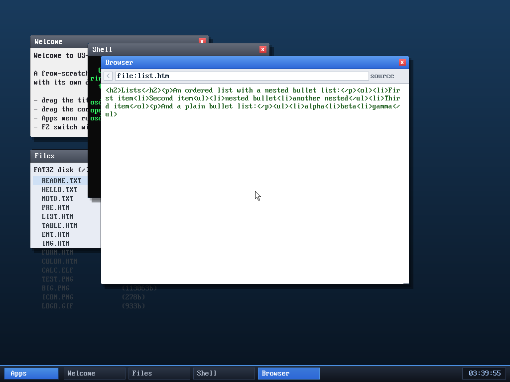

# Milestone 100 — view source

**Goal:** let you inspect a page's raw HTML — press `u` to toggle between the
rendered page and its source. A small, genuinely handy feature for a
from-scratch browser (and nice for debugging the renderer).

## How it works

- A `viewsource` flag on the browser, toggled by the **`u`** key (ignored while
  an image is shown), reset to off whenever a new page loads.
- The render path gains a branch: in view-source mode it draws `b->raw[0..rawlen]`
  as wrapped monospace text (tabs → space, non-printables → `.`), in a distinct
  green, with the normal scroll/scrollbar. `rawlen` is the loaded byte count
  (the HTTP response for `http:`, or the file for `file:`), so for a web page you
  even see the response headers.

## Verified (headless, by screenshot)

`browse file:list.htm` then `u` shows the page's raw markup —
`<h2>Lists</h2>
An ordered list…
<ol><li>First item…` — in green, with the
status line reading "source". Pressing `u` again returns to the rendered view;
navigating to a new page resets to rendered. No panics.

## Files
- `kernel/browser.c` — `viewsource` flag, the `u` key, and the source-render
  branch
