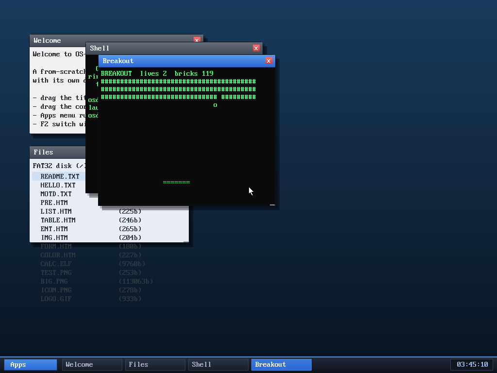

# Milestone 101 — Breakout

**Goal:** a ninth userspace program — Breakout — a real-time ball-and-paddle
arcade game.

## What it is

`user/breakout.c`: a paddle along the bottom (←/→), a ball that steps one cell
per tick with ±1 velocity on each axis, and three rows of bricks. The ball
bounces off the side/top walls, off the paddle (with a slight angle nudge near
the edges), and off bricks — each brick hit removes it and reverses the ball.
Miss the ball past the paddle and you lose a life (3 total); clear every brick
to win. Non-blocking input like the other games; **q** quits, any key replays
after win/lose.

## Verified (headless, by screenshot)

`run breakout` (or Apps → Breakout) shows the three brick rows, the ball, and the
paddle; the ball bounces and **breaks bricks** (the screenshot shows a gap in the
rows and the brick count down to 119), and the life counter tracks misses. No
panics.

## Files
- `user/breakout.c` — the game
- `Makefile`, `kernel/asm/user_blob.asm`, `kernel/app.c`, `kernel/desktop.c` —
  the four registration points

OS-DEV now has **nine** userspace programs (a shell, a clock, a calculator, a
text editor, and five games — Snake, 2048, Life, Tetris, Breakout).
