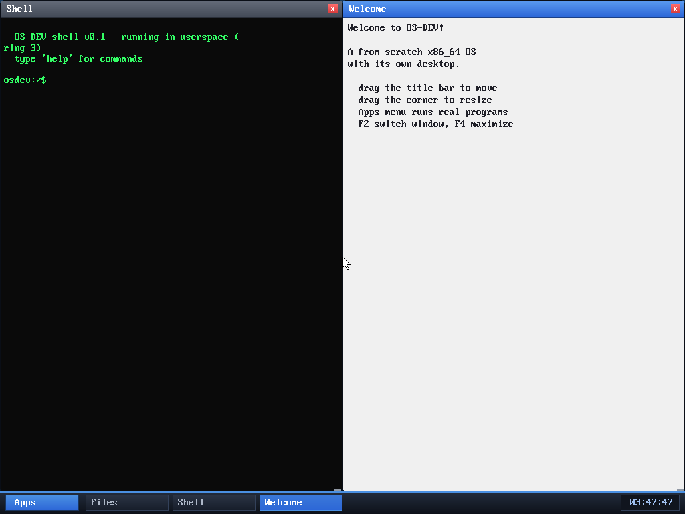

# Milestone 102 — window tiling (F5/F6)

**Goal:** the third core keyboard window operation after focus-cycle (F2) and
maximize (F4) — **snap the focused window to the left or right half** of the
screen, so two windows can sit side by side.

## How it works

`kernel/keyboard.c` maps **F5** (`0x3F`) and **F6** (`0x40`) to control codes
`0x10`/`0x17`, which the WM intercepts before routing to apps (like F2/F4).
`snap_window(idx, rightside)` reuses the maximize machinery: it saves the
window's original geometry (the first time, exactly as `toggle_maximize` does),
then sets it to `(0, 0, screen_w/2, screen_h-taskbar)` or the right half, and
marks it `maximized` — so **F4 or a drag restores** the original size, and the
drag-clears-maximized fix from milestone 83 applies unchanged.

## Verified (headless, by screenshot)

Boot focuses the Shell. **F5** snaps it to the left half; **F2** moves focus to
the Welcome window; **F6** snaps that to the right half. The result is the two
windows tiled cleanly side by side, each filling its half above the taskbar —
no panics.

## Files
- `kernel/keyboard.c` — F5/F6 → `0x10`/`0x17`
- `kernel/desktop.c` — `snap_window`, the F5/F6 intercept, and the Welcome hint

The WM now has the full set of keyboard window controls: **F2** cycle focus,
**F4** maximize/restore, **F5/F6** tile left/right.
