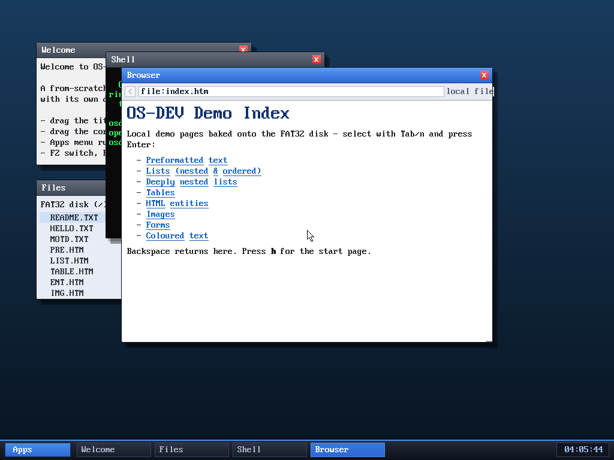
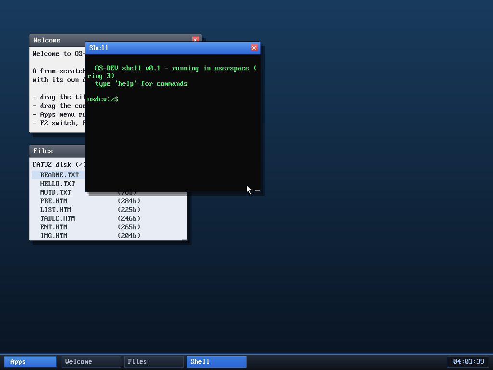

# Milestone 104 — multi-cluster root directory (lift the 16-file disk cap)

**Goal:** the on-disk root directory was a *single* FAT32 cluster — 512 bytes /
32 bytes per entry = **16 files maximum**, and we were sitting at 15. Rather than
ship a disk that couldn't grow, give the root directory a proper multi-cluster
chain so it holds as many files as we like. Then actually use the new headroom.

## The change is host-side only

The kernel's directory reader already did the right thing: `walk_dir` follows the
**FAT cluster chain** (`while (cl < EOC) … cl = fat_step(cl)`) and stops at the
`0x00` end-of-directory marker — so it reads a root that spans any number of
clusters with no change. `add_entry` (used when the OS *writes* a file) walks the
same chain. The only thing capping us at 16 was the image **builder**.

In `tools/mkfatfs.c`:
- The root directory now spans `rootcl = files/16 + 1` clusters, chained in the
  FAT (`fat[2] → 3 → … → EOC`). The `+1` guarantees at least one trailing zeroed
  slot, so the `0x00` end-of-directory marker always exists regardless of count.
- File data now starts at cluster `2 + rootcl` (after the root clusters) instead
  of a hard-coded cluster 3.
- Each directory entry is placed in its correct root cluster:
  `de = data_start·SECTOR + (i/16)·SPC·SECTOR + (i%16)·32`.
- The entry array and host-file cap grew from 16 to 64.

## New content using the headroom (now 18 files)

- **INDEX.HTM** — a local "table of contents" page that links (via `file:`) to
  every demo page. A genuine portal: Tab/n to a link, Enter to open, Backspace
  back, `h` for the start page.
- **NESTED.HTM** — a deeply nested ordered/unordered list to exercise the
  list-depth/numbering renderer.
- **GUIDE.TXT** — a concise on-disk usage guide (desktop keys, browser keys,
  shell commands).

## Files-window scrolling (it had been overflowing)

With more than ~8 files the Files window's list used to draw *past the window's
bottom edge onto the desktop* (visible in older screenshots). The `KIND_FILES`
renderer now computes how many rows fit (`(h - titlebar - 30)/18`) and scrolls so
the **selected row stays visible**, clipping the list to the window body. The
listing buffers in the shell `ls`, the boot log, and the Files app were bumped
from 16 to 32 entries so nothing is silently truncated.

## Verified

- **Serial boot log:** `/ contains 18 file(s)` and every one is listed —
  including `ICON.PNG` and `LOGO.GIF`, which are entries 16–17 and therefore live
  in the **second** root cluster. README.TXT's contents still read correctly,
  proving the file-data area shifted to the right place.
- **Live GUI:** the shell's `browse file:index.htm` loads and renders the new
  index page (heading, decoded `&mdash;`/`&amp;` entities, eight `file:` links) —
  a file read from the enlarged disk. No panics.
- The Files window now clips its list to the frame instead of spilling onto the
  desktop.

## Review

A read-only review subagent checked the cluster-offset math, the end-marker
guarantee (`ne/16 + 1` is exactly what keeps a trailing `0x00` entry even when
the file count is a multiple of 16), the file/root overlap, and the Files-window
scroll/clip and `line[48]` bounds — all correct, no CRITICAL/HIGH/MEDIUM bugs.
Its one LOW note — `mkfatfs` had no *volume-capacity* guard, so baked content
exceeding the 4 MiB image would silently overflow the FAT/image — was fixed:
the builder now errors out cleanly if the root directory or any file would run
past the last data cluster.

## Files
- `tools/mkfatfs.c` — multi-cluster root chain, entry placement, larger arrays,
  capacity guard, three new files
- `kernel/desktop.c` — Files-window scroll/clip; 32-entry listing buffers
- `kernel/term.c`, `kernel/kmain.c` — 32-entry listing buffers
