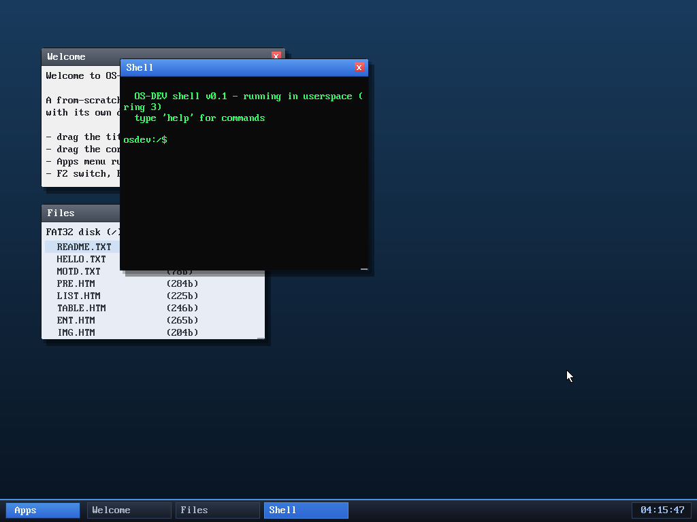

# Milestone 105 — compositor blit optimizations

**Goal:** make screen updates cheap. Two related wins, both serving the "keep
the OS lightweight" goal: (1) the partial cursor-rect blit that milestone 52
explicitly left for later, and (2) replacing the per-element framebuffer-copy
loop with `memcpy`.

## Part 1 — partial cursor-rect blit

This is the optimization milestone 52 explicitly left for later ("Future opt:
partial cursor-rect blit instead of full memcpy/blit").

## The problem

The double-buffered compositor (M52) splits drawing into `render_scene()`
(expensive — wallpaper + windows + taskbar into a cached `scenebuf`, only on a
real change) and `present_frame()` (the cheap per-frame path). But "cheap" still
did **two full-screen passes on every frame the cursor moved**:

1. `memcpy(backbuffer, scenebuf, screen_w*screen_h*4)` — ~786 K pixels (~3 MB),
   to wipe the old cursor and restore the scene underneath it, then
2. `fb_present()` — another ~786 K-pixel copy of the whole back buffer to the
   live framebuffer.

So just waving the mouse cost ~6 MB of memory traffic **per motion event**, even
though only a 12×19 cursor actually changed.

## The fix

A cursor-only update now repairs just the rectangles that changed:

- `fb_present_rect(x, y, w, h)` (kernel/fb.c) — flush a single clipped rectangle
  from the back buffer to the screen, instead of the whole framebuffer.
- `restore_scene_rect(x, y, w, h)` (kernel/desktop.c) — copy one clipped
  rectangle from `scenebuf` back into `backbuffer` (erasing the old cursor).
- `present_cursor()` (kernel/desktop.c) — when the scene didn't change and only
  the pointer moved: restore the **old** cursor rectangle from the scene cache,
  draw the cursor at its **new** spot, and `fb_present_rect` *only* those two
  small rectangles. It tracks the last painted position (`cur_px`/`cur_py`);
  `present_frame()` keeps that in sync after every full redraw, and the first
  frame (or any scene change) still takes the full path.
- The main loop now does `if (dirty) { render_scene(); present_frame(); } else
  if (moved) present_cursor();`. Dragging/resizing already set `dirty`, so those
  correctly keep the full-scene path; only pure pointer motion takes the fast
  path.
- `mouse_cursor_w()`/`mouse_cursor_h()` expose the cursor bitmap size so the
  compositor flushes exactly the right rectangle.

Per motion event the work drops from ~1.57 M pixel-copies to under a thousand —
on the order of a **1700× reduction** — with no change to what's on screen.

## Verified (headless, by screenshot)

Booted with the PS/2 mouse and swept the cursor across the screen with six
relative `mouse_move` hops, then screenshotted. The result shows **exactly one
cursor at the final position with no trails** (a broken old-rect repair would
leave a ghost cursor at each hop), and the windows/taskbar render perfectly. No
panics. Rectangle clipping handles the cursor straddling a screen edge.

## Part 2 — memcpy the framebuffer instead of looping

`lfb` (the live framebuffer pointer) is `volatile`, so `fb_present`'s old body —
`for (i…) lfb[i] = target[i];` over ~786 K elements — could **not** be
vectorised by the compiler: it emitted ~786 K individual volatile stores. And it
runs on *every* scene change: dragging a window, every keystroke that redraws an
app, the clock ticking each second. A framebuffer blit is exactly what `memcpy`
is for, so `fb_present` (whole screen) and `fb_present_rect` (per row) now use
`memcpy` (casting away the `volatile` only for the bulk copy — the stores are
always needed, so there's nothing for the compiler to elide). `memcpy` is the
kernel's optimised `rep`/word-at-a-time copy, several times faster than the
volatile element loop.

Verified the same boot screenshot renders identically (wallpaper, three windows,
taskbar, clock, cursor) with no corruption and no panics.

## Review

A read-only review subagent checked both blit changes (cursor-cache coherence,
rect clipping at every screen edge, the dropped-`volatile` `memcpy`, and the
dirty-vs-moved routing). It found **one MEDIUM bug**: `present_cursor()` sampled
`mouse_x()/mouse_y()` *several times*, so on the **PS/2** pointer — which an IRQ
updates asynchronously — a packet arriving mid-frame could make the painted
position, the flushed rectangle, and the cached `cur_px/cur_py` disagree, leaving
a cursor trail. (The default USB tablet updates synchronously, so it was
unaffected.) Fixed by sampling the position **once** per present and threading
that single snapshot through paint, flush, and cache — via a new
`mouse_paint_at(x, y)`. Re-verified with the PS/2 cursor sweep: still one clean
cursor, no trails. All other items were confirmed correct.

## Files
- `kernel/fb.c`, `kernel/include/fb.h` — `fb_present_rect`; `fb_present` and
  `fb_present_rect` now `memcpy`
- `kernel/mouse.c`, `kernel/include/mouse.h` — `mouse_paint_at(x,y)` (snapshot fix)
- `kernel/mouse.c`, `kernel/include/mouse.h` — `mouse_cursor_w/h`
- `kernel/desktop.c` — `restore_scene_rect`, `present_cursor`, `cur_px/cur_py`,
  and the fast-path branch in the main loop
