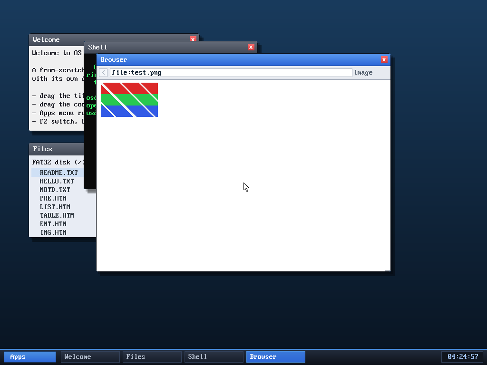

# Milestone 106 — word-at-a-time `memcpy` / `memset`

**Goal:** the kernel's `memcpy`/`memset` were byte-at-a-time (the source even
said "byte-at-a-time ... fine for now"). These are the hottest primitives in the
system, so making them copy a machine word at a time is a broad, high-leverage
win — exactly the "optimize / keep it lightweight" goal.

## Why it matters here specifically

The previous milestone made the compositor blit the whole ~3 MB framebuffer
through `memcpy` on every scene change. With a *byte* `memcpy` that's ~3.1
million single-byte stores — actually **worse** than the old 32-bit element
loop. The two milestones are a pair: M106 is what makes M105's `memcpy` flush an
actual speedup rather than a regression. Beyond the compositor, every
`memcpy`/`memset` benefits — the PNG/GIF decoders (scanline filters, palette
expansion), FAT32 sector I/O, and the struct copies GCC emits on its own.

## The implementation

`memcpy` and `memset` now have a **word (8-byte) fast path** with byte fallback:

- Align the destination to 8 bytes with a short byte loop, copy the bulk 8 bytes
  at a time through a `uint64_t`, then finish the tail with bytes.
- `memcpy` only takes the word path when source and destination share their low
  three address bits (`((d ^ s) & 7) == 0`); otherwise no single alignment works
  for both, so it falls back to bytes.
- The word accesses go through a `typedef uint64_t __attribute__((may_alias))`
  so they stay strict-aliasing-correct under `-O2`.
- The 8-byte unit is a **general-purpose** 64-bit register move, so it's
  compatible with the kernel's `-mgeneral-regs-only` (no SSE, which the kernel
  can't use without saving vector state).

`memmove`/`memcmp`/`strlen` are unchanged.

## Verified

- **Host unit test (`/tmp/memtest.c`):** my `memcpy`/`memset` compared against
  the system implementations across **every size 0–300 × every src/dst alignment
  0–15 (including unequal alignments that force the byte fallback) × four
  `memset` fill values**, plus one 3 MB framebuffer-sized aligned copy —
  **96,321 cases, zero mismatches.**
- **In-kernel:** boots clean; FAT32 mounts and lists all 18 files (sector I/O
  uses these); the desktop composites correctly (the blit path); and
  `browse file:test.png` decodes + blits the palette PNG to clean red/green/blue
  stripes (the decoders use these heavily). No panics in any test.

## Review

A read-only review subagent checked this against everything the host fuzz test
could not: strict-aliasing safety of the `may_alias` word accesses under `-O2`,
whether the compiler could be forced to emit forbidden vector instructions
(no — `-mgeneral-regs-only` constrains codegen to general registers, and the unit
is a scalar `uint64_t`), the byte-replication for all eight `memset` lanes, and
that `memmove` still handles overlap independently. **No bugs found** — all items
confirmed correct.

## Files
- `kernel/lib/string.c` — word-at-a-time `memcpy` and `memset`
