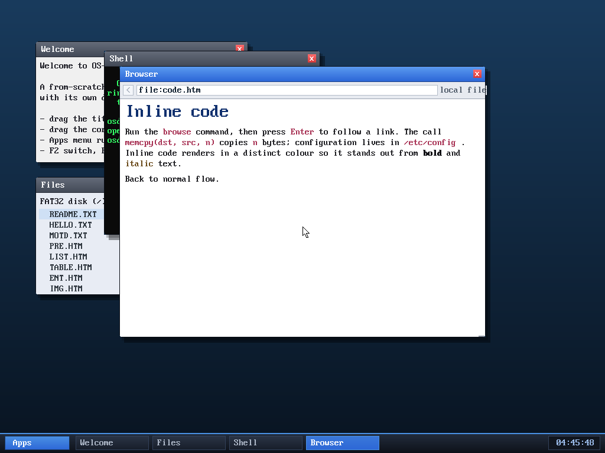

# Milestone 110 — inline `<code>` / `<tt>` / `<kbd>` / `<samp>`

**Goal:** real web pages constantly use inline code spans (`<code>`, `<tt>`,
`<kbd>`, `<samp>`); the browser ignored them, so they rendered as plain text and
got lost in the prose. Give them a distinct look.

## What changed

The font is a single fixed-width face (everything is already monospace), so a
code span can't be set apart by *typeface* — but it can by **colour**. A new
`STY_CODE` style renders inline code in crimson (`0xA83254`):

- `kernel/browser.c` — `STY_CODE` added to the style enum and `color_for`;
  `handle_tag` now treats `<code>`/`<tt>`/`<kbd>`/`<samp>` exactly like the
  `<b>`/`<i>` toggles (set the style on open, clear it on close, nesting-safe).
- `tools/mkfatfs.c` — a new **`CODE.HTM`** demo page (and a link to it from the
  index), now that the multi-cluster root (milestone 104) lets the disk hold
  more than 16 files — it's the 19th.

(Heading tiers were deliberately left alone: `<h1>`/`<h2>` are both the large
style and `<h3>`–`<h6>` the medium one. Splitting them finer would have shrunk
the `<h2>` section titles in the existing demo pages — a regression, not a win.)

## Verified

`browse file:code.htm` renders the new page: `browse`, `memcpy(dst, src, n)`,
`/etc/config`, the `<kbd>Enter</kbd>` and `<samp>n</samp>` spans all appear in
crimson, clearly distinct from black **bold**, brown *italic*, and normal body
text. The boot log shows the disk now holds 19 files. No panics.

## Files
- `kernel/browser.c` — `STY_CODE` + `<code>/<tt>/<kbd>/<samp>` handling
- `tools/mkfatfs.c` — `CODE.HTM` demo page + index link
