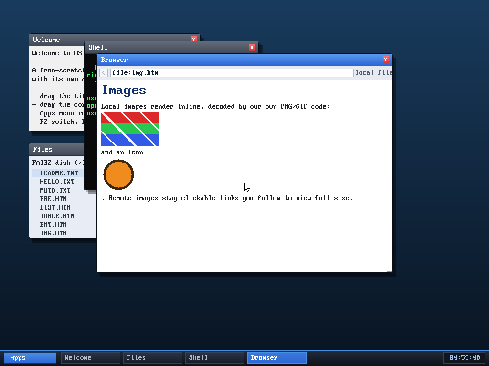

# Milestone 111 — inline images in the browser (local pages)

**Goal:** the big one. The browser already had from-scratch PNG and GIF decoders
(milestones 90–98), but an `` only ever became a clickable `[alt]` link you
followed to a full-page image view. Now a **local** image renders **inline, in
the text flow**, where it appears on the page — the highest-value browser
feature that was still outstanding.

## How it works

For an ``, the parser reads the file off the FAT32 disk and
decodes it (PNG or GIF) into one of up to **6 per-page image slots**; it then
emits a new **`TK_IMG`** token whose slot index travels in the token's `link`
field. The render loop blits that slot's RGBA inline — scaled to the content
width, height-capped at 360 px, alpha-blended over white (so the icon's
transparent corners read correctly). Remote (`http:`) images keep the old
clickable-link behaviour, because a synchronous fetch would freeze the WM.

Key pieces, all in `kernel/browser.c`:

- **`decode_image(data, len, &ow, &oh)`** — factored out of `try_image` (the
  full-page viewer): the signature check, dimension bounds (`≤2048`, area
  `≤1 M px`), scratch sizing, decode, and scratch-free, returning a kmalloc'd
  RGBA buffer or NULL. `try_image` now calls it too, so both paths share one
  audited decoder.
- **`decode_local_to_slot(b, path)`** — reads the file into a 128 KB scratch,
  decodes via `decode_image`, stores the result in `b->imgs[b->nimg++]`.
- **`` handler** — for a `file:` src, tries `decode_local_to_slot`; on
  success emits `TK_IMG` (between two breaks, so the image sits on its own line);
  otherwise falls back to the clickable link.
- **`TK_IMG` render case** — bounded blit with per-pixel clip to the content area
  and nearest-neighbour scaling; the image's height extends `content_h` so the
  scrollbar accounts for it.
- **Lifecycle** — `drop_image_slots(b)` frees the slots and is called from
  `parse_html`, `parse_text`, and `try_image` (every page transition) plus
  `free_buffers` (destroy / async-close); the struct is `kzalloc`'d so the slots
  start NULL.

## Verified

- `browse file:img.htm` renders **two images inline**: the palette test PNG
  (red/green/blue stripes) and the transparent icon PNG (an orange circle whose
  transparent corners correctly blend to white), each on its own line between the
  surrounding text. No panics.
- **Reloaded the page twice** (`r`) — each reload frees the old slots and
  re-decodes — and navigated away and back: no panics, no corruption, no leak
  across the slot free/re-decode cycle.

## Review

A read-only review subagent audited the feature for the things that matter in
kernel code: the `decode_image` refactor (bounds/scratch/free preserved — no
regression), slot bounds and the near-full-token edge, the blit (no OOB source
read or framebuffer write, division guarded), struct zero-init (`kzalloc` —
confirmed), and concurrency with the async fetch worker (the worker never
touches the image arrays). **Verdict: memory-safe — no OOB, double-free, UAF, or
div-by-zero.** It flagged two MEDIUM *memory-waste* (not crash) items — `parse_text`
and `try_image` didn't drop the slots on transition — both now fixed and
re-verified.

## Files
- `kernel/browser.c` — `decode_image`/`decode_local_to_slot`/`drop_image_slots`,
  `TK_IMG` token + render, `` inline path, slot lifecycle
- `tools/mkfatfs.c` — `IMG.HTM` text updated to describe inline rendering
