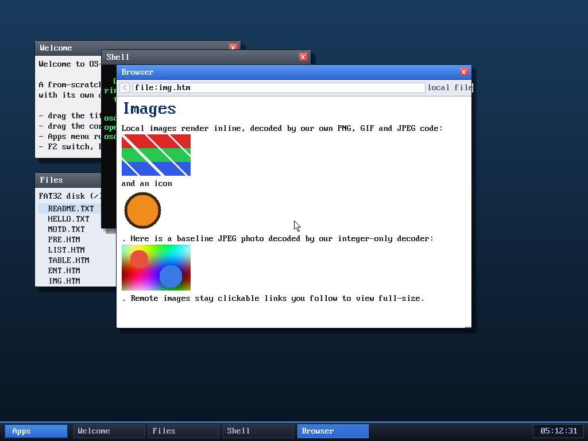

# Milestone 112 — a from-scratch baseline JPEG decoder

**Goal:** the one common image format the browser still couldn't show. After
PNG and GIF, **JPEG** is the obvious gap — and the hardest, because it needs
Huffman entropy decoding, dequantization, an inverse DCT, and chroma
upsampling. This adds a from-scratch **baseline (sequential DCT) JPEG decoder**
and wires it into the browser, so JPEGs now render — full-page and inline —
right next to PNG and GIF.

## The decoder (`kernel/jpeg.c`)

Baseline JPEG, 8-bit, SOF0/SOF1, Huffman, with the full pipeline:

- **Markers** — SOI/APPn/DQT/SOF0/DHT/DRI/SOS/EOI; quantization tables, Huffman
  tables, frame geometry, and per-component sampling factors.
- **Entropy decode** — a bit reader that handles `FF00` byte-stuffing and
  restart (`RSTn`) markers, canonical Huffman decode, DC difference coding and
  AC run/size coding into an 8×8 coefficient block (zig-zag order).
- **Dequantize → inverse DCT** — the well-known Loeffler integer IDCT.
- **Colour** — YCbCr→RGB with fixed-point coefficients, box chroma upsampling
  for 4:2:0 / 4:2:2 (and 4:4:4 / grayscale), assembled MCU by MCU into RGBA.

### Integer-only — because the kernel has no FPU

The kernel builds with `-mgeneral-regs-only` (no SSE, and it never saves FPU
state), so **everything is integer fixed-point** — the IDCT, the YCbCr matrix,
the upsampling. No `float` appears anywhere. `jpeg_probe` peeks the dimensions
and computes the exact scratch size so the browser can size its buffers without
decoding twice; `jpeg_decode` writes RGBA into caller-provided buffers (no
allocation inside).

## Verified — host-tested, fuzzed, and reviewed

- **Correctness vs libjpeg:** decoded against `djpeg -nosmooth` references for
  **4:4:4, 4:2:2, 4:2:0, and grayscale** — every case within **maxerr ≤ 3** (pure
  integer-IDCT rounding; average error ~0.5). (The decoder uses box chroma
  upsampling; PIL/libjpeg's default *fancy* upsampling differs only at sharp
  colour edges, which is why the reference is the `-nosmooth` output.)
- **Fuzzed:** ~22,500 truncated + randomly-corrupted inputs under
  **ASan + UBSan + signed-integer-overflow** — zero crashes, zero UB.
- **In the OS:** `browse file:photo.jpg` renders a baseline 4:2:0 photo, and the
  images demo page now shows a PNG, a transparent PNG, **and a JPEG** all inline.
  No panics.

### Review (review subagent)

A read-only review found, beyond what the fuzzer reached:

- **CRITICAL** — signed-integer overflow in the dequant/IDCT path: an adversarial
  stream pairing maximal coefficients with a maximal quantization table overflows
  32-bit `int` (undefined behaviour). **Fixed** by doing the DC predictor,
  dequant products, and IDCT intermediates in **64-bit**, and clamping the DC
  predictor to a sane range.
- **MEDIUM** — the marker parsers validated the segment length but not each
  individual read, so a too-small declared length could read past the segment
  (an OOB read in-kernel). **Fixed** with per-read bounds checks in
  `parse_dqt/parse_sof/parse_dht/parse_sos`.
- **LOW** — a second `SOF` is now rejected, keeping `jpeg_probe`/`jpeg_decode`
  dimensions in lockstep.
- Plus: left-shifts of (signed, possibly negative) DCT coefficients — UB per the
  C standard — were rewritten as multiplications. The decoder is now clean under
  UBSan's signed-overflow checks.

All other checked items (AC index bounds, restart-marker scan, chroma indices,
bit-reader termination, probe/decode size agreement) were confirmed correct.

## Files
- `kernel/jpeg.c`, `kernel/include/jpeg.h` — the decoder + `jpeg_probe`
- `kernel/browser.c` — `decode_image` dispatches JPEG (so both inline and
  full-page image paths gain JPEG for free)
- `tools/mkfatfs.c`, `tools/photo.jpg` — a baseline JPEG fixture on the disk,
  shown on the images demo page
