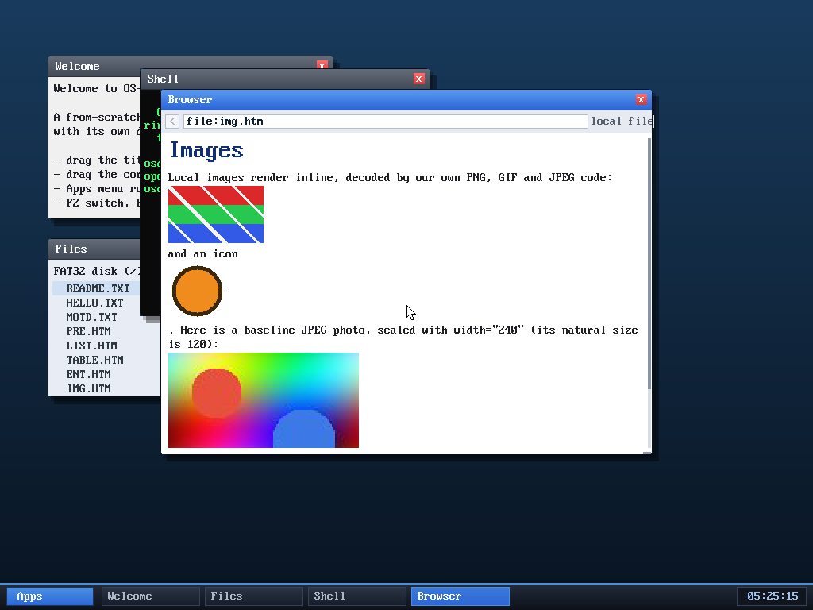

# Milestone 113 — `` for inline images

**Goal:** finish the inline-image layout story (milestone 111). Real pages
almost always state an image's display size with `width`/`height` attributes;
honouring them lets a page scale an image up or down rather than always drawing
it at its natural pixel size.

## How it works

- A small `attr_int(attrs, "width")` helper parses a numeric attribute (ignoring
  any trailing units), capped at 8192.
- The `` handler stores the requested width and height in the `TK_IMG`
  token's spare `off`/`len` fields (0 = unspecified).
- The render path picks the destination size:
  - both given → use them;
  - only one given → derive the other from the image's aspect ratio;
  - neither → natural size (as before).
  Then the existing clamps apply (fit to the content width, cap the height), so
  an oversized value can never overflow the viewport.

## Verified

The images demo page now sets `width="240"` on the JPEG photo (natural size
120px): it renders at twice the width, height scaled proportionally, clearly
larger than the PNGs above it — while the un-sized PNGs still render at their
natural size. No panics.

## Files
- `kernel/browser.c` — `attr_int`, width/height on the `TK_IMG` token, and the
  aspect-aware sizing in the render path
- `tools/mkfatfs.c` — the demo page sets a `width` on the JPEG
