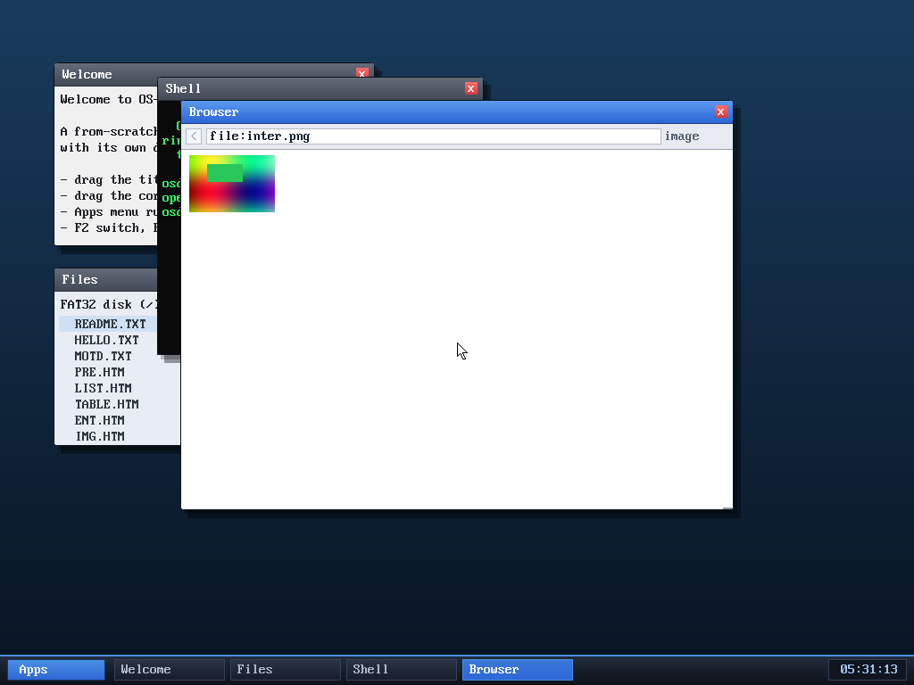

# Milestone 114 — Adam7 interlaced PNG

**Goal:** close the last gap in PNG support. The decoder handled all the 8-bit
colour types but **rejected interlaced PNGs** outright (`interlace != 0 → error`),
so an interlaced image failed to load entirely. This adds **Adam7
de-interlacing**, so those PNGs now decode too.

## How Adam7 works (and how we decode it)

An interlaced PNG isn't one image — it's **seven reduced-resolution passes**,
each a sub-grid of the pixels at a fixed (x,y) origin and (x,y) step. Pass 1 is
every 8th pixel in both directions; later passes fill in the gaps; pass 7 is the
remaining odd rows. Each pass is filtered **independently** (its own scanlines,
its own previous-row state).

The decoder now:

- Factors the per-scanline filter reversal into `recon_filters(base, rows,
  rowbytes, bpp)` and the pixel→RGBA conversion into `expand_px(...)`, so the
  plain and interlaced paths share exactly the same, already-tested logic.
- For a non-interlaced image, runs them once over `height` rows (as before).
- For an interlaced image, computes each pass's width/height
  (`pw = ceil((W - xorig)/xstep)`, likewise `ph`), sums them for the inflate
  size, then for each non-empty pass reconstructs its filters and **scatters**
  its pixels to their grid positions: `(xorig + col·xstep, yorig + row·ystep)`.
  The seven passes together cover every pixel exactly once.

## Verified — host-tested, regression-checked, fuzzed, in-OS

- **Byte-exact:** I wrote a tiny Adam7 PNG encoder (Pillow can't *write*
  interlaced PNGs), confirmed Pillow reads it back to the original, then decoded
  it with our `png_decode` — **0 mismatched bytes** for both interlaced
  truecolour and interlaced grayscale (PNG is lossless, so it must be exact).
- **No regression:** the existing non-interlaced fixtures (`test.png`,
  `icon.png`, `big.png`) still decode correctly through the refactored path.
- **Fuzzed:** ~22,800 truncated + corrupted interlaced inputs under ASan+UBSan —
  zero crashes.
- **In the OS:** `browse file:inter.png` renders an interlaced truecolour PNG
  (gradient + a green block) correctly. No panics.

PNG support is now complete for the 8-bit color types, interlaced and
non-interlaced alike.

## Files
- `kernel/png.c` — `recon_filters`/`expand_px` helpers, the Adam7 pass tables,
  and the interlace-aware decode path
- `tools/mkfatfs.c`, `tools/inter.png` — an interlaced PNG fixture on the disk
