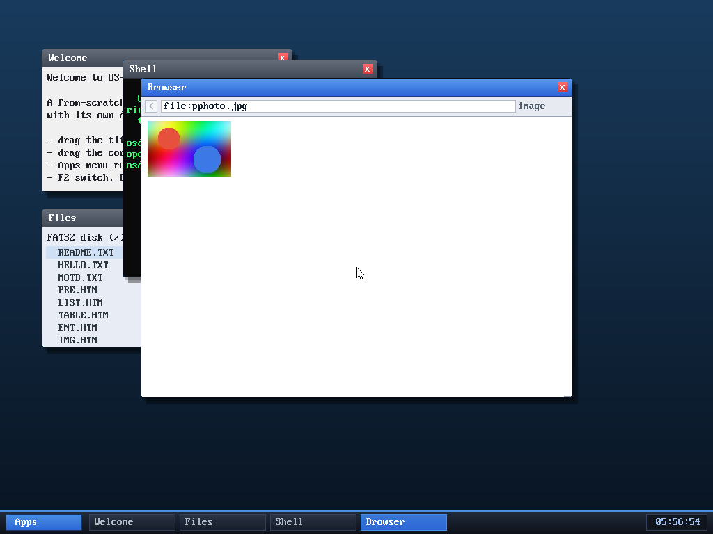

# Milestone 116 — progressive JPEG

**Goal:** finish JPEG. Milestone 112 added a baseline decoder; this adds
**progressive (SOF2)** support — the multi-scan encoding a large fraction of web
photos use. It's the most intricate codec feature in the OS: the image is
transmitted as several passes that each refine the coefficients, including the
notoriously fiddly **AC successive-approximation refinement** scan.

## How progressive differs from baseline

A baseline JPEG decodes block-by-block straight to pixels. A progressive JPEG
sends **multiple scans**, each carrying only part of each block's coefficients:

- **DC scans** — a *first* scan (the high bits of every block's DC) then
  *refinement* scans (one more bit each), interleaved across components.
- **AC scans** — one component at a time, over a **spectral band** `[Ss,Se]`,
  with a *first* scan (new coefficients, shifted by the approximation bit `Al`,
  with end-of-band run-length coding) and *refinement* scans (a correction bit
  for each already-nonzero coefficient, plus newly-significant ones).

So the decoder now buffers the **full coefficient set** for every block, applies
each scan's contribution into that buffer (`decode_scan_prog` → `prog_dc` /
`prog_ac`), and only after the final scan does one **dequantize + inverse-DCT**
pass into the sample planes. The scan loop also tracks two block grids per
component: the MCU-padded `bx×by` (interleaved DC scans, final IDCT) and the
real-image `wbx×wby` (non-interleaved AC scans). Baseline keeps its original
straight-to-pixels path; the magic-byte dispatch in the browser already routes
both, so progressive JPEGs render with no browser change.

It's all **integer fixed-point** (the kernel has no FPU), reusing milestone
112's Loeffler IDCT and YCbCr conversion.

## Verified — host-tested, fuzzed, reviewed, in-OS

- **Correct vs libjpeg/PIL:** a 10-scan progressive 4:4:4 image (DC first+refine,
  AC first, AC refine on all components) decodes to **maxerr ≤ 3** vs PIL;
  progressive 4:2:0 and a larger photo decode to **maxerr ≤ 4** vs the box
  reference (`djpeg -nosmooth`) — pure integer-IDCT rounding.
- **Fuzzed:** ~30 K+ truncated + corrupted progressive inputs under
  **ASan + UBSan + signed-integer-overflow** — zero crashes, zero UB.
- **In the OS:** `browse file:pphoto.jpg` renders a progressive 4:2:0 photo. No
  panics.

### Review (review subagent)

A read-only review verified the things that matter for intricate untrusted-input
kernel code: **no coefficient-buffer OOB for any dimension/sampling** (proved
`wbx≤bx`, `wby≤by` for all W,H ≤ 4096), the `jpeg_probe`/`setup_coef` scratch
sizes are **algebraically identical** (no under-allocation), the **AC-refinement
loop terminates and indexes in range**, the entropy-skip-to-marker is bounded,
and there's no remaining signed-shift UB. **Verdict: no memory-safety bug, no
scratch mismatch, no unbounded loop.** Its three LOW findings were all
hardened: clamp the progressive DC predictor (matching baseline), and reject
out-of-spec `Ah/Al` and inconsistent scan bands.

## Files
- `kernel/jpeg.c` — `prog_dc`/`prog_ac`/`decode_scan_prog`/`setup_coef`/
  `setup_dims`, the progressive branch of `jpeg_decode`, and `jpeg_probe`
  scratch sizing for SOF2
- `tools/mkfatfs.c`, `tools/pphoto.jpg` — a progressive JPEG fixture on the disk
