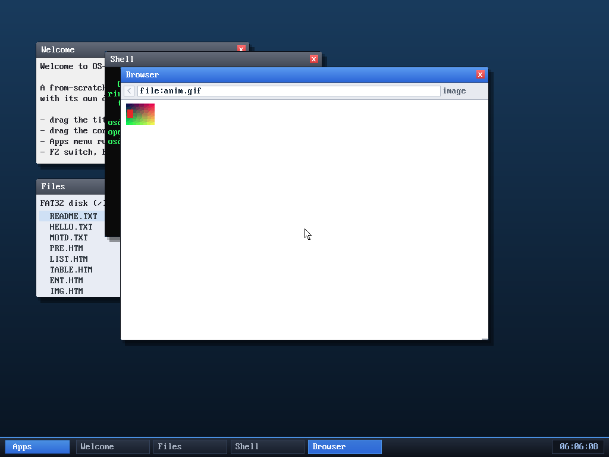

# Milestone 117 — animated GIF

**Goal:** the last image capability. The GIF decoder rendered only the first
frame; this decodes **all** frames and **plays them** in the browser's full-page
image view — a timer-driven animation loop.

## Multi-frame decode (`gif_decode_anim`)

A GIF is a stream of sub-images, each optionally preceded by a Graphic Control
Extension giving a delay, a transparent index, and a disposal method. The new
`gif_decode_anim` composites them onto a **canvas** the size of the logical
screen:

- For each frame it LZW-decodes the sub-image (reusing the existing decoder),
  then draws it onto the canvas at the frame's `(left,top)` — skipping
  transparent pixels so earlier content shows through.
- Between frames it applies the previous frame's **disposal**: *leave* (0/1) or
  *restore-to-background* (2, clears that frame's rectangle to transparent).
- It snapshots the canvas as each frame into the output buffer and records each
  delay (centiseconds). Frame count and total memory are bounded.

The original first-frame `gif_decode` stays for inline images; full-page GIF
viewing uses the animated path.

## Browser playback

`browser_t` gained `framebuf` (all frames), `nframes`, `framedelay[]`,
`curframe`, `frametick`. `try_image` decodes a full-page GIF with
`gif_decode_anim` and points `b->img` at the current frame. `browser_poll` —
already called every WM iteration — advances to the next frame once its delay
has elapsed (the PIT runs at 100 Hz, so one tick is one centisecond; delays of 0
are clamped to ~100 ms as browsers do) and asks for a redraw. Lifetime is
handled in `drop_image`/`free_buffers` (the frame buffer owns the memory;
`b->img` just points into it).

## Verified — host-tested, fuzzed, in-OS

- **Byte-exact decode:** a 6-frame animated GIF decoded with `gif_decode_anim`
  matches Pillow's per-frame output **exactly** (maxerr 0 on every frame — GIF is
  lossless), with the correct per-frame delays.
- **Fuzzed:** ~15 K truncated + corrupted inputs under ASan+UBSan — zero crashes.
- **In the OS:** `browse file:anim.gif` plays the animation — three screenshots
  taken ~0.3 s apart differ substantially in the image region (~80 K pixel-delta
  each), confirming the frames advance over time. No panics.

The browser now displays **every common web image format** — PNG (incl.
interlaced), GIF (incl. animation), and JPEG (baseline + progressive) — all from
scratch.

## Files
- `kernel/gif.c`, `kernel/include/gif.h` — `gif_decode_anim`
- `kernel/browser.c` — frame storage, the `try_image` animated path, the
  `browser_poll` frame-advance, and frame-buffer lifetime
- `tools/mkfatfs.c`, `tools/anim.gif` — an animated GIF fixture on the disk
