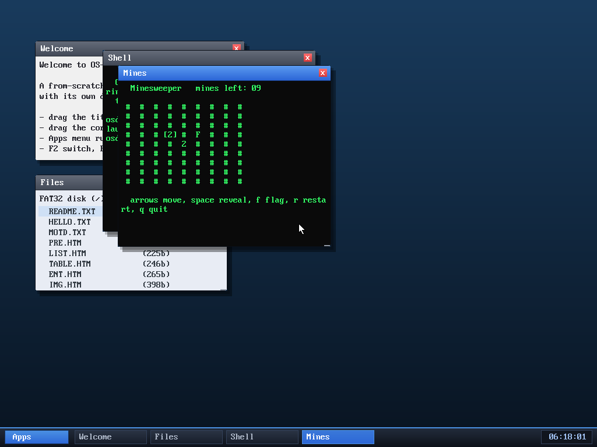

# Milestone 118 — Minesweeper

**Goal:** a sixth game — the classic Minesweeper. Pure userspace (it runs in
ring 3 like the other programs, draws into the app text grid, and reads keys
non-blocking), so it touches no kernel code beyond the four-line registration
every program needs.

## The game

A 9×9 board with 10 mines. A cursor (drawn bracketed, `[#]`) moves with the
arrow keys; **space** reveals a cell, **f** toggles a flag, **r** restarts,
**q** quits. Revealing an empty cell (no adjacent mines) flood-fills its region
open, as expected. Revealing a mine ends the game and shows all mines; clearing
every non-mine cell wins. A "mines left" counter tracks `10 − flags`. The RNG is
seeded from the clock so each game differs.

## Wiring

Adding a userspace program is the established four-edit pattern: the ELF is
built (`Makefile`), embedded via `incbin` (`user_blob.asm`), registered in the
program table (`app.c`), and added to the Apps menu (`desktop.c`). It then runs
from the menu or the shell's `run mines`.

## Verified

`run mines` opens the board; arrow-key movement, `space` reveal (revealed a `2`
and flood-filled), and `f` flag all work (the screenshot shows the cursor on a
revealed `2`, a flag `F`, and "mines left: 09"). No panics.

The OS now hosts **ten userspace programs**, six of them games (Snake, Tetris,
Breakout, 2048, Life, Minesweeper).

## Files
- `user/mines.c` — the game
- `Makefile`, `kernel/asm/user_blob.asm`, `kernel/app.c`, `kernel/desktop.c` —
  registration
