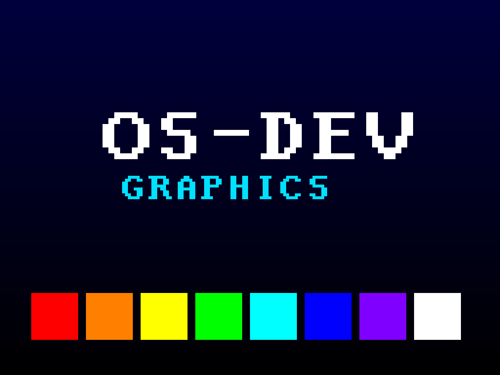

# Milestone 14 — Framebuffer graphics + font

**Goal:** leave the 80×25 text grid behind and draw actual pixels. A linear
framebuffer is the substrate every GUI — and eventually a browser — is built on.



*(Rendered entirely by our own driver: gradient background, an 8-color bar
strip, and text in a hand-built 8×8 font.)*

## Setting a graphics mode (`kernel/fb.c`)

QEMU's standard VGA exposes the **Bochs VBE** interface: write an index to port
`0x1CE` and a value to `0x1CF`. We disable output, set X/Y resolution and 32
bits-per-pixel, then re-enable with the **linear framebuffer** flag. The
framebuffer's physical address is the VGA card's **PCI BAR0** (found via the M12
enumeration); we map it and now `lfb[y * width + x] = 0x00RRGGBB` lights a pixel.

## Drawing

On top of raw pixels we build the usual primitives: `fb_clear`, `fb_pixel`,
`fb_fill_rect`. The splash uses them for a vertical gradient and the color bars.

## A font from scratch

Text on a framebuffer means **rasterizing glyphs yourself**. Our font is an 8×8
bitmap per character: each of 8 bytes is one row, each bit one pixel. `fb_char`
walks the bits and fills a `scale × scale` block for each set bit, so the same
font draws crisp at any size (the title is scale 12, the subtitle scale 6). We
only defined the glyphs the splash needs; a full font would just be a bigger
table.

## Verifying without a screen

Headless runs can't see the display, so the kernel **reads pixels back** from
the framebuffer and prints them over serial:

```
[gfx] readback green bar = 0x00ff00 (expect 0x00ff00)
[gfx] readback white bar = 0xffffff (expect 0xffffff)
```

To capture the image above, we boot under QEMU's monitor and issue `screendump`,
then convert the PPM to PNG. (`make run` shows it live in the window.)

## Files
- `kernel/fb.c`, `kernel/include/fb.h` — mode set, drawing, 8×8 font, splash
- builds on `kernel/pci.c` (find the VGA BAR) and the VMM (map the LFB)

## What this unlocks
A pixel surface + font is the start of a graphical console, a window system,
and ultimately rendering web pages. The immediate nice next step is a
**framebuffer text console** (a full font + scrolling) so *all* kernel and shell
output is visible in graphics mode, not just the splash.
