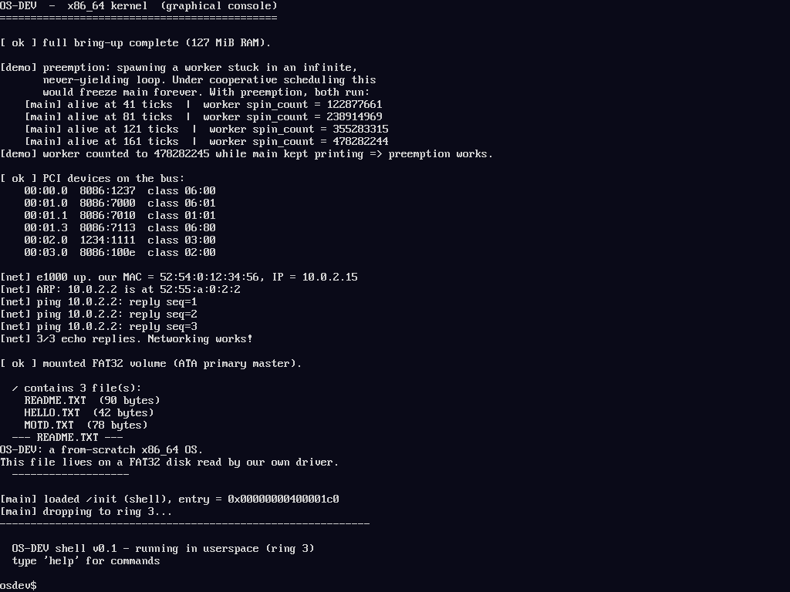

# Milestone 15 — Graphical console + real font

**Goal:** make the whole OS run *in graphics mode*. The framebuffer (M14) could
draw a splash; now it hosts a real scrolling text console with a proper font, so
every kernel message and the shell render graphically. This is the base layer
the desktop sits on.

## A real font, without hand-typing 95 glyphs

A console needs every printable character. Instead of crafting them by hand, we
took a real **PSF bitmap console font** from the host
(`/usr/share/consolefonts/lat1-16.psfu`), parsed it with a small Python script,
and emitted the glyph bitmaps as a C array (`kernel/font.c`, committed so the
build stays self-contained). It's an **8×16** font: 8 bits wide per row, 16 rows
per glyph, MSB = leftmost pixel.

## The console (`kernel/fbcon.c`)

`fbcon` recreates a terminal on raw pixels: a character grid (1024/8 = 128 cols
× 768/16 = 48 rows), a cursor, and per-glyph drawing via `fb_glyph` (which fills
the cell background then paints the set bits). Control characters (`\n \r \b \t`)
behave as expected. **Scrolling** shifts the whole framebuffer up one text line
(`fb_scroll`) and clears the new bottom row.

## Routing output (`kernel/console.c`)

The console gains a graphics flag. Early boot still uses VGA text (the
framebuffer isn't mapped until paging/heap are up); once `fbcon_init` succeeds,
`console_enable_gfx()` flips `console_putc` to draw through `fbcon`. Serial
output continues unconditionally — which is how the headless tests still capture
everything.

## What we proved
The screenshot shows the complete boot sequence — bring-up, the preemption demo,
the PCI listing, the network ARP/ping exchange, the FAT32 file listing and file
contents, and the shell prompt — all rendered by our own font + console on the
framebuffer.

## Note on double buffering
For a text console, drawing glyphs straight to the framebuffer is flicker-free,
so we render directly. **Double buffering** (draw to an off-screen buffer, then
blit) matters when we start *compositing* overlapping windows — so it lands in
M17 with the window manager, where it prevents tearing during redraws.

## Files
- `kernel/font.c` / `font.h` — the 8×16 font (generated from a PSF, committed)
- `kernel/fb.c` — `fb_glyph`, `fb_scroll`, full-font `fb_text`
- `kernel/fbcon.c` — the scrolling text console
- `kernel/console.c` — routes output to the framebuffer when graphics is on
