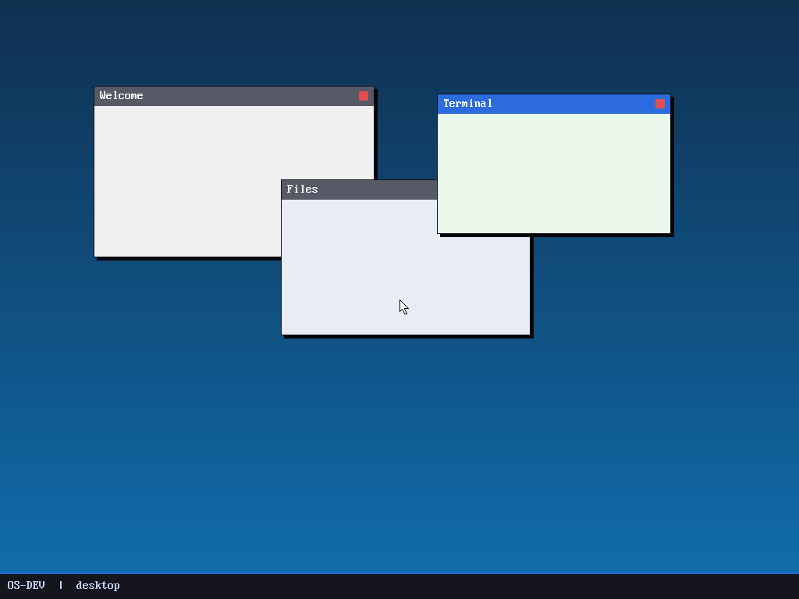
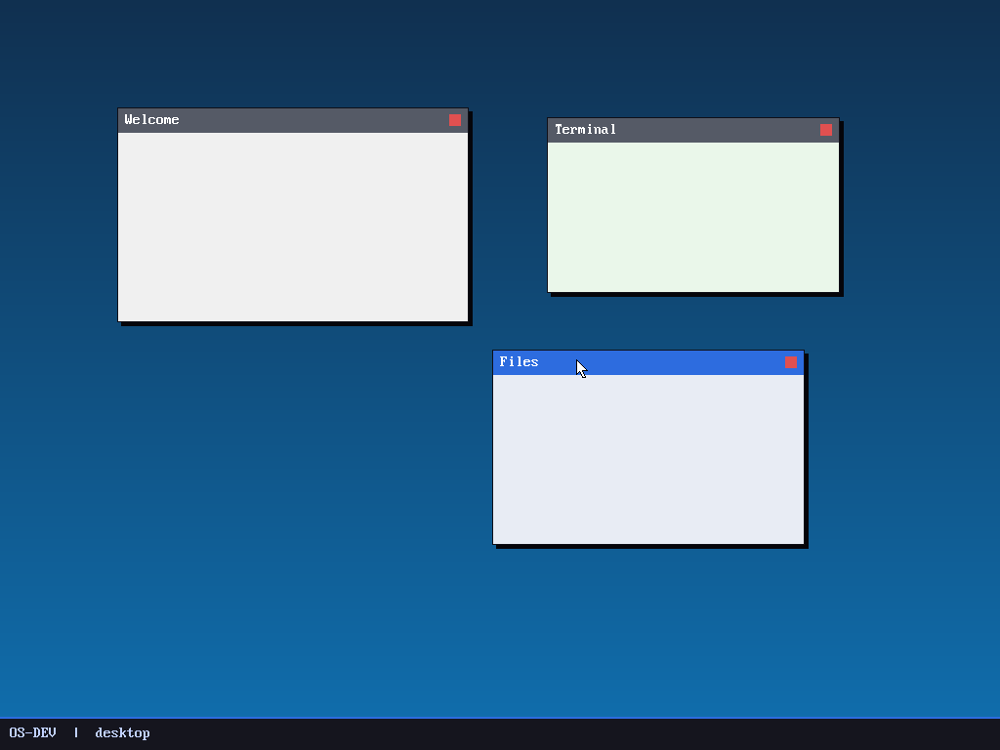

# Milestone 17 — Window manager / compositor

**Goal:** an actual desktop — a wallpaper, a taskbar, and windows you can drag
around with the mouse, with focus and stacking. This is "the DE."

*(Left: the desktop at rest. Right: after grabbing "Files" by its title bar and
dragging it — note it became focused (blue title bar) and "Terminal" lost focus
(gray), because clicking raised it to the top of the stack.)*

## Compositing, not direct drawing (`kernel/desktop.c`)

The window manager is a **compositor**: it never draws to the screen directly.
Every frame it redraws the *entire* scene into an off-screen **back buffer** —
wallpaper, then windows back-to-front, then the cursor — and blits the whole
buffer to the display in one shot (`fb_present`). Because the visible screen
only ever updates atomically, there's no flicker or tearing even when windows
overlap heavily.

The back buffer is just RAM from the heap; `fb_set_target()` redirects all the
framebuffer drawing primitives at it.

## Windows, stacking, focus

A window is a rectangle with a title, a body color, and a position. Stacking
order is simply array order — `windows[count-1]` is on top, so we draw front-to-
back by iterating the array. Each window gets a title bar (blue if focused, gray
if not), a drop shadow, a border, and a close button.

## Mouse interaction

The event loop polls the mouse each time an IRQ wakes it (`hlt`), and only
recomposites when something actually changed:

- **press** on a window → raise it to the top (focus); if the press landed on
  the **title bar**, start *dragging* and remember the grab offset.
- **move while dragging** → set the window position to `mouse − grab_offset`.
- **release** → stop dragging.

That's the whole interaction model behind every classic desktop.

## What we proved
Injecting a press-drag-release on the "Files" title bar moved the window and
raised it above "Terminal" (focus colors swapped) — drag, raise-to-front,
z-order, and double-buffered compositing all working together.

## Files
- `kernel/desktop.c` — the compositor + window list + event loop
- `kernel/fb.c` — gained `fb_set_target`/`fb_present` (double buffering)
- `kernel/mouse.c` — `mouse_paint` (cursor drawn into the composited frame)
