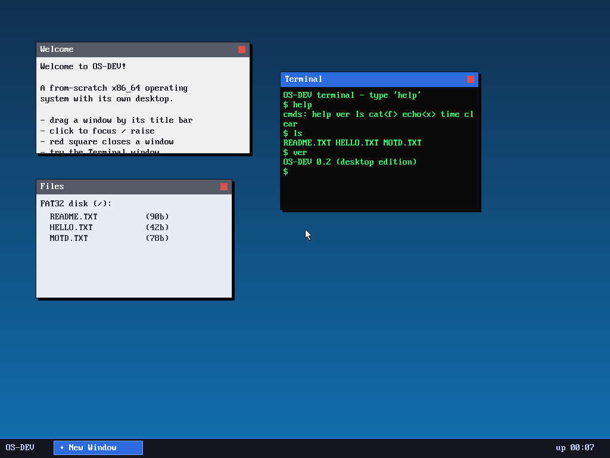

# Milestone 18 — Desktop apps + widgets

**Goal:** make the windows *do* things, so it's a real desktop environment and
not just draggable rectangles.

## Window content by "kind" (`kernel/desktop.c`)

Each window gets a `kind` that decides what's drawn in its body:

- **Welcome** — a static blurb.
- **Files** — a *live* listing of the FAT32 disk, pulled straight from the VFS
  (`vfs_list`), so it shows the real files and sizes.
- **Terminal** — an interactive shell (below).

## An in-window terminal (`kernel/term.c`)

The M9 shell ran in ring 3 and took over the whole screen. A windowed terminal
can't work that way (its `enter_user` would block the compositor's event loop),
so this terminal is a small **kernel-side shell** that renders into a character
grid the window manager paints inside the window. It supports `help`, `ver`,
`echo`, `time`, `clear`, and — using the real VFS — `ls` and `cat`. The
screenshot shows it running `help`, `ls` (listing the actual disk), and `ver`.

## Routing keystrokes

The window manager's event loop drains the keyboard non-blockingly each frame
(`input_trygetchar`) and feeds the bytes to the terminal **only when its window
is focused** (on top). That's the essence of GUI input focus: keystrokes go to
the active window. (Input arrives from the PS/2 keyboard or the serial line —
both push into the same queue — which is how the terminal can be driven
headlessly in tests.)

## Widgets: a clock and a button

- **Taskbar clock** — uptime as `MM:SS`, derived from the timer tick count. The
  loop recomposites whenever the second changes, so it ticks live.
- **"+ New Window" button** — a clickable taskbar widget; pressing it spawns a
  fresh cascading window. Plus every window's **red close box** removes it.

These are the primitive interactions (clickable regions with actions) that all
GUI widgets are built from.

## What we proved
A composited desktop where windows show live content, the terminal runs commands
against the real filesystem, the clock advances, and buttons/close-boxes/drag
all respond to the mouse and keyboard. That's a (small but real) desktop
environment, built from scratch on bare metal.

## Files
- `kernel/term.c` — the in-window shell
- `kernel/desktop.c` — window kinds, content rendering, input focus, widgets
- `kernel/keyboard.c` — `input_trygetchar` (non-blocking)
