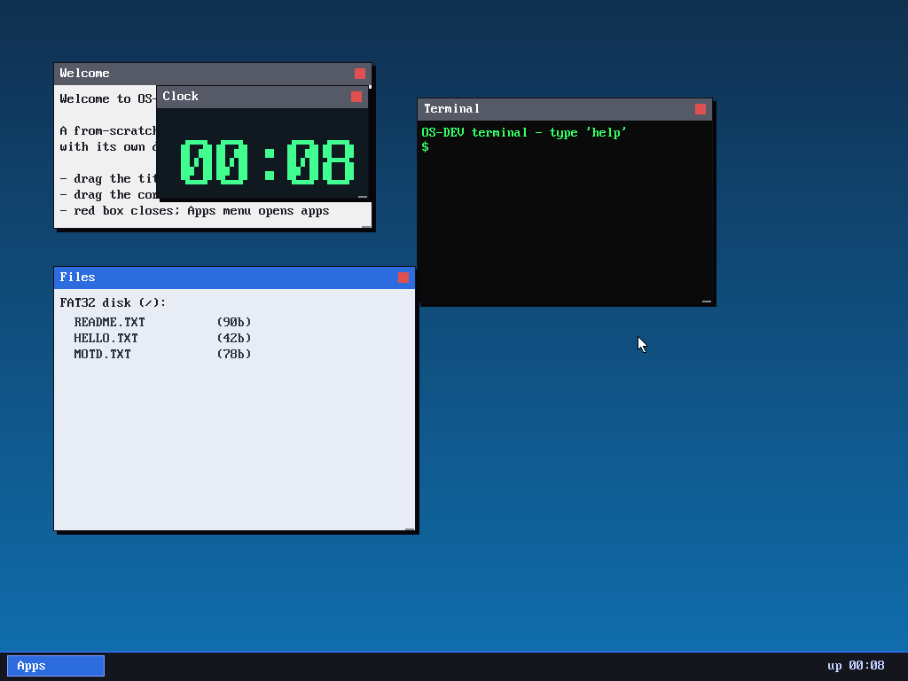

# Milestone 20 — Resizable windows + a start menu

**Goal:** make the desktop feel like a desktop — resize windows, and launch apps
from a menu instead of a fixed set.

*(The Apps menu launched a **Clock** window — big digits via the scaled font —
and the **Files** window was dragged larger by its corner grip.)*

## Resizable windows (`kernel/desktop.c`)

Each window now draws a small **resize grip** (diagonal hatching) in its
bottom-right corner. The event loop tracks a `resizing` window the same way it
tracks a `dragging` one:

- press inside the grip → start resizing that window (and raise it),
- move while held → set `w = mouse.x − win.x`, `h = mouse.y − win.y`,
- clamped to a per-window **minimum** (the terminal's minimum is exactly the
  size of its character grid, so its text never gets clipped).

So a window's title bar moves it and its corner resizes it — the two classic
window gestures, distinguished purely by where the press lands.

## A start menu

The taskbar gained an **Apps** button. Clicking it toggles a menu panel that
floats above the taskbar listing the available apps; clicking an item calls
`spawn_app(kind)` to open a fresh window of that type, and clicking anywhere
else closes the menu. This is the same hit-testing pattern as everything else —
rectangles with actions — just layered on top, and checked *before* window
hit-testing so the menu captures the click.

## Two more apps

`spawn_app` can create any window "kind," so adding apps is now just a content
renderer:
- **Clock** — the uptime as `MM:SS` in large digits (the bitmap font scaled 5×).
- **About** — a few lines about the system.

…alongside the existing Terminal, Files, and Welcome.

## What we proved

Driving it over QMP: opening the Apps menu and clicking **Clock** spawned a live
clock window, and dragging the **Files** window's corner enlarged it — resize,
the start menu, app launching, and the new apps all working together.

## Files
- `kernel/desktop.c` — resize gesture, start menu, `spawn_app`, Clock/About apps
