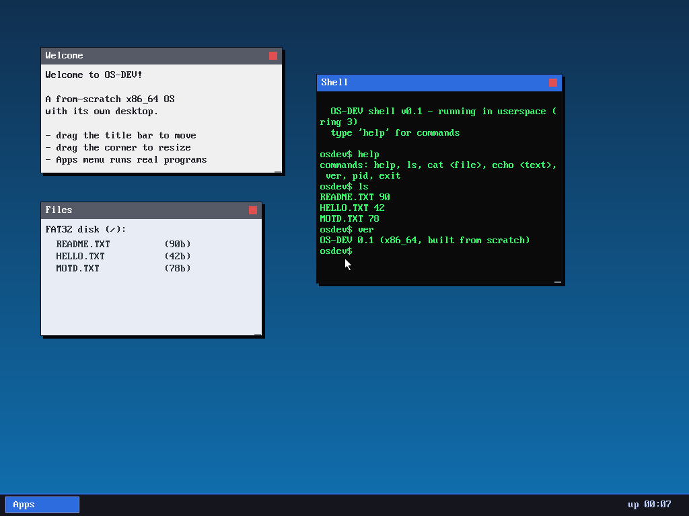

# Milestone 22 — Userspace apps as windows

**Goal:** the payoff of everything before it — run a *real* ring-3 program as a
window. Its output appears in the window; the keyboard drives it when it's
focused; it lives in its own isolated address space and is preempted like any
task. The kernel-side terminal becomes an actual userspace process.

*(The "Shell" window is the M9 ring-3 shell — it even reports "running in
userspace (ring 3)" — executing `help`, `ls` (the real FAT32 disk), and `ver`,
all rendered into its window.)*

## What it took

### 1. Per-task kernel stacks (`kernel/gdt.c`, `kernel/task.c`)
When a ring-3 task traps (syscall or timer), the CPU switches to the stack in
**TSS.rsp0**. With multiple preemptible user tasks, a single shared rsp0 would
let them clobber each other's kernel state, so each task gets its own kernel
stack and the scheduler updates `TSS.rsp0` on every switch.

### 2. The app/process model (`kernel/app.c`)
An *app* = a fresh address space (M21) + the shell ELF loaded into it + a user
stack + a kernel task whose trampoline drops to ring 3 via `enter_user`. Each
app owns a **text grid** (its stdout) and a small **input queue** (its stdin).

### 3. Per-process I/O routing (`kernel/syscall.c`)
`SYS_write` now writes to the *calling app's* grid (found via
`task_self()->proc`), not a global console. `SYS_read` pulls from the app's
input queue, **yielding** until a line arrives. `SYS_exit` marks the app dead
and calls `task_exit`. The userspace shell and libc are completely unchanged —
they just call `write`/`read`, and the kernel routes per-process.

### 4. The window manager as a tiny display server (`kernel/desktop.c`)
App windows (`KIND_APP`) draw their app's grid; the WM delivers keystrokes to
the **focused** window's app and reaps windows whose app has exited. The Apps
menu's "Shell" entry spawns more — each a separate, isolated process.

## The bug worth remembering

The first boot page-faulted at `0x40000000`. The cause was a **startup race**:
`task_create` inserted the task into the ready ring *before* its `cr3` was set,
so a timer preemption could run it with `cr3 == 0` (the kernel space, where the
user address isn't mapped). Adding a debug print "fixed" it by shifting the
timing — the classic sign of a race. The real fix: `task_create` now takes the
`cr3` and sets it *before* the task becomes schedulable.

## Known limitation

`SYS_read` blocks by **busy-yielding** (it repeatedly yields until input
arrives) rather than truly sleeping. That means the CPU never idles while an app
waits for input. A proper **sleep/wake** (block the task, wake it when its queue
gets data) is the clean next step and would let the kernel `hlt` when idle.

## Files
- `kernel/app.c` — the app/process model + per-process I/O
- `kernel/gdt.c`, `kernel/task.c` — per-task rsp0, race-free `task_create`
- `kernel/syscall.c` — route write/read/exit/getpid to the calling app
- `kernel/desktop.c` — app windows, focus-based input, window reaping
