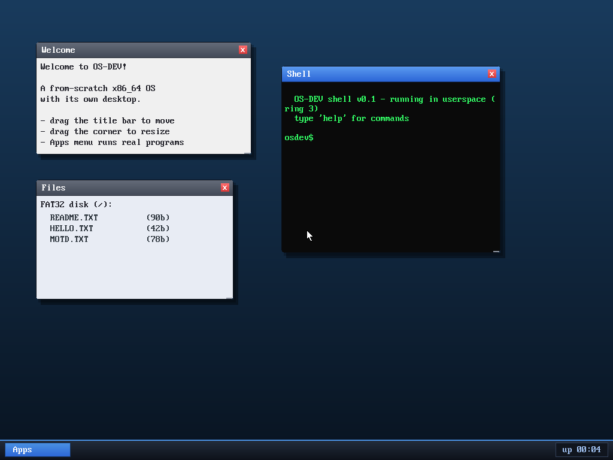

# Milestone 24 — Visual polish (theming)

**Goal:** make the desktop *look* good, not just work. A pass over the
compositor's drawing to add depth, gradients, and a consistent theme.

## What changed (`kernel/desktop.c`)

All built from a few small helpers, since the framebuffer only gives us raw
pixels:

- **`lerp` + `vgrad`** — blend two colors and fill vertical gradients. Used for
  the wallpaper, title bars, the taskbar, the Apps button, and close chips.
- **`darken`** — read the back buffer and scale a region toward black. Because
  we composite into an off-screen buffer (M17), we can *read back* what's there
  and darken it, which gives real **soft drop-shadows** under windows (two
  offset layers for a feathered edge).
- **Rounded corners** — a tiny per-row inset table notches the four window
  corners back to the wallpaper color, so windows read as rounded rather than
  hard rectangles.

## The theme

- **Wallpaper:** a smooth deep-blue vertical gradient.
- **Title bars:** a gradient (bright blue when focused, gray when not) with a
  1px highlight "sheen" along the top and a subtle separator under it.
- **Windows:** soft shadow + a dark outer border + rounded corners; close button
  is a little red gradient chip with an `x`.
- **Taskbar:** a gradient panel with a bright accent line on top, a beveled
  gradient **Apps** button, and the uptime clock in a recessed pill.

## Why it works without anti-aliasing

It's all flat bitmap drawing — no alpha blending or AA. The trick is that
**gradients + a readable shadow (via back-buffer read-back) + small rounded
corners** are enough to give flat pixels a sense of depth and hierarchy.

## Files
- `kernel/desktop.c` — `lerp`/`vgrad`/`darken` helpers + reworked
  `draw_window` and `composite`.
