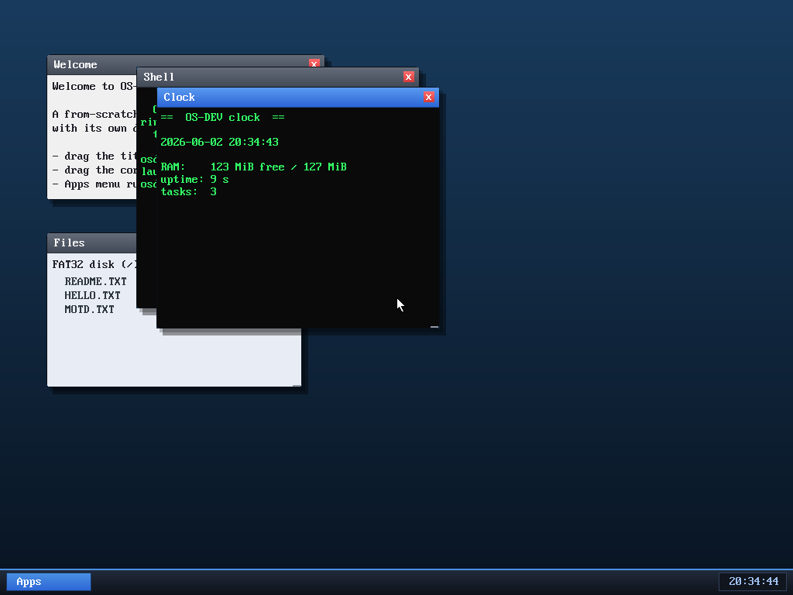

# Milestone 32 — Process spawning + multiple programs

**Goal:** the keystone of a multi-program OS — let the desktop (and the shell)
launch **distinct** programs, each its own isolated, preemptive process. Until
now every window ran a copy of the one shell ELF.

## Multiple programs (build + `kernel/app.c`)

The build now compiles each user program (`shell`, `clock`) with the shared
`ulib` into its own ELF, and the kernel embeds them all
(`kernel/asm/user_blob.asm` incbins each, exporting start symbols). A small
**program registry** in `app.c` maps a name → embedded ELF, and
`app_spawn(elf, title)` loads any of them.

`clock.c` is a genuinely different program: it loops forever showing the
date/time and a memory/uptime summary, refreshing once a second via a new
`SYS_sleep`. It proves the desktop hosts *distinct* programs, not just shells.

## Launching from anywhere (the spawn queue)

A running app can't create a window itself (the window manager owns the window
list). So `app_spawn` puts the new app on a **pending queue**; the WM drains it
each frame and gives each new app a window. This means a program launched from
the **shell** (`run clock`), from the **Apps menu**, or at boot all flow through
the same path. New syscall `SYS_spawn(name)` + shell **`run <program>`**.

## The bug worth remembering

`run clock` first crashed with a jump to `rip=0`. Cause: `vmm_create_address_space`
copied the **current** address space's page tables — fine at boot (called from
task 0, whose user region is empty), but `run` calls it from the **shell's**
context, whose user region already maps the shell's code/stack. The new space
inherited a *reference* to the shell's page tables, so the clock's ELF loaded
into the wrong tables and its entry resolved to 0.

Fix: always derive a new address space from the **kernel** PML4 (captured in
`vmm_init`), whose user region is always empty — its kernel/heap/MMIO mappings
are still shared by pointer, but the low user region starts clean. A real,
subtle isolation bug that only surfaced once a process spawned another.

## What we proved
`run clock` from the shell opened a live Clock window updating every second,
with **3 processes** running (WM + shell + clock), each isolated.

## Files
- `user/clock.c`, `user/ulib.c` — the second program + `sys_sleep`/`sys_spawn`
- `kernel/app.c` — program registry, `app_spawn(elf,title)`, spawn queue
- `kernel/vmm.c` — `vmm_create_address_space` now derives from the kernel PML4
- `kernel/syscall.c`, `user/shell.c` — `SYS_spawn`/`SYS_sleep` + `run`
