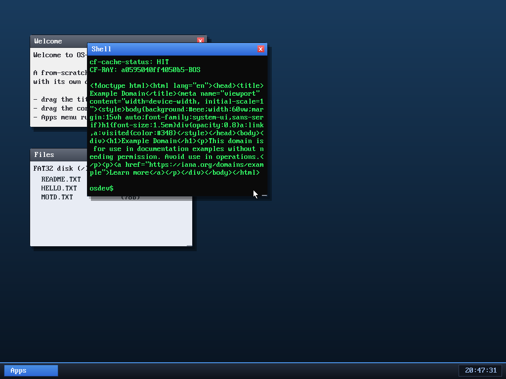

# Milestone 33 — TCP + HTTP GET (the internet works)

**Goal:** turn "we have a NIC and can ping" into "we can fetch a real web page
from the real internet." That means **TCP** (we only had ARP/ICMP/UDP/DNS) and a
tiny **HTTP/1.0** client on top.

That screenshot is our windowed shell printing the **actual HTML of
example.com**, fetched live — note the `cf-cache-status` / `CF-RAY: ...-BOS`
headers: it came straight from Cloudflare's Boston edge node.

## TCP, the minimum that really works

TCP is a reliable, ordered byte stream built on top of unreliable IP packets.
A full implementation is huge; ours is the smallest useful **client**:

- **Three-way handshake.** We send `SYN`, the server replies `SYN,ACK`, we send
  `ACK`. Each side picks a random initial sequence number (ISN); from then on
  every byte is numbered, and the *ack* field says "I've received everything up
  to here."
- **Sequence/ack tracking.** We keep `myseq` (our next byte number) and
  `theirseq` (the next byte we expect from them). We only accept in-order
  segments; for anything else we re-send an ACK (a "duplicate ack").
- **The request.** One `PSH,ACK` segment carrying
  `GET / HTTP/1.0\r\nHost: ...\r\nConnection: close\r\n\r\n`.
- **The reply.** We loop receiving data segments, copy each into the output
  buffer, advance `theirseq`, and ACK. When the server sends `FIN` (it's done,
  because we asked for `Connection: close`), we ACK it and send our own `FIN`.

No retransmission, no congestion control, one connection at a time — but over
QEMU's SLIRP NAT it talks to **real servers on the real internet**. We verified
it fetches example.com **byte-for-byte** (797 bytes, identical to a reference
`curl`-style fetch from the host).

## The checksum gotcha

TCP's checksum doesn't just cover the TCP segment — it also covers a **pseudo
header** (source IP, dest IP, protocol number, TCP length) that isn't actually
transmitted. It exists so a segment can't be silently mis-delivered to the wrong
host/protocol. `l4_checksum()` sums the pseudo-header first, then the segment.

## Routing to the internet

example.com isn't on our local 10.0.2.0/24 network, so we don't ARP *it* — we
ARP the **gateway** (10.0.2.2) and send our IP packets (addressed to the remote
IP) to the gateway's MAC. SLIRP NATs them out to the host's real network. Same
trick DNS uses.

## Using it
- New syscall `SYS_http(host, path, buf, max)` — note this is our first
  **4-argument** syscall; the 4th arg rides in `r10` (the int-0x80 path leaves
  it free, unlike the `syscall` instruction).
- Shell: **`get <host>[/path]`** fetches a URL and prints the response. At boot,
  `net_demo` also fetches example.com and logs the status line to the serial
  port, so the whole stack is smoke-tested every run.

## What's next
This is the foundation for a **browser**: next we parse the HTML and render it
graphically (text + links) in a window, instead of dumping raw tags.

## Files
- `kernel/net.c` — `http_get`, `tcp_send_seg`, `tcp_recv_seg`, `l4_checksum`
- `kernel/syscall.c`, `user/ulib.c`, `user/shell.c` — `SYS_http` + `get`
