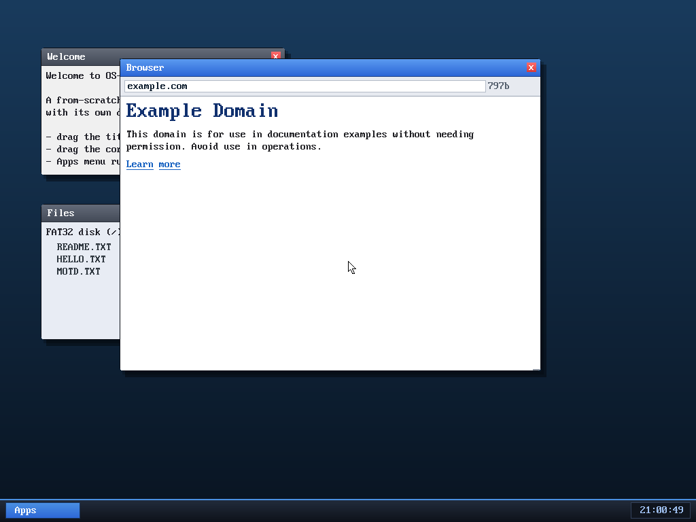

# Milestone 34 — A graphical web browser

**Goal:** the north star. Take the live HTML we can now fetch (M33) and actually
**render it** — styled, word-wrapped, scrollable — in a desktop window with an
address bar. Not a dump of tags: a readable page.

And, fittingly, our from-scratch browser showing **the world's first website**,
links and all:

## The pipeline

A browser window (`kernel/browser.c`) is a small four-stage pipeline:

1. **Parse the URL** in the address bar into `host` + `path` (tolerating an
   `http://` prefix).
2. **Fetch** it with `http_get()` — the real TCP/HTTP stack from M33.
3. **Strip the HTML** into a flat list of *tokens*. Each token is either a
   **word** (tagged with a style: normal / heading / link) or a **break**
   (line or paragraph). The parser:
   - skips the contents of `<script>`, `<style>`, `<title>` and `<head>`;
   - decodes the common entities (`&amp; &lt; &gt; &quot; &nbsp; &#NN;` …);
   - collapses runs of whitespace to single spaces (like a real browser);
   - turns block tags (`
 
 <h1> <li>  ` …) into line/paragraph breaks
     and `<a>`/`<h1-6>` into style spans.
4. **Render** the token stream with a word-wrap layout: it walks tokens placing
   words left-to-right, wrapping at the window edge, advancing by the line
   height (bigger for headings). Headings draw in a large blue font, links in
   blue **underlined**, body text in near-black. A scrollbar appears when the
   page is taller than the window.

This is intentionally **not** a layout engine — no CSS, no tables, no images,
no floats. But "tokenize into styled words + breaks, then word-wrap" is the
honest core of how text renders in a real browser, and it makes live pages
readable.

## Driving it
- **Apps menu → Browser** opens a window (it loads example.com to start).
- **Click the address bar** to edit; type a host and press **Enter** to load.
- When not editing: **Space/`f`** page down, **`b`** page up, **`j`/`k`** line
  scroll, **`g`** top, **`r`** reload, **`/`** edit the URL.

## Honest limitations
- **HTTP only** (no TLS), so it browses `http://` sites. Most of the modern web
  is HTTPS — implementing TLS is a milestone of its own (big-integer crypto +
  certificates). Plenty of pages (example.com, info.cern.ch, …) still serve
  plain HTTP and render great.
- The fetch is **synchronous** — the desktop briefly freezes (~1s) while a page
  loads, because the WM does the fetch on its own thread. An async fetch on a
  worker task is a clean follow-up.
- Links are rendered but **not yet clickable** — navigating means typing the URL.
  Click-to-follow needs storing each link's `href` alongside its words.

## Files
- `kernel/browser.c`, `kernel/include/browser.h` — the whole browser
- `kernel/desktop.c` — `KIND_BROWSER` window: render, key + click routing,
  an Apps-menu entry, and freeing it on close
