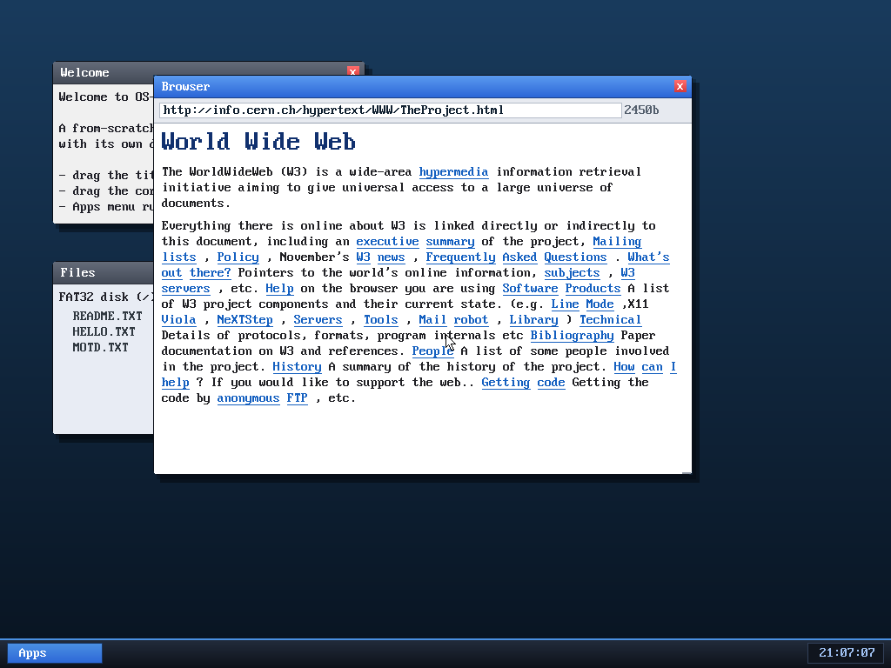

# Milestone 35 — Clickable links

**Goal:** make the browser actually *browsable*. M34 rendered links in blue but
you could only navigate by typing a URL. Now a link follows when you click it,
including resolving relative URLs — so you can move from page to page.

That's our browser after **following a link** from info.cern.ch — it landed on
`http://info.cern.ch/hypertext/WWW/TheProject.html`, Tim Berners-Lee's original
"World Wide Web" page (the literal first web page), with its ~25 links all
rendered and themselves clickable.

## What it took

Three pieces had to thread an `href` all the way from the HTML to a click:

1. **Capture the href.** When the parser opens an `<a>` tag it now scans the
   tag's attributes for `href="..."` (`find_href`), copies the value into an
   `hrefs` string pool, and remembers it as a numbered link. Every word emitted
   inside that `<a>` carries that **link id** in its token.

2. **Record where each link landed.** During layout, every link word also pushes
   a small rectangle — `{x, y, w, h, link-id}` — into a per-frame list, in the
   *same coordinate space the window manager uses for clicks*. (Re-recorded each
   render, so it stays correct after scrolling or resizing.)

3. **Hit-test + follow.** A click in the page body walks that rectangle list; if
   it lands on a link, `browser_follow` resolves the href and reloads.

## URL resolution

Links come in three flavours, and a browser has to handle all of them:

- **Absolute** (`http://host/path`) — use as-is.
- **Root-relative** (`/path`) — keep the current host, replace the path.
- **Relative** (`page.html`, `sub/x.html`) — keep the host *and the current
  directory* (everything up to the last `/`), then append.

`browser_follow` does exactly this string surgery. `https://` links are
detected and politely refused (we have no TLS — status shows `no https`), and
`#fragment` / `mailto:` / `javascript:` links are ignored.

## How it was verified

QEMU's text-monitor can't position the absolute USB tablet in this headless
setup, so a *scripted* mouse click isn't possible here. Instead the follow
pipeline was driven directly (programmatically following a page's first link)
and confirmed end-to-end: the address bar updated, a new page was fetched
(2450 bytes), re-parsed, and re-rendered — see the screenshot above. The click
hit-test itself is plain rectangle math in the **same** coordinate space the WM
already uses successfully for close/drag/resize.

## Files
- `kernel/browser.c` — `find_href`, `add_href`, link ids on tokens, the
  per-frame link-rect list, `browser_click` hit-testing, `browser_follow`
  (absolute / root-relative / relative URL resolution)
