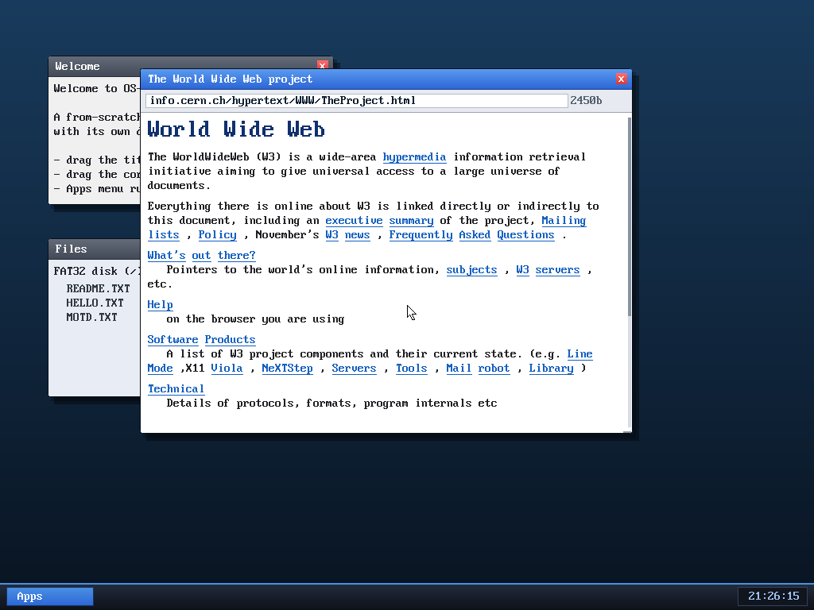

# Milestone 37 — Richer HTML rendering

**Goal:** make pages *look* like pages. M34–36 rendered a flat run of words;
this milestone adds the small structural touches that make real content
readable — the page title in the window bar, list/definition layout, and
horizontal rules.

Look at the title bar: it now reads **"The World Wide Web project"** — the
page's `<title>`, not a generic "Browser". And the body is no longer one long
blob: each definition term (**What's out there?**, **Help**, **Software
Products**, **Technical**) sits on its own line, with its description indented
beneath it. (Compare the earlier flat render in `osdev-browser-www.png`.)

## What was added

- **`<title>` → the window title bar.** The parser now *captures* the title text
  (collapsing whitespace) instead of just skipping it, and the window manager
  reads it via `browser_title()` after each load, so the OS window chrome shows
  the real page name — exactly like a desktop browser tab.
- **Lists.** `<li>` starts a new line with a `-` bullet; `<dt>`/`<dd>`
  (definition lists, common on classic pages) break onto their own lines with
  the definition indented. A new `emit_literal()` helper injects the bullet /
  indent as ordinary words so the existing word-wrap handles them for free.
- **`
` horizontal rules.** A new `TK_HR` token draws a thin full-width line,
  giving pages visual section breaks.

## Why it's structured this way

The renderer is a flat token stream (words + breaks), so "structure" is just
*more kinds of breaks and a few injected words*. Adding lists and rules didn't
need a new layout pass — `<li>` becomes "break + a bullet word", `<dd>` becomes
"break + an indent word", `
` becomes a one-off rule token the render loop
special-cases. Keeping the model flat is what keeps the browser **lightweight**:
every new tag is a handful of lines in `handle_tag`, not a new subsystem.

## Files
- `kernel/browser.c` — title capture, `emit_literal`, `<li>/<dt>/<dd>` breaks,
  `TK_HR` token + its render, `browser_title()`
- `kernel/desktop.c` — sets the window title from the loaded page
