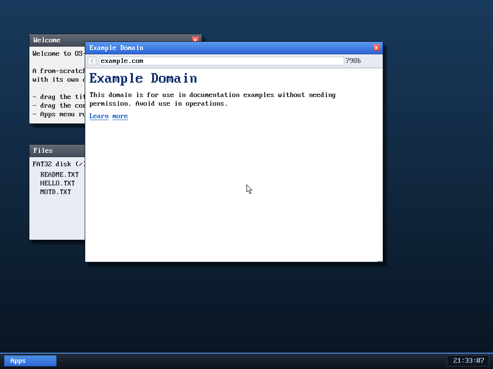

# Milestone 38 — Browser history / Back

**Goal:** make the browser actually navigable in both directions. With clickable
links (M35) you can go *forward* through the web; this adds a **back stack** so
you can return — the single most-used button in any browser.

Note the **`<` button** at the left of the address bar (greyed when there's
nowhere to go back to). The screenshot is example.com *after* a round trip:
example.com → info.cern.ch → **Back** → example.com. The window title
(`Example Domain`) and address bar both confirm we landed back on the first page.

## How it works

The browser keeps a small stack of previously-shown URLs:

- Every time you navigate somewhere new, the page you're *leaving* is pushed onto
  the stack — but **not** on a reload (same URL) and **not** when the navigation
  *is itself* a Back (tracked by an `is_back` flag, so Back doesn't re-push the
  page you're returning from).
- **Back** pops the top URL and loads it. When the stack is empty the button
  greys out and Backspace does nothing.

Back is wired to three things: the **`<` button**, the **Backspace** key (when
you're not editing the address bar), and it shares the same async load path as
everything else — so going back also shows "Loading…" and never freezes the UI.

## A bug the test caught

Driving example.com → info.cern.ch → Back end-to-end immediately surfaced an
*unrelated* bug from M37: the window title showed "Browser" instead of the
page's `<title>`. The cause — `<title>` lives inside `<head>`, but the parser's
"skip `<head>` content" check ran *before* the title-capture branch, so titles
inside a proper `<head>` were silently dropped. (info.cern.ch had hidden this
because its 1991-era markup uses `<HEADER>`, not `<head>`.) The fix: capture
`<title>` *before* skipping the rest of `<head>`. A good reminder that
exercising a new feature end-to-end shakes out bugs in the old ones.

A small permanent API, `browser_go(b, url)`, was also added (navigate to a URL,
pushing history) — handy for a future "home" button or a shell `browse` command.

## Files
- `kernel/browser.c` — the back stack, `browser_back`, `browser_go`, the Back
  button + its click/Backspace handling, and the `<title>`-in-`<head>` fix
