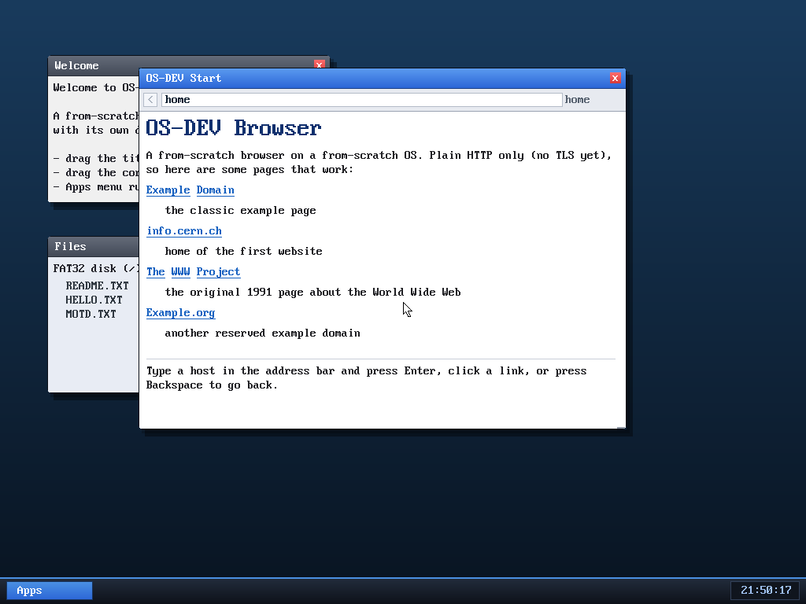

# Milestone 41 — A browser start page

**Goal:** give the browser a proper home. Opening it (or typing `home`) now
shows a built-in **start page** with clickable bookmarks — rendered entirely
locally, no network, so it appears instantly.

## How it works

The trick is that the browser's renderer already takes *HTML* and turns it into
styled, clickable content (M34–37). So the start page is just a constant HTML
string, `HOME_HTML`, baked into the kernel:

- When you navigate to `home` (or open a browser with no URL), `browser_navigate`
  spots it and — instead of handing the URL to the fetch worker — parses
  `HOME_HTML` **directly on the spot**. No TCP, no worker, no waiting.
- The page's links are real `http://` bookmarks, so clicking one (or the
  renderer following it) goes through the exact same navigation path as any
  other link. The start page is itself a normal history entry, so **Back**
  returns to it.

Because the home render bypasses the async fetch, it also bypasses the
worker hand-off entirely — there's nothing to free, nothing to wait for. (It's
refused only if a *previous* fetch on that window is still in flight, so it can't
stomp a pending result.)

A small related fix: the window manager now copies the page title into the
window's title bar **every frame** rather than only when a network load
finishes — otherwise the locally-rendered start page's title ("OS-DEV Start")
would never show.

## Why it's nice

The default browser now opens to something useful and friendly instead of a
hard-coded example.com, it documents its own limitation ("Plain HTTP only — no
TLS yet"), and it gives one-click access to the pages that actually render. All
for the cost of one HTML string and a special-case in `navigate` — no new
rendering code, which keeps the browser lightweight.

## Files
- `kernel/browser.c` — `HOME_HTML`, the `home` special-case in `browser_navigate`,
  default URL = `home`
- `kernel/desktop.c` — sync the window title from the page every frame
