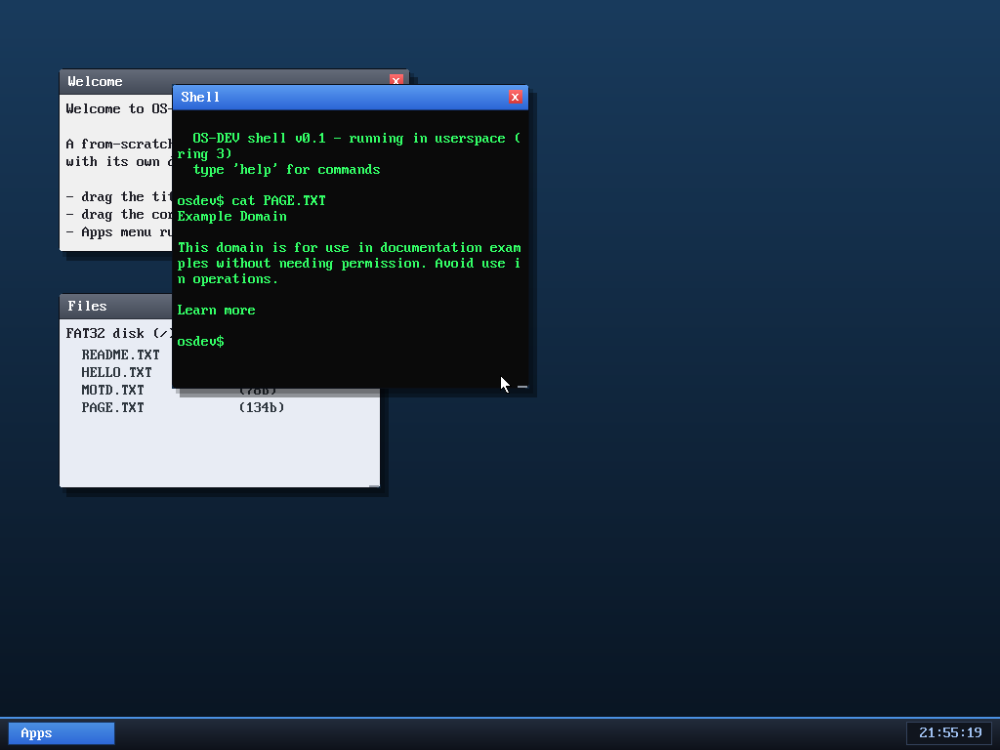

# Milestone 42 — Save a page to disk

**Goal:** connect the browser to the filesystem. Press **`s`** in the browser
and the current page is written to **PAGE.TXT** on the FAT32 disk — a tiny
"reader mode" you can read back later, even offline.



That screenshot is the whole loop in one frame: the **shell** ran
`cat PAGE.TXT` and printed the readable text of example.com — *which the browser
had fetched and saved* — and the **Files** window lists `PAGE.TXT (134b)`
alongside the disk's original files.

## What happens on `s`

The renderer holds the page as a token stream (words + line/paragraph breaks).
Saving just walks that stream back into plain text — each word followed by a
space, each break a newline, each `<hr>` a `----` divider — and hands it to
`vfs_write("PAGE.TXT", …)`, the same FAT32 write path the shell's `write`
command uses. The result is exactly what you'd want to `cat` later: the page's
prose without the markup.

## Why it's a satisfying milestone

It's the first time the **browser** (kernel-side) and the **shell** (a ring-3
userspace process) exchange data — through the **filesystem**, the way real
programs do. Three independent subsystems built over many milestones — the
TCP/HTTP stack, the HTML renderer, and the read-write FAT32 driver — all line up:

```
TCP/HTTP fetch → HTML render → press s → vfs_write → FAT32 on disk
                                                        ↓ (next boot)
                                   shell: cat PAGE.TXT → the saved text
```

It persists across reboots (verified: the page text and a `PAGE    TXT`
directory entry show up in the raw disk image), and it costs almost nothing —
one function that reuses the existing token stream and the existing FS write.

## Limits
- One fixed filename (`PAGE.TXT`) in the root directory (FAT32 writes are
  root-only so far), and it saves the *text*, not the original HTML.

## Files
- `kernel/browser.c` — `browser_save` (token-stream → text → `vfs_write`), bound
  to the `s` key; the start page mentions it
