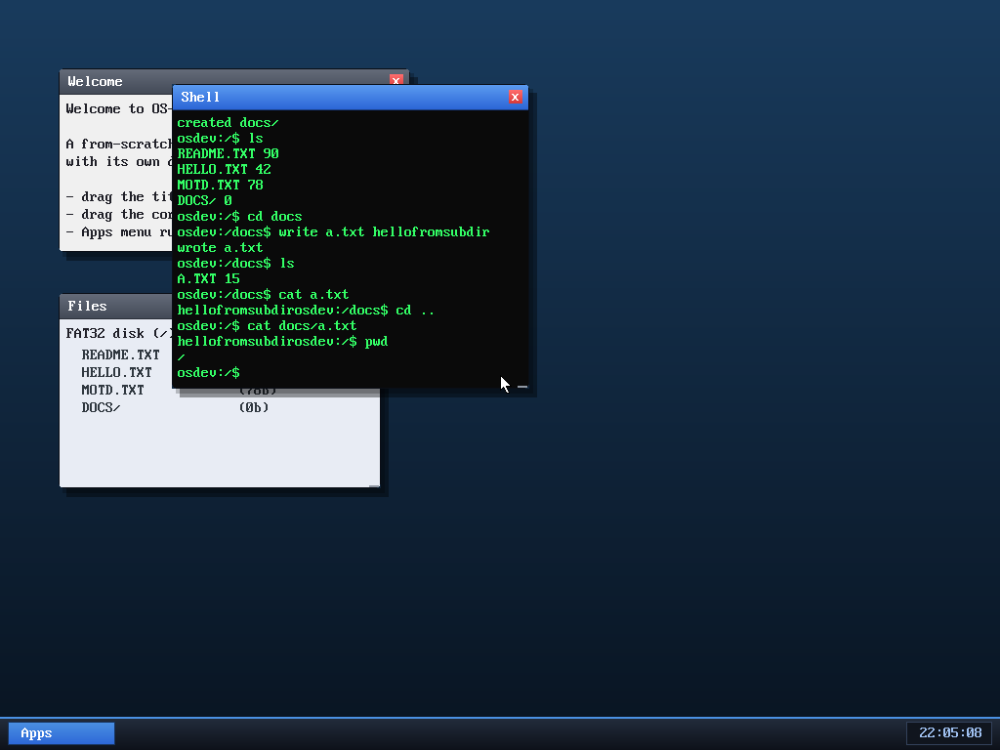

# Milestone 43 — FAT32 subdirectories

**Goal:** a real filesystem has folders. Until now FAT32 was flat — every file
lived in the root. This milestone adds **directories**: `mkdir`, `cd`, `pwd`, and
path-aware file access, so you can organise the disk into a tree.

That shell session does the whole thing: `mkdir docs` (it shows up as `DOCS/` in
both `ls` and the Files window), `cd docs` (the prompt becomes `/docs`), write a
file *inside* it, `cat` it, `cd ..` back to root, then `cat docs/a.txt` — reading
the file by **path** from the parent.

## The key insight

In FAT32 a directory **is just a file** whose contents are 32-byte entries.
So the root and any subdirectory are the same kind of thing — a cluster chain of
entries. The driver already walked the root that way; this milestone generalises
that one function, `walk_dir(cluster, …)`, to walk *any* directory, and almost
everything else falls out:

- **`resolve(path)`** splits a path like `docs/a.txt` into "the directory cluster
  to operate in" + "the final name", descending each `/`-separated component
  (finding the entry, checking its *directory* attribute bit, following it to its
  cluster). Absolute paths start at the root; relative ones at the current
  directory; `.` and `..` are handled.
- **`mkdir`** allocates a cluster, writes the mandatory **`.`** (points to itself)
  and **`..`** (points to the parent — stored as `0` when the parent is the root,
  per the FAT spec) entries, and adds a directory entry in the parent with the
  directory attribute set.
- **read / write / rm** now `resolve()` their path first, then operate inside the
  resulting directory — so they work anywhere in the tree.
- **`cd`** walks the path and remembers the destination as the driver's *current
  directory* (`cwd_cluster`), which `ls` and relative paths use as their base.

## What stays simple (on purpose)

- 8.3 short names only (no long-file-name entries), and a directory doesn't grow
  beyond its first cluster's worth of entries — plenty for a hobby disk.
- The shell keeps a *display* copy of the path for the prompt and `pwd`; the
  kernel's `cwd_cluster` is the real source of truth.

The whole thing reuses the existing cluster/FAT/entry machinery — generalising
`walk_root` into `walk_dir` and factoring out an `add_entry` helper was most of
the work. Verified end to end in the OS and by inspecting the on-disk image
(the `DOCS` directory, the file inside it, and its contents all persist).

## Files
- `kernel/fat32.c` — `walk_dir`, `dir_find`, `resolve`, `add_entry`,
  `fat32_mkdir`, `fat32_chdir`, path-aware read/write/delete, `cwd_cluster`
- `kernel/vfs.c` / `vfs.h` — `mkdir` / `chdir` ops + wrappers
- `kernel/syscall.c`, `user/ulib.c`, `user/shell.c` — `SYS_mkdir`/`SYS_chdir`,
  the `mkdir` / `cd` / `pwd` commands, and a path-aware prompt
