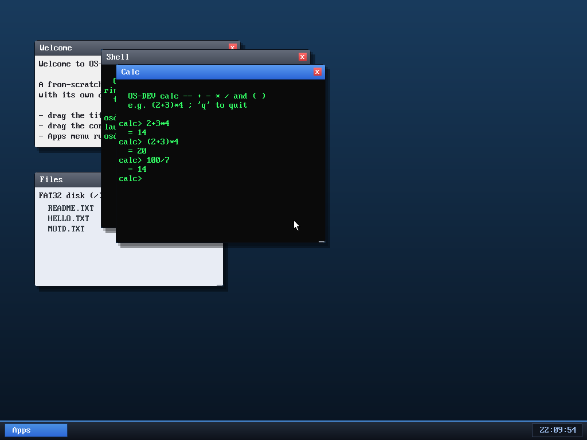

# Milestone 44 — A calculator app

**Goal:** a third userspace program, and a properly *interactive* one with real
logic — to show the desktop runs varied apps, not just a shell and a clock.



Launched with `run calc` (or from the Apps menu), it reads expressions and
evaluates them — note the results respect **operator precedence** (`2+3*4 = 14`,
not 20), **parentheses** (`(2+3)*4 = 20`), and integer division (`100/7 = 14`),
all in its own window, concurrently with the shell behind it.

## How it parses

It's a textbook **recursive-descent parser** — the same structure a real
compiler's front end uses, just for arithmetic:

```
expr   → term  (('+' | '-') term)*
term   → factor (('*' | '/') factor)*
factor → number | '(' expr ')' | '-' factor
```

Each grammar rule is one function calling the others, and the call structure
*is* the precedence: `expr` only handles `+`/`-`, so it can't run until the
`term`s on either side (which greedily consume `*`/`/`) are done — that's why
multiplication binds tighter, for free. Parentheses just recurse back into
`expr`. A shared cursor walks the input string; an `err` flag catches malformed
input ("`? syntax error`").

## What it demonstrates about the OS

`calc` is built exactly like the shell and clock: one C file linked with the
shared `ulib`, compiled to its own ELF, embedded in the kernel, and registered
by name. Adding a whole new program was four small edits (the program registry,
the embed list, the Makefile, the Apps menu) — the multi-program machinery from
milestone 32 means new apps are cheap. It runs as an **isolated ring-3 process**
with its own address space, preemptively scheduled alongside everything else.

## Files
- `user/calc.c` — the calculator (recursive-descent evaluator + REPL)
- `kernel/app.c`, `kernel/asm/user_blob.asm`, `Makefile` — register/embed it
- `kernel/desktop.c` — a "Calc" entry in the Apps menu
