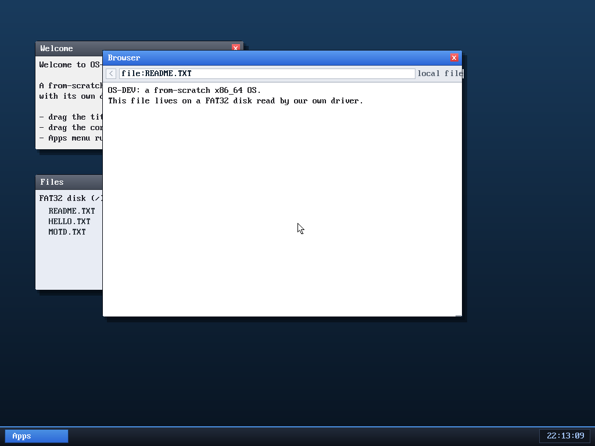

# Milestone 45 — Browsing local files

**Goal:** let the browser open files from the disk, not just the network. Type
`file:README.TXT` (or any path) in the address bar and the browser reads it from
FAT32 and displays it — which, with save-page (milestone 42), gives **offline
reading**: save a page, reopen it later.

That's `README.TXT` read straight off the disk and rendered in the browser, with
its line breaks preserved.

## How it works

A `file:` URL skips the network entirely (like the start page does):
`browser_navigate` reads the file with `vfs_read` — the same FS path the shell's
`cat` uses — then picks how to render it:

- if the content starts with `<`, it's treated as **HTML** and run through the
  normal `parse_html` (so a saved `.htm` page renders as a page);
- otherwise it's **plain text**, run through a new `parse_text` that turns each
  whitespace-separated run into a word and each newline into a line break (a
  blank line becomes a paragraph break) — so a text file keeps its shape instead
  of collapsing into one paragraph.

It reuses everything: the same token stream, the same word-wrap renderer, the
same history/Back, and (because it's local) it renders instantly with no worker.
The start page now lists a `file:README.TXT` bookmark too.

## Why it's a nice tie-together

The browser now reads from **both** of the OS's data sources — the network
(TCP/HTTP) and the disk (FAT32) — through one address bar and one renderer.
Save a web page with `s`, then open `file:PAGE.TXT` to read it back, no network
needed. Three subsystems (HTTP, the renderer, the filesystem) meeting in one
small feature.

## Files
- `kernel/browser.c` — the `file:` branch in `browser_navigate`, `parse_text`,
  and a `file:` bookmark on the start page
