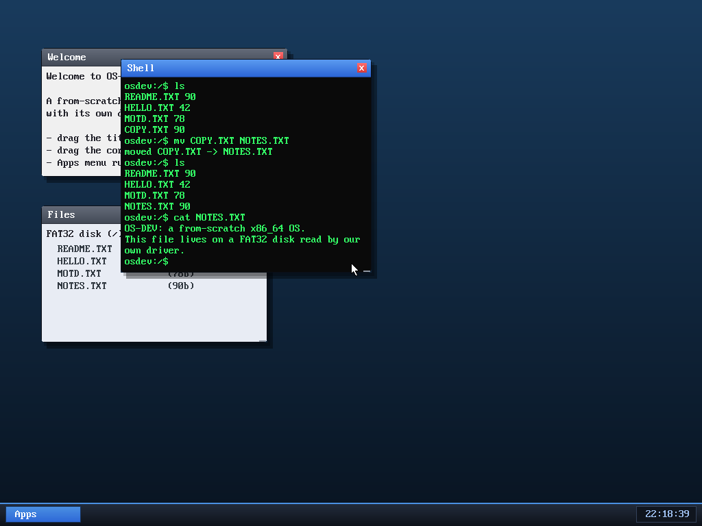

# Milestone 47 — `cp` and `mv`

**Goal:** finish the file toolkit. With subdirectories (milestone 43) and write
hardening (46) in place, the obvious missing everyday commands are **copy** and
**move/rename**.

`cp README.TXT COPY.TXT` makes a copy (it shows up in `ls` at the same 90 bytes);
`mv COPY.TXT NOTES.TXT` renames it (COPY.TXT disappears, NOTES.TXT appears); and
`cat NOTES.TXT` confirms the contents came along for the ride.

## Built entirely from existing syscalls

Neither command needed any kernel work — they're pure userspace, composed from
syscalls the shell already had:

- **`cp src dst`** = `read(src)` into a buffer, then `write(dst)`.
- **`mv src dst`** = the same copy, then `delete(src)`.

That's the nice thing about having a real syscall layer: new tools are just
combinations of primitives, exactly like `cp`/`mv` are thin programs over
`read`/`write`/`unlink` on a real Unix. (Today both go through a 4 KB buffer, so
they handle the small files this OS deals in; a streaming copy would lift that.)

The file toolkit is now complete: **`ls cat edit write rm cp mv mkdir cd pwd`**.

## Files
- `user/shell.c` — the shared `cp`/`mv` command handler
