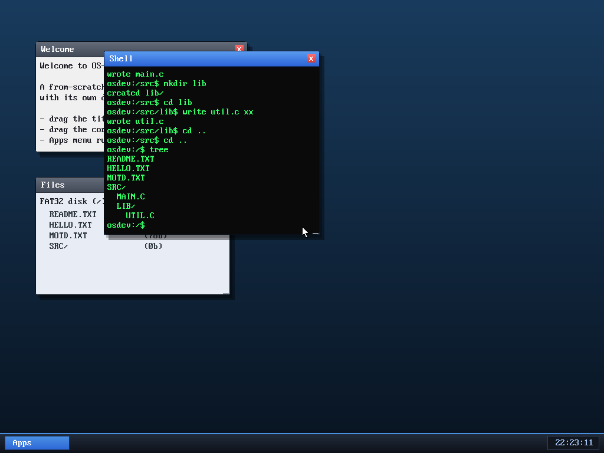

# Milestone 48 — `tree`

**Goal:** show off the directory hierarchy (milestone 43) with a `tree` command
that prints the whole filesystem as an indented tree.



```
README.TXT
HELLO.TXT
MOTD.TXT
SRC/
  MAIN.C
  LIB/
    UTIL.C
```

Two levels of nesting (`src` → `lib` → `util.c`) with proper indentation, all
from one command.

## How it works

`tree` is the first **recursive** filesystem operation. A kernel helper walks
the current directory; for each entry it prints the name (indented by depth, and
suffixed `/` for directories), and if the entry *is* a directory it calls itself
on that directory's cluster with `depth + 1`. The recursion reuses the same
`walk_dir` machinery the rest of the driver uses — the visit callback simply
recurses before returning.

Two safety bounds keep it from running away on a deep or corrupt tree: a **depth
cap** (5 levels) and the output **buffer length** (every write is bounds-checked
against `max`). Each recursion level keeps its own 512-byte sector buffer on the
kernel stack, so the depth cap also bounds stack use well within the 16 KB
kernel stack.

It's exposed the usual way — a `tree` op on the VFS, a `SYS_tree` syscall, and a
`tree` shell command — so the whole feature is a few dozen lines on top of what
the subdirectory milestone already built.

## Files
- `kernel/fat32.c` — `tree_rec` / `tree_visit` / `fat32_tree`
- `kernel/vfs.c` / `vfs.h`, `kernel/syscall.c`, `user/ulib.c`, `user/shell.c` —
  the `tree` op, `SYS_tree`, and the `tree` command
