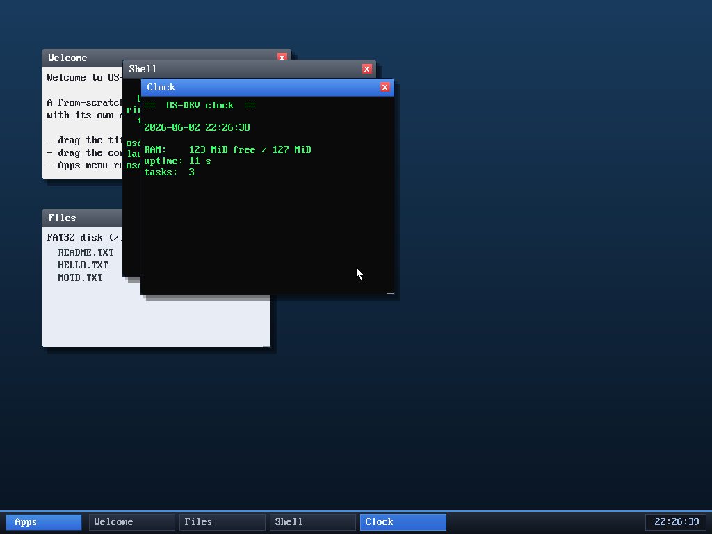

# Milestone 49 — A taskbar window list

**Goal:** make the desktop feel like a desktop. The taskbar had an Apps button
and a clock; now it shows a **chip per open window**, with the focused one
highlighted — and clicking a chip brings that window to the front.

With Welcome, Files, Shell and Clock open, the taskbar shows a labelled chip for
each; the **Clock** chip is highlighted because it's the focused (top-most)
window. It's the single most recognisable piece of desktop furniture, and it
makes a screen full of overlapping windows navigable.

## How it works

The window manager already keeps windows in a back-to-front array (`windows[]`,
with the last element on top/focused), so the taskbar is just a render of that
array:

- **Draw:** in the compositor, after the Apps button, loop the windows and draw
  a chip for each — a gradient pill with the window's title, brighter for the
  focused one (`i == win_count - 1`). Chips stop before the clock if they run out
  of room.
- **Click:** a click in the taskbar row is hit-tested against the same chip
  geometry; the matching window is raised with `raise_window(i)` — the same call
  the WM uses when you click a window directly. Sharing the geometry (via the
  `TB_CHIP*` constants) keeps draw and hit-test in lockstep.

No new window-manager state was needed — the taskbar is a *view* of the existing
z-ordered window list, which is exactly why it stays correct as windows open,
close, and change focus.

## Files
- `kernel/desktop.c` — window chips in `composite()` and chip click handling in
  `desktop_run`, plus the `TB_CHIP*` layout constants
