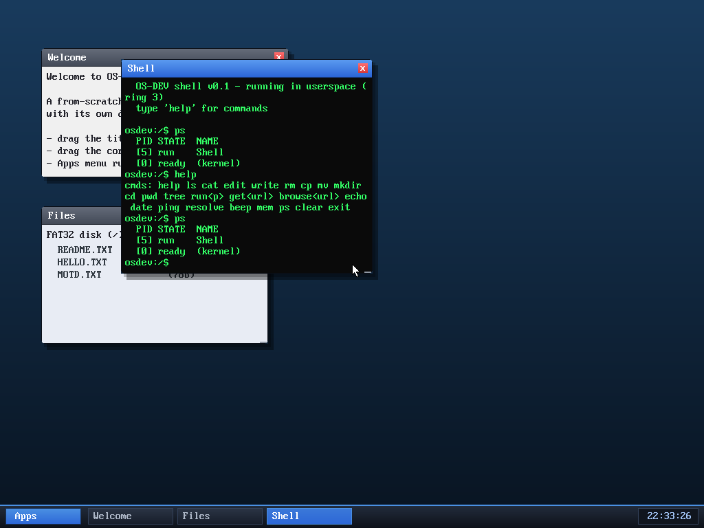

# Milestone 50 — `ps` (a process list)

**Goal:** let the OS show what it's running. `ps` lists the live tasks with
their id, scheduler state, and name — a window into the multitasking the whole
system is built on.



```
  PID STATE  NAME
  [5] run    Shell
  [0] ready  (kernel)
```

Here the **Shell** is `run`ning (it's the task executing `ps`) and the
**(kernel)** task — the window manager / idle task — is `ready`, waiting its
turn. Launch more programs and they show up too, each in its own row.

## How it works

The scheduler keeps all tasks in a circular "ready ring" (`current` points at
the running one). `task_snapshot()` walks that ring — **with interrupts off**,
because the timer IRQ mutates the same ring to preempt tasks — and copies each
task's `{id, state, proc}` into a caller array. The `ps` syscall then formats
it: the state enum becomes `ready`/`run`/`block`/`dead`, and the name comes from
the task's `proc` pointer — for a userspace app that's its window title
(`app_title`), and for kernel threads (the WM, the browser's fetch worker) it's
`(kernel)`. Dead tasks are filtered out.

It's a small thing, but it's the first tool that makes the OS's concurrency
*visible* — the same `[id] state name` shape `ps` has on a real Unix, reading
straight from the kernel's run queue.

## Files
- `kernel/task.c` / `task.h` — `task_snapshot` (interrupt-safe ring walk)
- `kernel/syscall.c` — `SYS_ps` formatting (state names + per-task `app_title`)
- `user/ulib.c` / `ulib.h`, `user/shell.c` — `sys_ps` + the `ps` command
