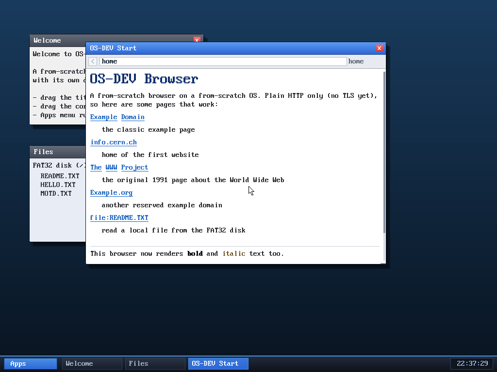

# Milestone 51 — Bold & italic text

**Goal:** render inline emphasis. `<b>`/`<strong>` now come out **bold** and
`<i>`/`<em>` in a distinct colour, so pages with emphasis read the way they're
meant to.

The last line — "This browser now renders **bold** and *italic* text too" —
shows both: "bold" is visibly heavier, "italic" is tinted.

## Faux-bold with one font

The kernel ships a single 8×16 bitmap font — no bold weight. So bold is faked
the way dot-matrix printers did it: **draw the word twice, one pixel apart**
("double-strike"). The catch is the second pass must be drawn *transparently*
(only its set pixels), or it would re-paint the background and erase the first
pass — so it goes through `fb_text` (transparent) rather than the opaque glyph
blit. The result is a convincingly heavier stroke. Italic can't be slanted
without a transformed font, so `<i>`/`<em>` are rendered in a contrasting colour
instead.

Both are just two more entries in the renderer's style enum (`STY_BOLD`,
`STY_EM`), set by `<b>`/`<i>` in the tag handler exactly like links and
headings, and they flow through the same word-wrap path.

## Files
- `kernel/browser.c` — `STY_BOLD`/`STY_EM`, the `<b>`/`<i>` tag handling, the
  transparent double-strike, and a demo line on the start page
