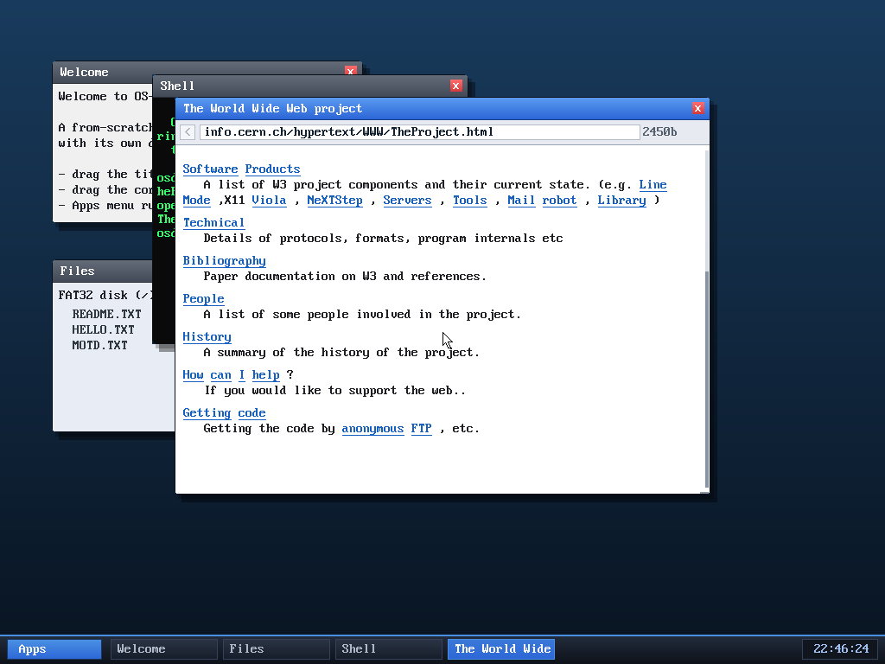

# Milestone 53 — Arrow keys

**Goal:** support the arrow keys — a foundational input feature that unlocks
scrolling, editor cursors, history, and games.

That's TheProject.html scrolled well past its heading — done purely by pressing
**↓** a dozen times (note the scrollbar thumb is now partway down).

## The extended-scancode dance

A normal key sends one PS/2 scancode. The arrows (and a few other keys) send
**two bytes**: a `0xE0` prefix followed by the key's scancode (`0x48` up,
`0x50` down, `0x4B` left, `0x4D` right), with a matching `0xE0`-prefixed release.
The keyboard driver ignored these, so arrows did nothing.

Now the IRQ handler remembers a `0xE0` prefix and, on the next byte, maps the
arrow to a small **control code** (`0x11`–`0x14` for up/down/left/right) pushed
into the same input stream as regular characters. Apps that care about arrows
check for those codes; everything else ignores them. (The kernel's line reader
now drops control codes below `0x20`, so an arrow can never corrupt a typed
line — verified by typing a full URL with the change in place.)

## First consumer: the browser

The browser's key handler now scrolls on ↑/↓ (alongside the existing `j`/`k`),
which is what the screenshot shows. The same control codes are ready for the
next things that want them — a text editor's cursor, shell command history, a
game.

## Files
- `kernel/keyboard.c` — `0xE0` extended-scancode decoding → control codes
- `kernel/app.c` — line reader ignores control codes (no input corruption)
- `kernel/browser.c` — ↑/↓ scroll the page
