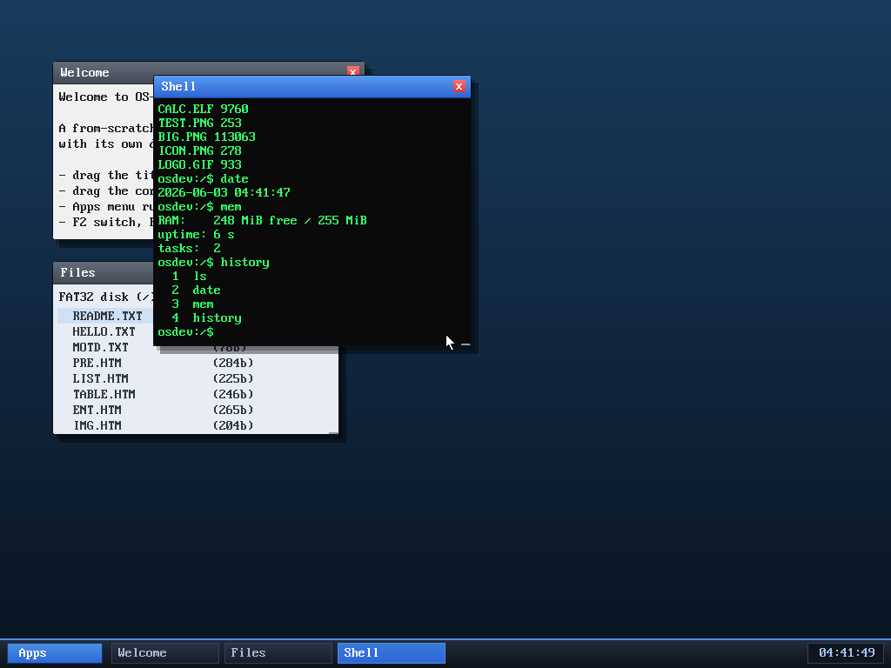

# Milestone 54 — Shell command history

**Goal:** press ↑/↓ to recall previous commands — the convenience every shell
has, now built on the arrow keys from milestone 53.

After running `ver` then `date`, pressing **↑** brings `date` back onto the
prompt, ready to edit or re-run.

## Where it lives

History is handled in the **kernel's line reader** (`app_sys_read`) rather than
in the shell, so *every* program that reads a line (the shell, the calculator)
gets it for free. Each app keeps a small ring of recent input lines. While
reading, ↑ walks back through them and ↓ forward; each step erases the on-screen
line (the erase is wrap-aware, so it works even when a long command spilled onto
a second row) and re-echoes the recalled one. On Enter, the line is pushed into
the history ring.

## A responsiveness bug this caught

Wiring up history immediately exposed a regression from the compositor
scene-cache (milestone 52): after that change the desktop only re-rendered on a
`dirty` flag, and **delivering a keystroke to a windowed app didn't set it** —
so typed characters (and recalled history) only appeared on the next once-per-
second clock tick, i.e. up to a second of input lag. The fix is one line: mark
the scene dirty when a key goes to a focused app, just like the browser already
did. Typing is crisp again. (Browser keys already set it, which is why the lag
hid until now — a good reminder to test the thing you just optimized.)

## Files
- `kernel/app.c` — per-app history ring, `hist_recall`, wrap-aware `grid_erase`,
  ↑/↓ handling in `app_sys_read`
- `kernel/desktop.c` — mark the scene dirty on a keystroke to a focused app
