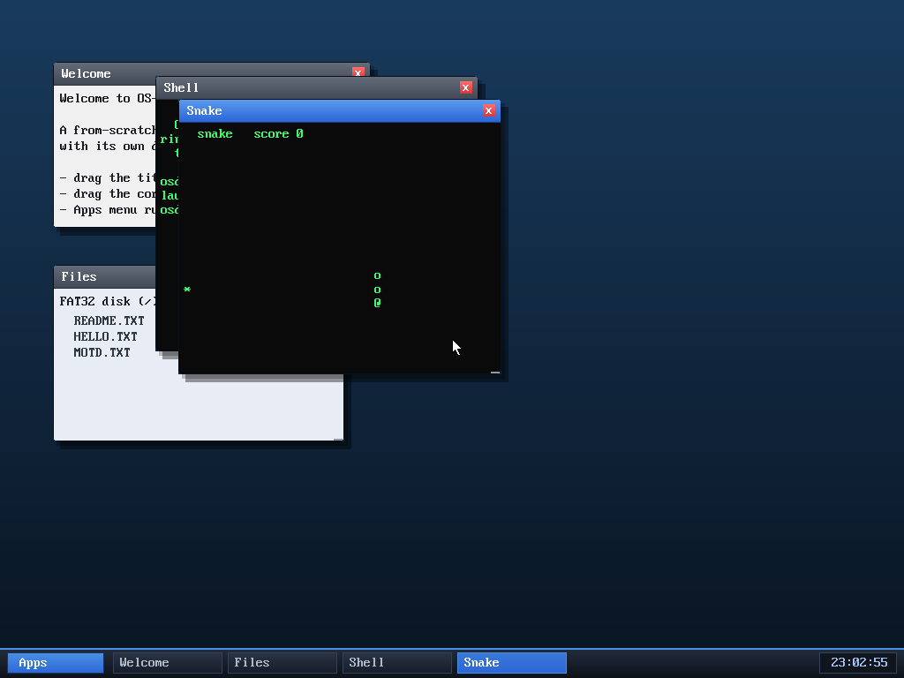

# Milestone 55 — Snake (a real-time game)

**Goal:** a real-time, interactive game — the first program that reacts to input
*without blocking*, so the action continues whether or not you touch a key.

The snake (`@` head, `o` body) steered down-then-right with the arrow keys, with
food (`*`) to eat — running in its own window alongside the shell.

## What it needed from the OS

Every program before this either blocked waiting for a whole line (shell, calc)
or just looped on a timer (clock). A game needs both at once: **keep moving on a
clock, but steer instantly on a keypress, never blocking**. That meant two new
pieces of OS support, both small:

- **Non-blocking input** — `sys_pollkey()` returns the next queued key or `-1`
  immediately, so the game loop drains any pending arrows each tick and moves on.
- **Prompt repaint of autonomous output** — until now the compositor only
  repainted on a keystroke or the once-a-second clock tick, so a program that
  redraws itself ~9×/second (like this) would animate at 1 fps. Now each app
  carries a "grid changed" flag that the window manager polls every loop, so any
  app's output — the game, the clock, even echoed typing — shows up within a
  frame. (This also smoothed the clock app.)

The game itself is textbook Snake in ~110 lines: a body as an array of cells,
grow on food, die on a wall or yourself, an xorshift RNG for food placement, and
the board drawn into the app's text grid each tick. It's the **fourth** userspace
program (after shell, clock, calc), all built the same way and isolated as
separate ring-3 processes.

## Files
- `user/snake.c` — the game
- `kernel/app.c` — `app_sys_pollkey` (non-blocking) + the grid-dirty flag;
  `kernel/syscall.c`, `user/ulib.c` — `SYS_pollkey`
- `kernel/desktop.c` — the WM polls each app's dirty flag and repaints
- `kernel/app.c`/`asm/user_blob.asm`/`Makefile`/`desktop.c` — register `snake`
