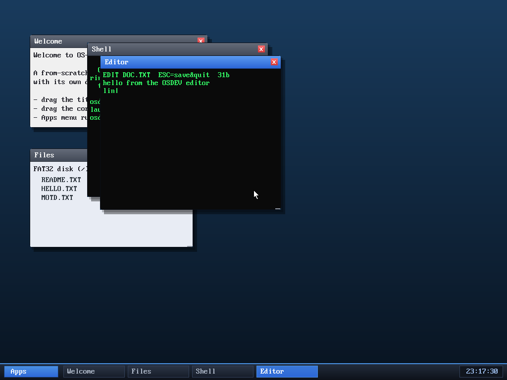

# Milestone 57 — A graphical text editor

**Goal:** a real text editor app — load a file, edit it with a moving cursor,
save it back to disk. The shell's `edit` was a crude line-at-a-time entry; this
is a full-screen editor you drive with the arrow keys.

It prompts for a filename, loads it (or starts empty), and shows the text with
the cursor as an inline `|`. The status bar gives the file name, the save key,
and the byte count. Here it's part-way through typing a two-line document into
`DOC.TXT`; pressing **ESC** saves it (verified — the text really lands in
`DOC.TXT` on the FAT32 disk).

## What it uses

The editor is the program that finally exercises all the input plumbing at once:

- **`sys_pollkey`** (non-blocking) drives the edit loop — poll a key, apply it,
  redraw, sleep a beat.
- **Arrow keys** move the cursor: left/right by a character, up/down to the same
  column on the adjacent line.
- **Printable keys insert, Backspace deletes, Enter splits a line** — all by
  splicing a flat character buffer at the cursor index.
- **`sys_writefile`** saves to FAT32 on ESC.

Rendering is deliberately simple: the whole buffer is printed each keystroke
with a `|` spliced in at the cursor, and the window's own text grid handles
wrapping and scrolling. (So the cursor is always visible when editing near the
end of a file; mid-file editing of a very long file can scroll it off — a known
simplification.) It's the **fifth** userspace program (shell, clock, calc,
snake, editor), each an isolated ring-3 process.

## Files
- `user/editor.c` — the editor
- `kernel/app.c` / `asm/user_blob.asm` / `Makefile` / `desktop.c` — register it
