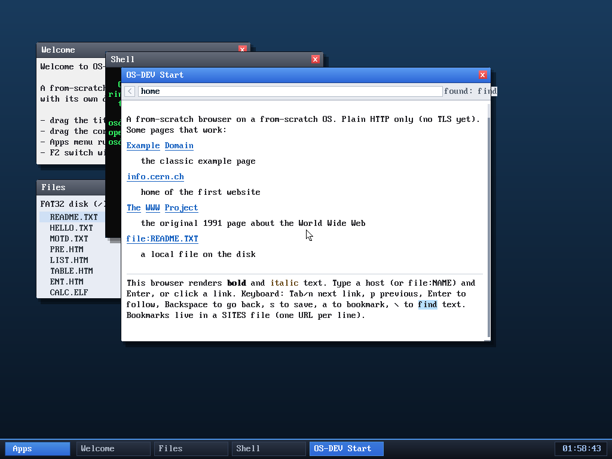

# Milestone 58 — `find`

**Goal:** search the filesystem. `find <name>` walks the whole directory tree
and prints the full path of every file or folder whose name contains the query.

After making `src/a.txt` and `src/sub/b.txt`, `find txt` from the root returns
all five matches with their paths — including the nested
`/SRC/A.TXT` and `/SRC/SUB/B.TXT`. The match is case-insensitive and a substring,
so `find txt` catches `README.TXT` too.

## How it works

`find` is the second recursive filesystem operation (after `tree`). It walks the
current directory and, for each entry, appends `/name` to a running path buffer,
checks the name against the query (case-insensitive substring), prints the full
path on a match, and — if the entry is a directory — recurses into it before
restoring the path buffer. A depth cap (6) and the bounded output buffer keep it
safe on deep or large trees. New `find` VFS op + `SYS_find` + shell command.

It rounds out the file toolkit, which is now a fairly complete set:
**`ls cat edit write rm cp mv mkdir cd pwd tree find df`** plus the graphical
editor and Files window.

## Files
- `kernel/fat32.c` — `find_rec`/`find_visit`, `name_has` (substring match),
  `fat32_find`; `vfs.c`/`vfs.h`, `syscall.c`, `user/ulib.c`, `user/shell.c`
