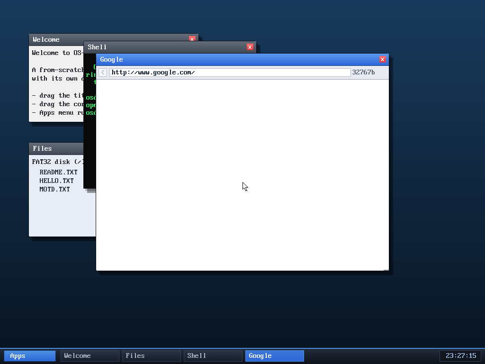

# Milestone 59 — Following HTTP redirects

**Goal:** handle 3xx redirects, so typing a bare domain that the server bounces
elsewhere actually gets you there.

Typing `google.com` returns a **301 Moved Permanently** to
`http://www.google.com/`; the browser follows it and loads the real page (note
the address bar and the "Google" window title). The page renders mostly blank
because google.com is almost entirely JavaScript — which a no-JS browser
correctly strips — but the redirect itself was followed and the page fetched.

## How it works

When a fetched response's status line starts `HTTP/1.x 3xx`, the browser looks
for a `Location:` header (`find_loc`), resolves it against the current URL, and
navigates there — counting hops and giving up after 5 to break redirect loops.
Two details make it behave:

- **It resolves like a link would.** The existing URL-resolution logic was
  factored out of "follow a link" into a shared `goto_href` that both link
  clicks and redirects use, so a `Location:` that's absolute, root-relative, or
  relative all work, and an `https://` target is refused cleanly (no TLS).
- **Redirects replace, they don't stack.** A redirect navigates with the
  history-push suppressed, so pressing **Back** returns to the page *before* the
  redirect chain — not into a loop bouncing through the intermediate URL.

The hop counter resets when a normal (non-3xx) page finally loads, so each fresh
navigation starts clean.

## Files
- `kernel/browser.c` — `goto_href` (shared resolution), `find_loc` (Location
  header), and 3xx handling in `browser_poll`
