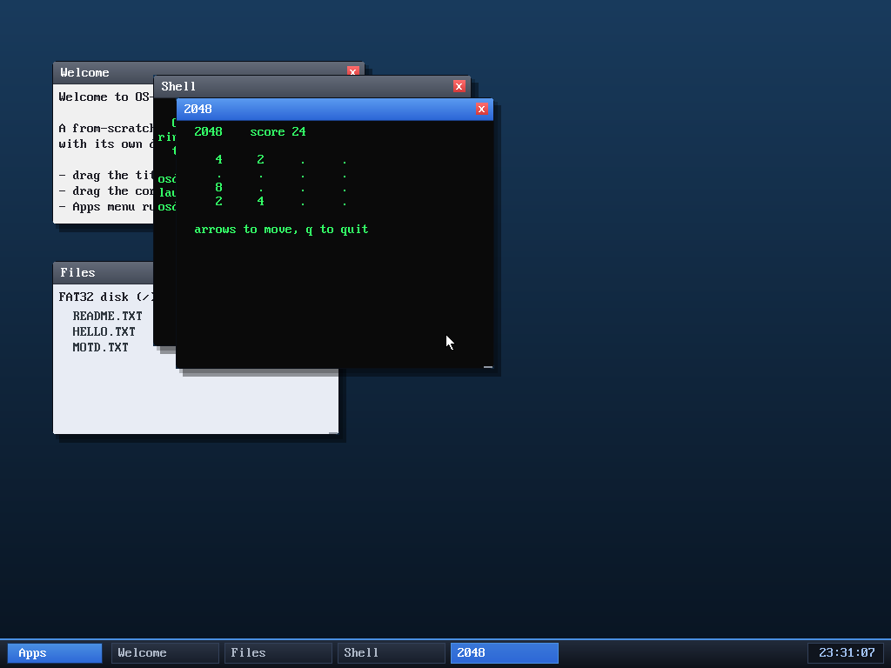

# Milestone 60 — 2048

**Goal:** a second game — the turn-based puzzle 2048 — to round out the apps and
show off varied interactive programs.

Slide the 4×4 board with the arrow keys; tiles that collide and match double and
add to the score (here an `8` has formed from two 4s, score 24). Reach 2048 to
win, or fill the board with no moves left to lose.

## The interesting bit: one slide for four directions

The merge logic lives in a single function, `slide4`, that compacts a 4-cell
line toward index 0 and merges equal neighbours once. Every direction reuses it:
a move gathers each row or column into a 4-element line — **reversed** for
right/down so "toward index 0" means the right/bottom — slides it, and scatters
it back. So left/right/up/down are the same code with two index tweaks, instead
of four near-duplicate routines. A new tile (mostly 2, sometimes 4) appears after
any move that actually changed the board, and `can_move` checks for a stuck
board to end the game.

Like Snake, it's a turn-based loop on `sys_pollkey` (no key, no work) rendering
into the app's text grid — the **sixth** userspace program (shell, clock, calc,
snake, editor, 2048).

## Files
- `user/g2048.c` — the game
- `kernel/app.c`/`asm/user_blob.asm`/`Makefile`/`desktop.c` — register `2048`
