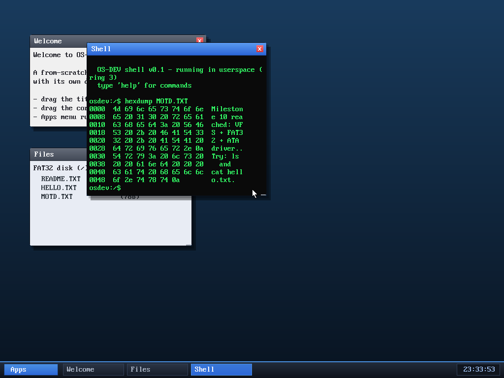

# Milestone 61 — `hexdump`

**Goal:** inspect a file's raw bytes — the classic `hexdump` view, offset + hex +
ASCII.

`hexdump MOTD.TXT` shows each 8-byte row as a hex offset, the bytes in hex, and
the printable ASCII alongside (non-printables shown as `.`). Eight bytes per row
keeps each line inside the window's 44-column grid.

It's a pure shell command built on `sys_readfile` — read up to 512 bytes, then
format. Small, but it's the tool you reach for to see what's *actually* in a
file (line endings, encoding, binary content), and it rounds out the file
toolkit nicely.

## Files
- `user/shell.c` — the `hexdump` command
