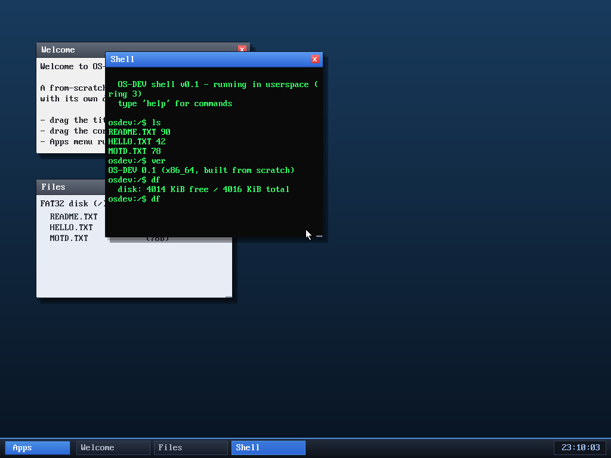

# Milestone 62 — `wc` + FAT cycle-guard (review round)

A small tool plus a robustness fix from a code review.

<!-- (wc output shown in the session; see also osdev-hexdump for the file toolkit) -->

## `wc`

`wc <file>` reports the line, word, and byte counts of a file — e.g.
`wc MOTD.TXT` → `lines 2  words 14  bytes 78`. A pure shell command over
`sys_readfile`. Standard, handy, and it rounds out the inspection tools next to
`hexdump`.

## The review fix: bound every FAT chain walk

A review of the recursive FAT code found one real hazard (everything else —
path buffers, the recursion depth vs the kernel stack, the redirect loop, all
three games and the editor — checked out as bounds-safe). The hazard: the loops
that follow a file/directory's cluster chain with `cl = fat_next(cl)` stopped
only at the end-of-chain marker. **A corrupt FAT entry that points backward
(a cycle) would loop forever, hanging the kernel inside a syscall** — and it's
reachable from `ls`, `cat`, `tree`, `find`, or any write, on any merely-corrupt
disk, not just a hand-crafted one.

The fix is a tiny `fat_step()` wrapper used by every chain-following loop
(`walk_dir`, `fat32_read`, `add_entry`, `fat32_delete`, `free_chain`): it counts
hops and bails out once they exceed the volume's total cluster count — a chain
genuinely can't be longer than that, so a legitimate file is never cut short,
but a cycle is broken. (Also hardened the mount-time cluster-count computation
against a malformed BPB so the cap stays meaningful.) Verified that normal file
operations — including a multi-cluster file — still work unchanged.

It's the kind of bug that never shows up in normal use but turns a single bad
byte on disk into a hang; cheap to prevent, exactly what a periodic review is
for. (Six reviews now, each having found at least one real issue.)

## Files
- `user/shell.c` — the `wc` command
- `kernel/fat32.c` — `fat_step` cycle guard on all chain loops; safer
  `total_clusters` at mount
