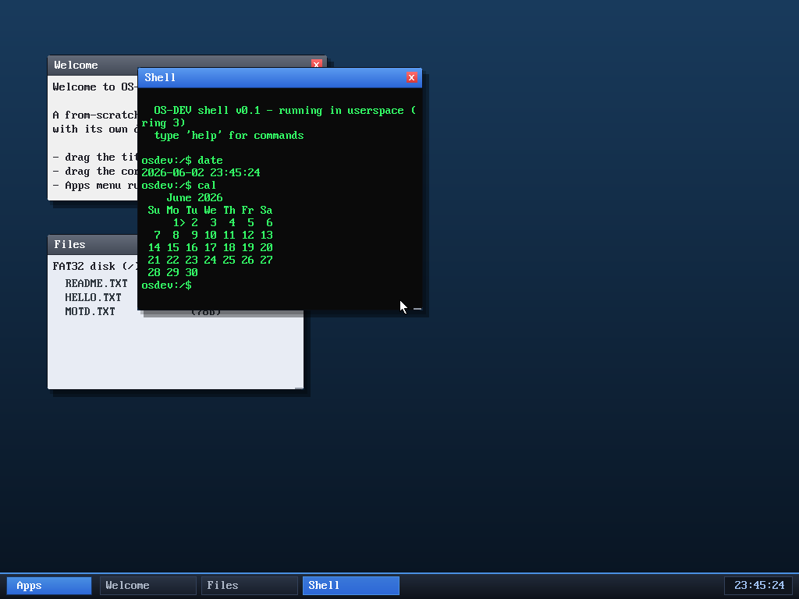

# Milestone 63 — `cal`

**Goal:** a calendar — the classic `cal`, printing the current month with today
marked, using the real-time clock.

`cal` reads the date from the RTC (via `sys_time`), works out which weekday the
1st falls on, and prints the month grid — today (the 2nd here) flagged with `>`.

## The bit of maths

The only non-trivial part is "what day of the week is the 1st?" — solved with
**Sakamoto's algorithm**, a compact closed-form day-of-week computation (a small
month-offset table plus the year and its leap-day corrections, all mod 7). With
the starting weekday and the days-in-month (leap-year-aware for February), the
grid is just padding the first row and wrapping every 7 days. Cells are a fixed
three characters wide so the columns line up under the `Su Mo Tu …` header.

A small thing, but `cal` is a nice demonstration that the userspace clock syscall
plus a few lines of date arithmetic gives you a genuinely useful tool.

## Files
- `user/shell.c` — `cmd_cal` + the `cal` command
