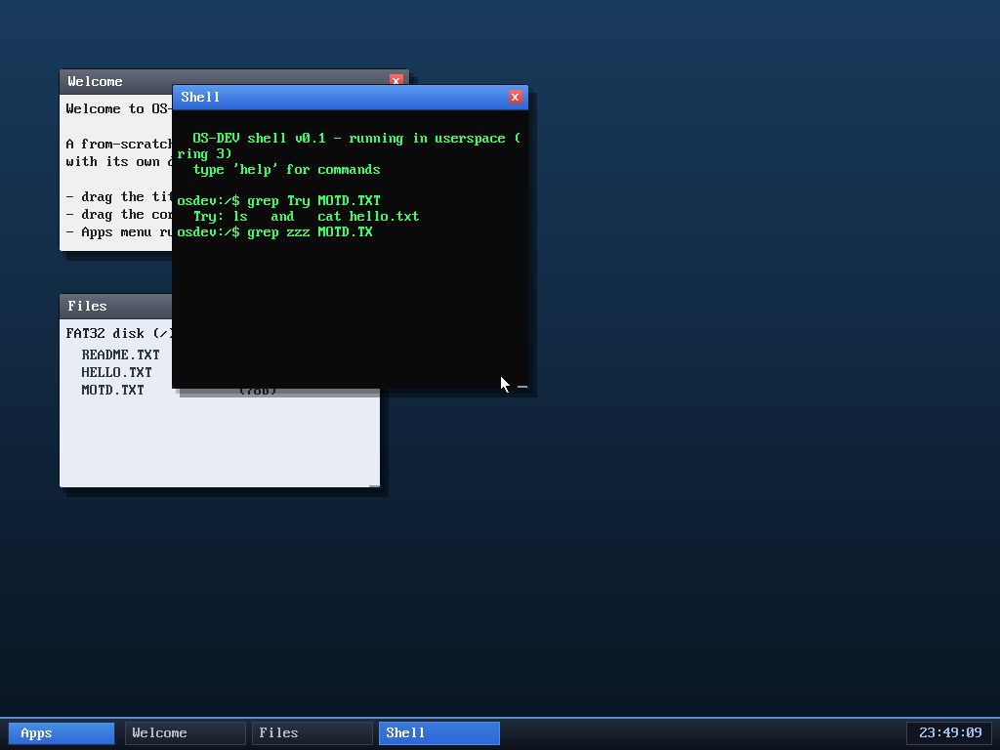

# Milestone 64 — `grep`

**Goal:** search *inside* files — the companion to `find` (which searches file
*names*).

`grep <pattern> <file>` reads the file, scans it line by line, and prints each
line that contains the pattern (a plain substring match). Here `grep Try
MOTD.TXT` pulls out the one line mentioning "Try".

It's a pure shell command over `sys_readfile`: split the buffer on newlines, and
for each line do a substring scan against the pattern, printing matches. Small,
but `find` + `grep` together are the two searches you actually reach for — names
and contents.

## Files
- `user/shell.c` — the `grep` command
