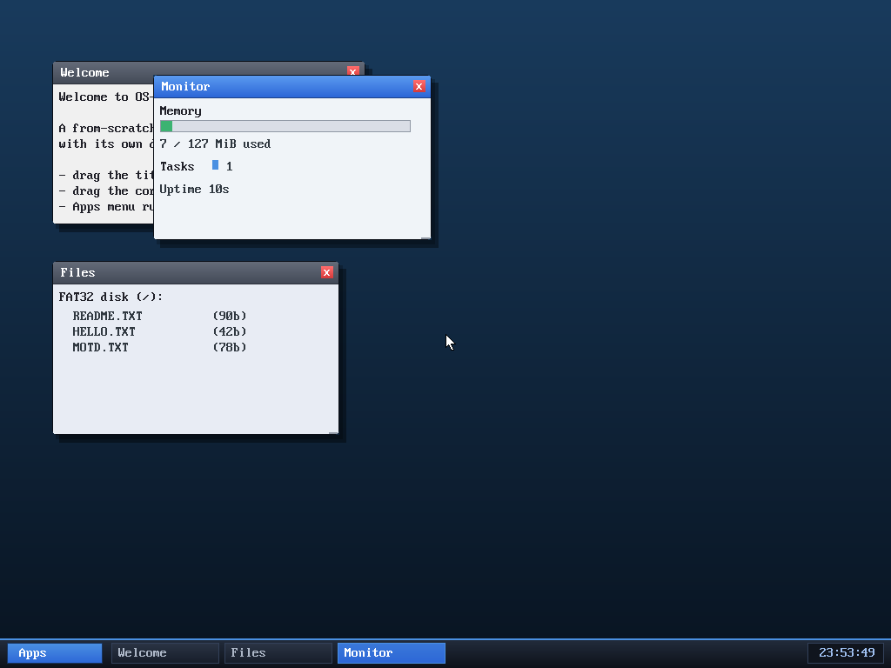

# Milestone 65 — A graphical System Monitor

**Goal:** a real graphical app — a system monitor with live bar graphs — rather
than another text command. It shows memory, task, and uptime stats updated in
place.

The Monitor window draws a **memory-usage bar** (green/orange/red by fill level —
here a thin green sliver for ~5% used, "7 / 127 MiB used"), a **Tasks** row with
one block per running task, and the uptime. It repaints every second, so the bar
and counts track the live system.

## Why it's different from the clock app

The clock and the other userspace programs can only print **text** into their
window's character grid. The Monitor is a **kernel-drawn window** (like the
Files and About windows), so its `draw_content` can use the framebuffer
primitives directly — `fb_fill_rect` for the bar track and fill, `box` for the
border, colored blocks per task. That's what lets it show actual graphics
instead of ASCII. The data comes straight from the kernel: `pmm_total_bytes` /
`pmm_free_bytes` for memory, `task_count` for tasks, `timer_ticks` for uptime.

It rides on the compositor's existing once-a-second repaint (the same tick that
updates the taskbar clock), so the live values refresh without any extra
machinery.

## Files
- `kernel/desktop.c` — `KIND_SYSMON` window: the bar-graph `draw_content`, a
  `Monitor` Apps-menu entry, and an `unum` number formatter
